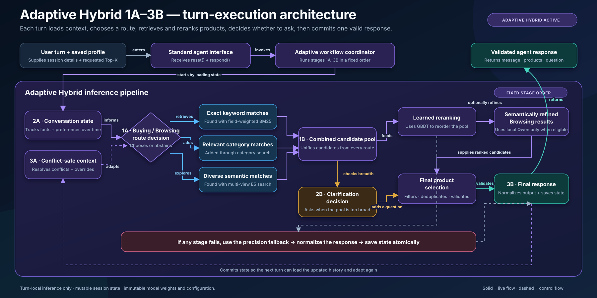
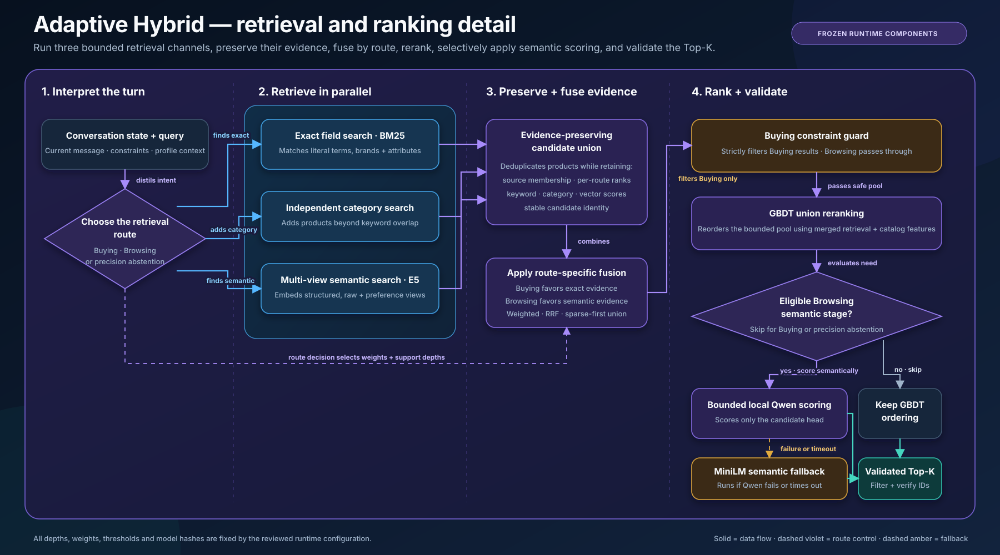

# Architecture overview

The diagram presents the **Adaptive Hybrid 1A–3B runtime** as the single application architecture behind the official `Agent` interface.

Each turn follows the fixed workflow: State V2 and conflict-safe profile context feed the Buying/Browsing router; field BM25, independent category retrieval and multi-view E5 produce a bounded three-source candidate union; the union GBDT and selective local-LLM semantic stage rank that pool; EIG guidance chooses an optional question; and the coordinator validates and atomically commits the returned action.

Component failures remain inside the adaptive coordinator and return its complete precision fallback path. The overview does not contain a separate champion runtime branch.

Model fitting and GhostLab configuration search happen offline. The reviewed adaptive configuration, model assets, thresholds and budgets are hash-pinned and remain frozen throughout a customer session.

## Retrieval and ranking detail

This detailed view expands the runtime's three retrieval channels, evidence-preserving union, route-specific fusion, Buying constraint guard, GBDT reranking, selective SmolLM2 semantic stage, MiniLM fallback, optional hash-bound Top-10 residual reranking, and final Top-K validation. The frozen champion also enables RRF fusion without changing the required stage order.
