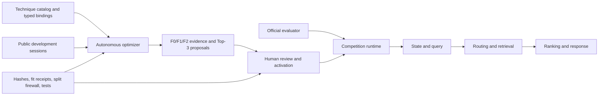

# GhostLab Architecture, TechJam Alignment, and Improvement Roadmap

Status: architecture and competition-alignment reference  
Snapshot: 2026-08-28  
Branch reviewed: `feat/adaptive-autonomous-optimizer`  
Runtime commit reviewed: `3b74d57`  
Protected F3/private evaluation: not accessed

## 1. Purpose of this document

This document explains GhostLab from first principles and then evaluates it against the
TikTok TechJam 2026 Shopping Copilot problem statement and judging criteria. It answers
five questions:

1. What is GhostLab?
2. What happens when the competition calls `starter.Agent`?
3. What does the autonomous optimizer do, and what does it not do?
4. Which parts of the problem statement are implemented, merely available for
   experimentation, or still missing?
5. What should the team improve before final submission and presentation?

The distinction between implementation states is essential. A technique existing in the
repository does not mean that the submitted agent currently uses it. Throughout this
document:

| Label | Meaning |
|---|---|
| **Deployed** | Used by `starter.Agent` when no active-candidate pointer exists. |
| **Runtime-composable** | Executable through an explicit candidate configuration and capable of being switched on or off. |
| **Evaluated experimental** | Implemented and supported by development evidence, but not automatically deployed. |
| **Historical/parked** | Preserved for diagnostics or future retesting, but not currently preferred. |
| **Planned** | Represented by a hypothesis or catalog entry but not yet a validated runnable submission technique. |
| **Offline-only** | Used to search, train, compare, or validate candidates; it is not part of customer-facing inference. |

## 2. Executive summary

GhostLab is a development and runtime framework for building a multi-turn shopping agent
from interchangeable state, questioning, retrieval, routing, ranking, personalization,
and safety techniques. Its distinctive contribution is not a single retrieval model. It
is the controlled process that:

- represents shopping-agent mechanisms as typed, dependency-aware switches;
- constructs compatible pipeline candidates from those switches;
- adapts both pipeline structure and technique-specific parameters;
- trains fit-required techniques without mixing training and validation sessions;
- prunes weak candidates through F0/F1/F2 multi-fidelity evaluation;
- records why techniques and interactions improved or regressed;
- produces reviewable proposals rather than silently changing the deployed agent; and
- preserves a deterministic, offline-capable fallback.

GhostLab has three planes:



- The **runtime plane** answers customer turns through the official `Agent` interface.
- The **experimentation plane** materializes and evaluates alternative pipelines.
- The **evidence and promotion plane** prevents an experimental score from becoming the
  deployed method without validation and explicit human approval.

This architecture is highly relevant to the TechJam challenge. It directly addresses
multi-turn state, intent override, hybrid retrieval, semantic ranking, proactive
questioning, Hit@10, MRR, MTTC, reproducibility, and offline feasibility. However, the
default deployed champion does not currently exercise the full architecture. It uses
sparse retrieval, a guarded GBDT ranker, raw-history state, and a static question sequence.
Dense Browsing routing, adaptive questioning, and runtime workflow orchestration exist as
candidate capabilities, but they must win validation and be activated before the team can
honestly describe them as the deployed solution.

The strongest positioning for the project is therefore:

> GhostLab is an evidence-driven shopping-agent laboratory and deployment system. It can
> discover, train, validate, explain, and safely activate context-sensitive shopping
> pipelines while protecting against public-set overfitting and unsafe promotion.

It should not be presented as:

> A production agent that already uses every technique in the repository or rewrites its
> own code during a customer session.

## Part I — Complete GhostLab architecture

## 3. Repository entry point and deployment selection

The official entry point is `starter/agent.py`. It intentionally contains almost no
shopping logic. It delegates to `ghostlab.runtime.selected.SelectedRuntime`, which makes
deployment selection explicit.

Runtime selection works as follows:

1. If `configs/active_candidate.json` exists, its schema, relative path, and preset hash
   are verified.
2. The referenced candidate preset is materialized through the unified research runtime.
3. The frozen guarded-GBDT runtime remains available as an exception fallback.
4. If no active pointer exists, `starter.Agent` uses the frozen guarded-GBDT champion.
5. Every response is normalized, deduplicated, catalog-validated, and truncated to the
   requested Top 10.

This design separates experimental artifacts from selection state. Running a campaign,
creating a proposal, or obtaining a high score does not alter `starter.Agent`. Only an
explicit activation command creates the hash-bound pointer.

Current snapshot:

- `configs/active_candidate.json` is absent;
- the default deployed agent is the guarded-GBDT champion;
- the adaptive optimizer is running as development work and has not changed deployment.

Primary files:

| Responsibility | File |
|---|---|
| Official adapter | `starter/agent.py` |
| Active-preset selection and hash validation | `ghostlab/runtime/selected.py` |
| Frozen champion and safe fallback | `ghostlab/runtime/agent.py` |
| Unified configurable runtime | `ghostlab/runtime/unified_experimental.py` |
| Output-contract normalization | `ghostlab/runtime/normalizer.py` |
| Candidate activation | `scripts/activate_candidate.py` |

## 4. Customer-facing runtime data flow

For each isolated session, the evaluator calls `reset(session_id, user_profile)` and then
calls `respond(...)` for at most ten turns. A configurable GhostLab candidate follows this
logical flow:

```text
user message + turn + safe aggregate profile
    -> session-state update
    -> intent/correction/override interpretation
    -> query construction
    -> question/stop decision
    -> retrieval route selection
    -> sparse and/or semantic candidate generation
    -> fusion and optional filtering
    -> ranking, reranking, priors, and diversity
    -> intent-scoped recommendation-history filtering
    -> contract normalization and Top-10 response
```

Not every candidate enables every stage. Technique switches, dependencies, exclusive
groups, and conditional parameters determine the actual path.

### 4.1 State and dynamic context

GhostLab supports multiple state representations because conversation memory is a causal
design choice rather than a universal constant:

| State mechanism | Purpose | Current status |
|---|---|---|
| Current message only | Pure baseline and unbiased discovery anchor | Runtime-composable control |
| Raw history | Preserve every lexical term from the dialogue | Deployed champion |
| Multi-value state | Retain multiple positive/negative values per attribute | Runtime-composable |
| Compressed state | Reduce history into a shorter summary | Historical/parked |
| State Baseline V2 | Typed constraints, provenance, corrections, intent epochs, and shown IDs | Evaluated/runtime-composable |

State Baseline V2 is the clearest implementation of the problem statement's dynamic state
machine. It owns state transitions and query construction. GhostLab components receive a
read-only `V2StateView` containing active constraints, query text, intent epoch, and shown
product IDs. Retrieval and ranking components cannot mutate that state.

Intent override is represented as a state transition rather than simply appending new
text. When a correction changes the intent epoch, earlier incompatible constraints and
intent-scoped recommendation history can be invalidated. This is important for the
organizer's Intent Override scenario, in which old preferences must not continue to
dominate after the customer changes direction.

State-related files include:

- `ghostlab/state/baseline_v2.py`;
- `ghostlab/state/v2_view.py`;
- `ghostlab/state/memory.py`;
- `ghostlab/state/query.py`;
- `ghostlab/state/normalization.py`; and
- `ghostlab/state/catalog_ontology.py`.

### 4.2 Query construction

GhostLab can build queries from current text, raw dialogue, structured active evidence, or
State V2 coverage-adaptive logic. The coverage-adaptive V2 query uses structured evidence
when it is sufficiently informative and preserves a raw-history fallback when catalog
coverage is uncertain.

Additional query experimentation includes catalog-grounded pseudo-relevance feedback and
guards designed to prevent expansion from replacing the user's intent. Query expansion is
treated as a risky conditional technique because a fluent-looking expansion can decrease
exact-product recall.

### 4.3 Questioning and stopping

The system distinguishes the content of the next clarification from the decision to keep
asking at all.

Available approaches include:

- fixed or explicit question sequences;
- a broad `other` clarification control;
- heuristic adaptive selection from observable uncertainty and missing attributes;
- a learned linear action-value policy;
- candidate-facet expected information gain (EIG);
- reward/value-of-information questioning; and
- a joint observable policy capable of selecting questions and routes together.

Candidate EIG estimates which allowed attribute would most reduce uncertainty in the
retrieved candidate set. Reward-aware termination compares expected question value with
the cost of delaying a recommendation. This directly targets the tension in the metric:
asking one more question costs MTTC, but may improve Hit@10 or move the target toward rank
one.

The current deployed champion does not make this decision adaptively. It uses:

```text
other, other, use_case, other, size, other, other, size
```

That sequence was selected by historical experimentation and is frozen in the champion
configuration. Answers still change retrieval and ranking, but they do not change which
question type comes next.

Question-policy files include:

- `ghostlab/policy/adaptive_questions.py`;
- `ghostlab/policy/eig_questions.py`;
- `ghostlab/policy/learned_questions.py`;
- `ghostlab/policy/joint_policy.py`; and
- `ghostlab/policy/distilled_expert.py`.

### 4.4 Intent and route selection

The target architecture supports contextual route selection through observable signals
such as retrieval entropy, coverage, constraint strength, turn, and state confidence.
Routing mechanisms include a calibrated observable router, joint policy routing, a
historical decision list, and a historical route stump/table.

The intended dual-track behavior is:

```text
high-confidence Buying intent
    -> preserve and enforce hard constraints
    -> prioritize precise sparse/category/filter signals

ambiguous Browsing intent
    -> preserve diversity and semantic recall
    -> activate dense or hybrid retrieval
    -> ask a high-value clarification when appropriate
```

This route-sensitive architecture is present in the research runtime, but it is not the
default champion path. Earlier observable routing experiments frequently collapsed to
always-sparse because the tested signals could not reliably predict when dense retrieval
would rescue the target. The new optimizer is allowed to revisit routing with better
state, retrieval, ranking, and conditional activation.

### 4.5 Candidate generation and retrieval

Sparse retrieval is implemented with field-aware FTS5/BM25. The candidate query can score
title, categories, features, details, store, and description with separate weights. Sparse
retrieval is fast, deterministic, and particularly strong on exact catalog language.

Semantic options include pinned offline MiniLM and E5 encoders. Hybrid routes include:

- reciprocal-rank fusion;
- conditionally weighted sparse/dense fusion;
- sparse-first union with semantic backfill;
- sparse/semantic union; and
- planned learned-sparse or late-interaction rescue routes.

The evidence ledger explains why dense retrieval is complementary but not automatically
superior. An early MiniLM experiment had weaker standalone Recall@200 than sparse search,
while sparse+dense union recovered additional targets. The unresolved problem was turning
those rescues into correctly ordered Top-10 results without allowing dense noise to damage
already-good sparse results.

Retrieval files include:

- `ghostlab/retrieval/sparse.py`;
- `ghostlab/retrieval/dense.py`;
- `ghostlab/retrieval/fusion.py`;
- `ghostlab/retrieval/sparse_semantic_fusion.py`;
- `ghostlab/retrieval/learned_sparse.py`;
- `ghostlab/retrieval/late_interaction.py`; and
- `ghostlab/retrieval/pseudo_relevance.py`.

### 4.6 Filtering, ranking, and reranking

Candidate generation determines whether the target can be found. Ranking determines
whether it appears in the Top 10 and at which reciprocal rank. GhostLab therefore keeps
retrieval and ranking evidence separate.

Ranking mechanisms include:

- deterministic lexical scoring;
- metadata and constraint-aware GBDT;
- pairwise linear ranking;
- cross-encoder semantic reranking;
- reward-aligned and turn-aware LambdaMART;
- fold ensembles and rank stacking;
- quality and profile priors;
- facet-aware diversity; and
- the Top-10 residual reranker.

The residual reranker is specifically designed to improve MRR without changing Top-10
membership. It receives the parent's ten recommendations and may only reorder those same
ten IDs. Its adaptive training searches model family, feature subset, regularization,
depth, ensemble membership, blend weight, rerank depth, confidence gates, and maximum
moved IDs. It fails closed to the parent order when expected gain is insufficient.

Its fold-safe development evidence is promising:

| Parent | Residual off | Residual on | Delta | Interpretation |
|---|---:|---:|---:|---|
| Exact State V2 parent | `0.782154` | `0.876700` | `+0.094546` | Fair baseline-plus-technique comparison |
| Stronger ranked State V2 parent | `0.885391` | `0.912467` | `+0.027076` | Compatibility evidence |

Hit@10 membership and MTTC were unchanged in both comparisons. These are public
development estimates, not a private leaderboard result and not yet the deployed method.
The runtime reordering mechanism is in `ghostlab/retrieval/residual.py`, while its
fold-safe model selection and fitting path is in `ghostlab/training/residual.py`.

### 4.7 Personalization and priors

The evaluator supplies a privacy-safe aggregate profile. GhostLab can use a bounded profile
prior and a catalog-quality prior. The quality prior is deployed at a small weight as a
tie-breaker. Earlier fixed profile weights regressed, so profile personalization remains
optional and must yield to explicit current-session evidence.

The project must not claim unrestricted long-term memory. The competition sessions are
isolated, public and private users differ, and the agent receives only the allowed
aggregate profile. The defensible claim is safe profile-conditioned ranking plus
short-term session context, not cross-session identity tracking.

### 4.8 Recommendation history, correction, and output safety

State V2 can suppress already-shown products within the current intent epoch and reset
that history after a genuine intent change. Final output normalization:

- removes invalid catalog IDs;
- removes duplicate IDs;
- preserves order;
- truncates to ten;
- validates the response contract; and
- retains an offline keyword fallback if an optional component fails.

This is a practical strength. A sophisticated technique is not useful if a missing model,
bad asset, or malformed response causes the whole session to fail.

## 5. The currently deployed champion

When no active-candidate pointer exists, the runtime uses
`ghostlab_guarded_constraint_gbdt_v1`:

1. Retain provenance-aware raw conversation history.
2. Ask the frozen eight-question sequence shown above.
3. Retrieve Top 200 with field-aware sparse BM25 using weights
   `2.0, 8.0, 4.0, 2.5, 1.5, 1.0`.
4. Apply a catalog-quality prior of `0.2` over the Top-50 head.
5. Normally rerank with the constraint-aware 56-round GBDT.
6. After observable override invalidation, use the audited base metadata GBDT.
7. Normalize and return Top 10.

Development evidence:

| Evidence class | Technical score | Meaning |
|---|---:|---|
| Five-fold grouped OOF | `0.878963` | Honest selected development estimate |
| All-development compiled replay | `0.886852` | Deployment-fit replay, not an OOF estimate |
| Protected F3/private | Not accessed | No generalization claim may be made yet |

The OOF candidate had Hit@10 `0.973333`, MRR `0.737878`, and MTTC `2.453333` across
the 150-session adaptive development split. It passed runtime parity, integrity, offline,
latency, memory, and fallback checks. Its statistical evidence over the metadata GBDT is
positive but borderline, which is why the protected confirmation boundary remains
important.

The champion is strong on exact relevance, ranking, efficiency, and override safety. It
is weaker as a demonstration of dense Browsing retrieval, dynamic question choice, and
runtime route orchestration.

## 6. The research runtime and technique surface

The unified experimental agent exposes typed switches rather than arbitrary dictionaries.
The documented system surface contains runtime-composable techniques, anchor/intrinsic
implementations, and offline research/search procedures. Important exclusive families
include state representation, question policy, dense backend, fusion route, and primary
reranker. Additive techniques such as priors, filtering, history handling, and diversity
may coexist when their dependencies permit it.

The catalog and bindings solve different problems:

- `configs/techniques/catalog_v2.json` records technique identity, family,
  availability, dependencies, assets, evidence, and retest triggers.
- `ghostlab/campaign/bindings.py` maps a technique ID to a typed runtime patch.
- compatibility validation rejects mutually exclusive or dependency-invalid candidates;
- omission restores the baseline/off behavior;
- parameters are only active when the owning technique is enabled.

This prevents meaningless experiments such as tuning dense weight when no dense retriever
exists, enabling two incompatible primary question policies, or emitting a fitted model
without its required asset.

At this snapshot, the version-two catalog contains a mixture of available, evaluated,
interaction-reserve, parked, and planned entries. “Planned” entries must not be described
as implemented runtime features merely because their IDs exist.

## 7. Autonomous optimization architecture

The autonomous optimizer is a development system. It does not participate in a customer
turn and it does not autonomously deploy a winner.

### 7.1 Search modes

| Mode | Starting anchor | Purpose |
|---|---|---|
| `discover` | Pure current-message + fixed-question + sparse keyword baseline | Reconstruct without incumbent structural bias |
| `augment` | Strong ranked State V2 parent | Find safe improvements around the current architecture |
| `full` | Discovery and strong composable anchors | Cover both exploration and exploitation |

Known champions may be evaluated as comparison controls. In discovery mode they are not
used as construction anchors, so seeing a control obtain the live highest score does not
mean the search secretly started from it.

### 7.2 Candidate construction

The engine:

1. resolves dependencies and exclusive groups;
2. evaluates controls, standalone techniques, and compatible pairs;
3. preserves skip reasons as evidence;
4. retains strong, uncertain, family-diverse, and interaction-reserve candidates;
5. expands supported combinations to higher orders through bounded beam search and
   crossover; and
6. uses backward ablation and add-back tests to determine whether each component earns
   its place.

This is not an exhaustive power-set search. Exhaustively enumerating every parameterized
combination would be computationally infeasible and would severely overfit 200 public
sessions. The objective is broad, auditable coverage with controlled pruning.

### 7.3 Adaptive parameter optimization

Technique presence is only one decision. The optimizer conditionally searches meaningful
parameters such as:

- question order, horizon, EIG depth, and stop margin;
- six sparse field weights and retrieval depth;
- normalized sparse/dense fusion share;
- dense activation and uncertainty thresholds;
- cross-encoder depth, weight, turn, and activation gates;
- profile and quality prior weights;
- query expansion depth and guards;
- diversity strength and activation;
- residual-ranker model family, features, regularization, blend, depth, and safety gates.

BOHB-style proposals combine random exploration with sampling near strong observed
regions. Successive halving gives all candidates a small seed budget and reserves larger
budgets for survivors. This is adaptive optimization, but it does not remove the need for
held-out validation.

### 7.4 F0, F1, F2, and F3

| Stage | Role | Can optimize after seeing it? |
|---|---|---|
| F0 | Cheap stratified screening and initial pruning | Yes, within frozen search data |
| F1 | More reliable search-fold racing and conditional HPO | Yes, within frozen search data |
| F2 | One frozen-seed confirmation on disjoint development folds | No further tuning on F2 |
| F3/private | External protected confirmation | Not accessible to the autonomous engine |

Live `highest_individual_job` values are diagnostics, not promotion evidence. Final
decisions use matched aggregate comparisons across the required jobs and scenarios.

### 7.5 Overfitting controls

GhostLab reduces selection overfit through:

- grouped splits that keep all turns from one session in one fold;
- prospectively frozen search and confirmation folds;
- deterministic session hashes and campaign manifests;
- fit receipts proving disjoint training and validation IDs;
- target/scenario/future-answer firewalls for runtime features;
- paired candidate-versus-control comparisons;
- scenario regression gates;
- multi-seed racing;
- complexity, latency, memory, and asset checks;
- backward ablations;
- one protected F3 boundary; and
- human approval before activation.

These controls reduce risk; they cannot guarantee private-set generalization. Repeatedly
changing the search after examining F2 or F3 would invalidate the intended boundary.

### 7.6 Proposal and promotion

The optimizer can materialize up to three behaviorally distinct proposals: a score leader,
a robust leader, and an efficient alternative. It prints preparation commands and records
the exact enabled techniques, parameters, assets, hashes, evidence, and comparison against
the current champion.

Human promotion is intentional:

```text
campaign result
    -> matched review against champion
    -> prepare candidate and final development fit if required
    -> verify hashes, receipts, parity, latency, and rollback
    -> human activation command
    -> starter.Agent uses the new hash-bound preset
```

The engine never commits, pushes, opens F3, or silently replaces the champion.

## 8. Evidence system and historical learning

GhostLab stores both raw reports and an append-oriented decision ledger. This is intended
to answer more than “which score was largest?” It records:

- what changed;
- what the correct control was;
- which scenarios improved or regressed;
- whether the mechanism behaved as expected;
- whether a loss was standalone or dependency-specific;
- why a technique was promoted, parked, or retained for interaction testing; and
- what change would justify retesting it.

Examples of durable findings include:

- field-aware sparse retrieval produced large early gains;
- dense retrieval supplied complementary rescues but weak standalone ordering;
- naive fusion could not repair a weak dense head;
- hard filtering could falsely exclude relevant products and therefore needs fail-open
  guards;
- fixed profile priors hurt and should be conditionally gated;
- static heuristic adaptivity did not predict downstream question value reliably;
- shallow GBDT ranking improved ordering materially;
- observable override fallback protected a vulnerable scenario; and
- membership-preserving residual reranking can improve MRR without changing Hit@10 or
  MTTC.

This evidence discipline is one of GhostLab's strongest technical and innovation claims.

## Part II — Alignment with the TechJam problem statement

## 9. Pillar I: Core architecture — intent routing and hybrid pipeline

### Required by the problem

- Distinguish targeted Buying from open-ended Browsing.
- Use a high-precision constraint route for Buying.
- Use diverse dense retrieval for Browsing.
- Combine keyword, category, vector similarity, and semantic ranking in memory.

### What GhostLab covers

| Requirement | Coverage | Evidence in the system |
|---|---|---|
| Sparse keyword retrieval | Strong/deployed | Field-aware FTS5/BM25 |
| Category and structured signals | Implemented | Field weights, typed state, structured filter |
| Dense semantic retrieval | Implemented/optional | MiniLM and E5 backends |
| Hybrid retrieval | Implemented/optional | RRF, weighted fusion, sparse-first union |
| Semantic reranking | Implemented/optional | Compact cross-encoder |
| Constraint-sensitive ranking | Strong/deployed | Guarded constraint GBDT |
| Observable routing | Implemented but not deployed by default | Calibrated/joint route mechanisms |
| Buying/Browsing behavioral split | Architecturally supported, incompletely demonstrated | Route and activation switches |

### Assessment

Architecture-level alignment is strong. Deployment-level alignment is partial because the
current champion is sparse-only and does not expose an explicit Buying-versus-Browsing
route. The repository should not describe the compact cross-encoder as a generative LLM.
It is a local transformer semantic reranker. The competition allows local models and does
not require paid LLM access, so this can still satisfy the semantic-ranking intent if
described accurately.

### Needed improvement

The selected final candidate should, if validation permits, implement an observable route
with traceable behavior:

- constraint-confidence and low-entropy Buying states use precision-first retrieval;
- high-entropy or low-coverage Browsing states enable dense/hybrid recall and diversity;
- the router fails safely to the sparse path; and
- route decisions are evaluated separately for Buying, Browsing, Override, and Boundary.

If this does not beat the champion, the team should present it as an evaluated capability
and explain why the evidence selected the simpler runtime. It must not claim that the
deployed agent uses dual-track routing when it does not.

## 10. Pillar II: Dialog strategy — multi-turn scenario evolution

### Required by the problem

- Accumulate information across turns.
- Erase or rewrite obsolete slots after intent override.
- Detect over-generality and ask proactive structured clarification questions.
- Reach the correct product without wasting the ten-turn budget.

### What GhostLab covers

State V2 closely matches the dynamic-state requirement: typed constraints, negative
evidence, provenance, corrections, intent epochs, and correction-scoped recommendation
history. Adaptive, learned, EIG, and reward-aware question policies provide multiple
approaches to proactive clarification and stopping.

### Assessment

The state architecture is one of the best-aligned parts of the project. The weakness is
again deployment: the current champion asks a fixed sequence rather than selecting the
next question from the current uncertainty, candidate distribution, or intent.

### Needed improvement

The final demo should prove three traces:

1. a vague Browsing query where candidate overload triggers a useful question;
2. a targeted Buying query where explicit constraints are preserved and unnecessary
   questions are avoided; and
3. an Intent Override where stale constraints and shown-product history are invalidated.

The team should report whether adaptive questioning improved total TechnicalScore and not
only whether it appeared more intelligent. A policy that asks elegant questions but harms
MTTC is not automatically better for this challenge.

## 11. Pillar III: Self-evolution — dynamic context programming

### Required by the problem

- Distill accumulated context.
- use the safe profile where appropriate;
- re-orchestrate the runtime workflow according to the evolving session; and
- iteratively refine guidance logic.

### What GhostLab covers

GhostLab covers two different forms of adaptation:

- **development-time adaptation:** the autonomous optimizer changes structures,
  parameters, fitted models, and interactions using controlled evidence;
- **runtime adaptation:** state, EIG, calibrated routing, uncertainty gates, and joint
  policies can change actions according to the current conversation.

### Assessment

The optimizer is innovative, but development-time search must not be mislabeled as runtime
self-evolution. The deployed champion updates retrieval evidence after every answer and
reacts to override signals, but it does not dynamically choose its whole workflow.

Long-term personalization is also limited by the competition contract. Sessions are
isolated and only an anonymized aggregate profile is available. The project correctly
avoids cross-user identity reconstruction, but its deployed profile use is modest.

### Needed improvement

Use a clear claim:

> GhostLab evolves pipelines offline under fold-safe evidence and executes only frozen,
> audited policies online. Within a session, observable state can route retrieval, choose
> clarification, and gate semantic components.

This is more credible than claiming unrestricted online self-modification. Add runtime
traces showing which state signals activated or suppressed a component. Keep target,
scenario label, future answers, and evaluator outcomes outside all runtime decisions.

## 12. Pillar IV: Evaluation matrix — product and efficiency metrics

### Required by the problem

- Hit Rate@10 for coverage;
- MRR for ranking precision;
- MTTC for conversational efficiency; and
- reliable execution under the official API.

### What GhostLab covers

This is GhostLab's strongest alignment. The optimizer and reports use the official
TechnicalScore and retain component and scenario metrics. Ranking techniques target MRR,
question/termination policies model turn cost, and retrieval diagnostics distinguish
candidate recall from final ordering.

The system additionally measures latency, memory, asset size, response failures, parity,
and offline behavior. This supports the feasibility criterion without changing the
official score.

### Needed improvement

Final reports must compare the selected candidate and champion on exactly the same folds,
seeds, session IDs, and evidence class. Do not compare an individual F0 maximum with an
aggregated OOF or F2 score. Keep public-development, all-development replay, protected F3,
and organizer-private results explicitly separated.

## 13. Constraints and scope compliance

| Constraint | GhostLab position | Remaining check |
|---|---|---|
| Maximum ten turns | Runtime contract validates turns 1–10 | Confirm every activated policy terminates safely |
| Read-only 50,000-product catalog | Retrieval indexes read catalog data without catalog mutation | Exclude generated/mock ASINs from packaging |
| Text-only | All current runtime techniques consume text/metadata | No multimodal claim |
| No full foundational-model training | Uses local encoders, shallow learners, and rerankers | Disclose every model and asset |
| In-memory/light infrastructure | Local FTS, cached embeddings/models, no external vector DB | Benchmark final candidate on organizer-like hardware |
| Offline final execution may be required | Frozen champion and pinned optional models support offline execution | Test with network disabled |
| Isolated sessions | State is keyed by session and tested for interleaving | Avoid cross-session personalization claims |
| No required paid API | Default champion makes no external call | If adding an API, retain and document offline fallback |

## Part III — Judging-criteria assessment

## 14. Technical Execution — 35%

### Strengths

- Clear official adapter and deployment boundary.
- Typed configurations, safe paths, content hashes, and dependency validation.
- Modular state, query, policy, retrieval, fusion, ranking, and fallback components.
- Deterministic local evaluation and reproducible campaign manifests.
- Grouped splits, fit receipts, protected confirmation, and paired evidence.
- Offline fallback, normalization, parity tests, latency and memory measurements.
- Checkpoint/resume for long-running campaigns.

### Weaknesses and risks

- The architecture is large enough that documentation and configuration drift are real
  risks.
- A long autonomous campaign is not itself evidence that the final agent is reliable.
- Several catalog techniques are planned, parked, or historical rather than submission
  ready.
- The default champion does not exercise the complete advertised hybrid architecture.
- Fit-required techniques need a final allowed-data fit and immutable receipt before
  deployment.

### What judges should be shown

- One command that installs and runs the selected agent.
- The exact active candidate and its hashes.
- A short runtime architecture trace.
- Reproduction of the official metrics.
- Cold start, warm p95, memory, model size, and offline behavior.
- A controlled fallback demonstration.

### Priority improvement

Freeze a minimal submission package after candidate selection. Run the full test, parity,
integrity, offline, and resource suite against that exact package rather than against the
research repository in general.

## 15. Innovation and Problem Insight — 20%

### Strengths

- Treating the shopping pipeline as a typed, searchable technique graph is distinctive.
- F0/F1/F2 search with conditional HPO, interaction discovery, and ablation goes beyond
  selecting one hand-tuned model.
- Candidate EIG and reward-aware stopping frame clarification as an economic decision.
- Membership-preserving residual ranking isolates MRR gains from Hit@10/MTTC risk.
- The intent-epoch boundary is a sharp response to genuine consumer intent changes.
- The evidence ledger captures causal hypotheses and retest conditions instead of only
  leaderboard numbers.

### Weaknesses and risks

- The innovation can look like brute-force evaluator optimization if the consumer problem
  is not explained first.
- Offline autonomous optimization is not the same as real-time adaptive orchestration.
- A static deployed policy weakens the visible innovation story even if its score is best.
- Trying many public-set configurations increases selection-overfit risk despite fold
  controls.

### Priority improvement

Tell the story around uncertainty and changing intent:

> No fixed shopping pipeline is best for every turn. GhostLab measures the state of the
> conversation, tests which mechanisms help each failure mode, and deploys only a frozen
> policy whose gains survive disjoint validation.

Then demonstrate at least one context-dependent runtime decision. Use the optimizer as
supporting innovation, not as the entire user-facing story.

## 16. Impact and Relevance — 20%

### Strengths

- Better Hit@10 reduces failed shopping journeys.
- Higher MRR reduces scanning effort and moves likely purchases to the top.
- Lower MTTC reduces repeated questioning and cognitive load.
- Intent correction prevents irrelevant recommendations after a customer changes their
  mind.
- Offline compact models can support sellers or platforms without mandatory per-query API
  cost.

### Weaknesses and risks

- The current narrative is dominated by experiment infrastructure rather than shopper
  outcomes.
- The project does not yet quantify business-facing improvements such as fewer failed
  sessions, fewer turns, or lower serving cost in intuitive terms.
- Recommendation explanations and customer trust are not central in the current runtime.
- The Amazon category and deterministic simulator limit claims about general retail
  generalization.

### Priority improvement

Translate the final metric deltas into customer terms. For example: additional successful
sessions per 1,000 conversations, average turns saved, rank improvements, and latency/cost
per turn. Mark these as estimates from the competition setting rather than production
conversion claims.

## 17. Feasibility and Practicality — 15%

### Strengths

- No external vector database is required.
- The deployed champion is deterministic, offline, and compact.
- Optional dense and cross-encoder assets are pinned and locally cached.
- Runtime failures degrade to contract-safe keyword search.
- Search and inference are cleanly separated: expensive experimentation need not run in
  production.
- Candidate activation and rollback are explicit.

### Weaknesses and risks

- The full optimizer can run for many hours and is unsuitable as part of deployment.
- Some optional models may impose cold-start, memory, licensing, or packaging costs.
- The full research repository is much larger and more complex than the necessary
  submission artifact.
- A winning development pipeline could still be too slow or asset-heavy for organizer
  limits.

### Priority improvement

Present two cost profiles:

1. offline research cost for discovering a candidate; and
2. online inference cost for the frozen candidate.

Only the second is the serving architecture. Package only required runtime code and assets,
then benchmark it under network-disabled CPU conditions.

## 18. Presentation and Communication — 10%

### Strengths

- Extensive evidence and technical documentation exist.
- The project can explain both successful and failed techniques.
- The architecture supports a compelling before/after and scenario-based demonstration.

### Weaknesses and risks

- The current documentation surface is overwhelming for a first-time reader.
- Terms such as champion, control, F0, OOF, fitted asset, and active pointer can be easily
  confused.
- A live F0 maximum can be mistaken for a validated final score.
- Judges may not understand why unused techniques matter or why the optimizer is separate
  from the shopping agent.

### Priority improvement

Use a simple presentation sequence:

1. customer problem;
2. two example failure modes: vague browsing and intent override;
3. the runtime pipeline;
4. one adaptive trace;
5. validated metrics and runtime cost;
6. GhostLab's safe self-evolution loop; and
7. limitations and next steps.

Do not lead the pitch with worktrees, campaign IDs, hyperparameter counts, or Git history.
Those are engineering evidence for Q&A, not the opening story.

## Part IV — What is covered, what is missing, and what to do next

## 19. Coverage summary

| Capability | Exists in code | Evaluated | Deployed by default | Submission readiness |
|---|---:|---:|---:|---|
| Field-aware sparse retrieval | Yes | Yes | Yes | Strong |
| Constraint-aware GBDT ranking | Yes | Yes | Yes | Strong with stated uncertainty |
| Intent-override protection | Yes | Yes | Yes | Strong for observed override class |
| State V2 dynamic state | Yes | Yes | No | Strong candidate capability |
| Dense retrieval | Yes | Yes | No | Complementary but not yet proven as final route |
| Hybrid fusion | Yes | Yes | No | Needs a strong conditional use case |
| Explicit Buying/Browsing router | Yes | Partial/historical and new search | No | Important gap |
| Adaptive heuristic questions | Yes | Yes | No | Earlier version lost |
| Candidate-EIG questions | Yes | In active search/reserve | No | Promising, requires confirmation |
| Reward-aware stopping | Yes | In active search | No | Directly relevant, requires confirmation |
| Cross-encoder semantic reranking | Yes | Historical/parked | No | Retest only with justified dependency |
| Safe profile prior | Yes | Fixed prior regressed | No | Needs contextual gating |
| Residual Top-10 reranking | Yes | Strong fold-safe experimental evidence | No | Needs final fit and promotion |
| Autonomous structure search | Yes | Running/validated by tests | Offline only | Strong development innovation |
| Conditional parameter optimization | Yes | Implemented and running | Offline only | Strong development innovation |
| F0/F1/F2 and fit receipts | Yes | Yes | Offline only | Strong validation architecture |
| Automatic production promotion | Intentionally no | N/A | No | Human gate is a strength |
| Protected F3/private access | Intentionally no | Sealed | No | Correct boundary |

## 20. Principal weaknesses and limitations

### 20.1 Capability versus deployment gap

The largest weakness is that the repository can do more than the default agent currently
does. Judges score the submitted behavior, not the number of available modules. The final
README and pitch must distinguish the deployed pipeline from the research surface.

### 20.2 Incomplete visible dual-track behavior

The problem statement explicitly asks for Buying precision and Browsing semantic diversity.
GhostLab can represent this, but the champion does not currently provide a clear,
validated route split.

### 20.3 Static deployed question policy

The fixed sequence is evidence-selected and performant, but it is less compelling than a
context-sensitive question policy and may ask semantically repetitive `other` questions.
Adaptive alternatives must prove score and scenario safety rather than being enabled for
appearance.

### 20.4 Public-development selection pressure

The project has evaluated many candidates on only 200 public sessions. Grouped folds,
multi-seed checks, F2, and F3 separation help, but cannot erase researcher degrees of
freedom. New ideas should not be designed in response to confirmation-fold outcomes.

### 20.5 Historical fitted assets

Some learned models are historical controls rather than fold-locally retrained assets for
the new State V2 context. They should remain diagnostic until retrained under the current
fit-receipt contract.

### 20.6 Personalization limitations

Fixed profile priors regressed, and the competition exposes only safe aggregates. The
project does not demonstrate persistent user memory across sessions. Claims must remain
within the allowed profile and isolated-session setting.

### 20.7 Semantic-model terminology

MiniLM, E5, and the cross-encoder are transformer models, but they are not automatically an
LLM reasoning layer. Calling them an LLM would weaken technical credibility. Describe the
actual model and its function.

### 20.8 Complexity and maintainability

The research system has many techniques, configs, reports, campaign modes, and historical
branches. This supports experimentation but creates onboarding and drift risk. The final
submission should be much smaller than the research workspace.

### 20.9 Simulator and domain limits

The public conversations are generated from intent cards, not real free-form shopping
dialogue. Inputs are pre-cleaned, the catalog is static, and only one Amazon category is
used. Results do not prove robustness to typos, adversarial phrasing, live inventory,
multi-modal products, or other retail domains.

### 20.10 No private result yet

The strongest reported values remain development evidence. No claim of winning, private
generalization, or production conversion lift is justified before protected evaluation.

## 21. Prioritized improvement roadmap

### P0 — required before submission

1. **Finish the current campaign without treating live F0 maxima as decisions.** Review
   matched F1/F2 evidence and scenario gates.
2. **Choose one exact deployment candidate.** Prepare fit-required assets on all allowed
   development data only after configuration selection is frozen.
3. **Validate the exact `starter.Agent` artifact.** Run parity, API contract, offline,
   integrity, latency, memory, asset-hash, and rollback checks.
4. **Create a minimal submission package.** Include only required source, config, assets,
   dependency lock, licenses, and one execution command.
5. **Complete required documentation.** Add explicit development tools, libraries, models,
   APIs, datasets/assets, limitations, team-member contributions, setup, reproduction,
   and model-cost disclosure.
6. **Keep F3 sealed until the candidate and analysis are frozen.** Run it once through the
   authorized process and report the result even if negative.

### P1 — highest-value problem-alignment improvements

1. **Validate explicit Buying/Browsing routing.** Prefer an observable, calibrated,
   fail-safe route over a hard keyword heuristic.
2. **Validate adaptive question/stop behavior.** Candidate EIG plus reward-aware stopping
   is the most direct fit to proactive guidance and MTTC.
3. **Promote the residual reranker only through its complete fit path.** It currently has
   the clearest experimental MRR upside with membership protection.
4. **Add runtime decision tracing for the demo.** Show state, route, question reason,
   candidate count, and ranking stages without exposing target or evaluator information.
5. **Demonstrate the three required scenario stories.** Buying, Browsing, and Intent
   Override should each visibly exercise a different need.

### P2 — valuable after the submission path is stable

1. Improve dense rescue with better locally packageable retrieval representations.
2. Revisit cross-encoding only when candidate recall and latency justify it.
3. Learn gated profile usage that defers to explicit session intent.
4. Add concise customer-facing recommendation rationales grounded in catalog fields.
5. Reduce research-config duplication and generate documentation tables from the
   authoritative technique catalog.
6. Add stress tests for larger catalogs, paraphrases, misspellings, and inventory changes
   outside the competition assumptions.

## 22. Recommended final architecture target

The ideal final architecture is not necessarily the most complex candidate. It is the
simplest candidate that survives matched validation while visibly addressing the problem:

```text
State V2 as sole state writer
    -> observable intent/uncertainty view
    -> precision-first sparse/constraint route for Buying
       OR guarded semantic/hybrid/diverse route for Browsing
    -> context-sensitive question-or-stop decision
    -> strong ranker plus optional membership-preserving residual reorder
    -> correction-scoped history and normalized Top 10
    -> component-level fallback to the validated sparse path
```

Every additional component must earn its place through an ablation. If a simpler static
or sparse candidate remains better on disjoint confirmation, deploy it and present the
adaptive architecture as rigorously tested research—not as active behavior.

## 23. Demo and pitch blueprint

### Demonstration sequence

1. Show the weak keyword baseline on an ambiguous query.
2. Run the selected agent on a Browsing session and display its clarification and route.
3. Run a Buying session and show constraint locking and rank precision.
4. Run an Intent Override session and show the intent epoch changing and stale state being
   removed.
5. Display the final Hit@10, MRR, MTTC, scenario scores, latency, and memory.
6. Show the optimizer's proposal manifest and explain that it did not auto-deploy.
7. Show one-command activation and rollback without actually changing the frozen candidate
   during judging.

### Suggested pitch statement

> Shopping intent changes while the conversation is happening, but a single rigid search
> stack cannot know in advance whether exact constraints, semantic exploration, another
> question, or immediate recommendation is best. GhostLab makes those mechanisms
> composable and observable, learns which combinations work under the official reward,
> validates them without crossing session or holdout boundaries, and deploys only a
> frozen, offline-safe winner with rollback.

### Q&A topics the team must understand

- Why the champion can remain static even though adaptive techniques exist.
- Why F0 maxima are not final evidence.
- Why dense recall can improve while end-to-end score decreases.
- Why Hit@10, MRR, and MTTC create conflicting decisions.
- Why residual reranking protects membership.
- How intent epochs prevent stale constraints after overrides.
- Why profile evidence must be gated.
- What fit receipts prove.
- Why human promotion is safer than automatic deployment.
- How offline search cost differs from online serving cost.

## 24. Claims checklist

### Claims currently supported

- GhostLab implements a modular, locally executable multi-turn shopping-agent framework.
- The deployed guarded-GBDT champion materially outperforms the weak starter on grouped
  public-development evaluation.
- State V2 supports corrections and intent-epoch invalidation.
- Sparse, dense, hybrid, semantic-reranking, adaptive-question, and residual-ranking
  mechanisms exist in the research runtime.
- The autonomous optimizer searches compatible structures and conditional parameters.
- Fit-required residual training can be performed fold-safely with receipts.
- Campaigns stop at development proposals and require human activation.
- The default champion is offline and has a keyword fallback.

### Claims not currently supported

- That the default deployed champion uses dense Buying/Browsing dual-track routing.
- That the default deployed champion asks dynamically selected questions.
- That every cataloged technique has been validated or is submission-ready.
- That the optimizer exhaustively tries every mathematical combination.
- That public-development gains guarantee private evaluation performance.
- That GhostLab performs unrestricted online learning during customer conversations.
- That MiniLM/E5/cross-encoder components constitute a generative LLM.
- That the system remembers real user identities or histories across sessions.
- That any current score proves production conversion lift.

## 25. Deliverables readiness checklist

| Deliverable requirement | Current state | Required action |
|---|---|---|
| Clear project overview | Present but technically dense | Use this document and a concise README summary |
| Setup and installation | Present | Verify from a clean machine/environment |
| Reproduction steps | Present for champion and campaigns | Add one minimal final-submission command |
| Working Agent API | Present | Validate exact packaged artifact |
| Tools used | Not prominent enough | Add VS Code/terminal/notebook details actually used |
| Libraries/frameworks | Spread across dependency files/docs | Add concise disclosed list |
| APIs/models | Generic policy text exists | Name exact selected model and whether network is required |
| Dataset/assets | Present | List selected runtime assets and licenses |
| Limitations/reflection | Distributed across technical reports | Add concise submission-facing section |
| Team contributions | Not evident in the reviewed README | Add named contribution table |
| Demo video | External deliverable | Record three scenario traces plus metrics |
| Public repository hygiene | Research branch is broad | Exclude secrets, private data, caches, and unnecessary artifacts |

## 26. Source map for further study

Read these files after this overview:

1. `README.md` — commands, deployed champion, strategy surface, and search workflow.
2. `docs/essentials/competition_specification.md` — official protocol and metrics.
3. `docs/essentials/unified_technique_operations.md` — every technique, dependency,
   switch, asset, and retest procedure.
4. `docs/adaptive_autonomous_optimizer.md` — adaptive search, parameters, fit contracts,
   and campaign modes.
5. `docs/essentials/autonomous_unified_system_reference.md` — full F0/F1/F2 and promotion
   specification.
6. `docs/essentials/final_candidate_checkpoint.md` — guarded champion evidence.
7. `docs/state_v2_adaptive_residual_v2_decision.md` — residual-ranker evidence.
8. `docs/essentials/technique_decision_ledger.md` — historical causal decisions.
9. `configs/techniques/catalog_v2.json` — technique metadata and status.
10. `ghostlab/campaign/bindings.py` — executable typed bindings.
11. `ghostlab/runtime/selected.py` — deployment-selection boundary.
12. `ghostlab/runtime/unified_experimental.py` — configurable runtime pipeline.

## 27. Final assessment

GhostLab is highly relevant to the TechJam Shopping Copilot challenge and has unusually
strong engineering and evaluation depth. It covers nearly every requested mechanism at
the architecture or research-runtime level, and its fold-safe autonomous optimization is
a credible innovation beyond a hand-tuned search pipeline.

Its primary risk is not lack of techniques. It is the gap between the breadth of the
research system and the behavior of the exact agent that will be judged. The final phase
should therefore prioritize candidate selection, runtime alignment, proof, packaging, and
communication rather than adding more unrelated mechanisms.

Success means the team can answer, without ambiguity:

- what `starter.Agent` runs;
- why each enabled component is present;
- how the agent behaves differently under Buying, Browsing, and Intent Override;
- whether its gains survive matched confirmation;
- what it costs to run;
- how it fails safely; and
- which limitations remain.

If those answers are visible in the code, metrics, demo, and pitch, GhostLab provides a
strong response to both the technical task and the broader judging criteria.
