# GhostLab Adaptive Hybrid Shopping Copilot

## 90+ Judging Target and Implementation Plan

Status: implementation blueprint  
Runtime target: fully local and reproducible  
Evaluation target: exact `parent_asin` ranking under the official multi-turn harness

## Executive decision

The project should be presented and implemented as an **evidence-compiled shopping
copilot**, not as a collection of retrieval experiments.

GhostLab remains the offline experimentation, counterfactual evaluation, training,
and safety-gating system. It compiles one focused runtime:

> **AdaptiveHybridAgent:** a state-aware shopping agent that preserves lexical
> precision for decisive buyers, activates semantic exploration for vague browsers,
> handles preference changes explicitly, asks only useful questions, and explains
> every routing decision.

The runtime contains an explicit three-level reliability stack:

```text
AdaptiveHybridAgent primary
-> exact frozen guarded-GBDT champion proposal on abstention or adaptive failure
-> basic keyword emergency response only if the champion also fails
```

The champion is the complete currently trained policy: raw-history state, fixed
question sequence, field-weighted BM25 Top-200, catalog-quality prior, guarded
constraint/base GBDT, and normalized Top-10. It is not shorthand for plain BM25.

The winning thesis is:

> Shopping intent changes during a conversation, so one retrieval strategy is not
> universally correct. GhostLab learns when precision, semantic exploration, or
> clarification has the highest expected value, then compiles only decisions that
> survive leakage-safe validation into a small offline agent.

This is stronger than both obvious alternatives:

- a keyword-only system scores well but does not fully address the requested
  adaptive shopping architecture; and
- an unconditional dense or LLM pipeline looks aligned but can reduce exact-product
  accuracy, increase latency, and violate hard constraints.

No plan can guarantee a judging score. This document targets a credible score above
90 by pairing a complete problem-statement implementation with measurable technical
evidence, user value, operational feasibility, and a simple demonstration story.

## 1. Problem-statement contract

The formal objective is to identify the hidden purchased product as early and as
highly ranked as possible. Only the first ten valid unique `parent_asin` values are
scored. The official TechnicalScore is:

```text
TechnicalScore = 0.50 * HitRate@10 + 0.30 * MRR + 0.20 * Efficiency
Efficiency = clip((11 - MTTC) / 10, 0, 1)
```

The workshop additionally asks for:

1. Buying/Browsing intent routing.
2. High-precision retrieval for Buying.
3. Dense cross-category exploration for Browsing.
4. Keyword, category, and vector candidate merging.
5. Semantic ranking.
6. Information accumulation and intent override.
7. Over-generality detection and proactive clarification.
8. Dynamic context programming and orchestration.
9. Safe profile use.
10. Coverage, precision, conversion efficiency, and feasible execution.

The authoritative repository requirements are recorded in
[competition_specification.md](competition_specification.md) and
[submission_rules.md](submission_rules.md).

## 2. Requirement-to-implementation traceability

Every organiser suggestion must produce visible runtime behaviour and measurable
evidence. Architectural boxes that never affect a decision do not count.

| Organiser requirement | Runtime implementation | Judge-visible proof |
|---|---|---|
| Buying/Browsing routing | Observable action-value controller chooses precision or exploration | Route trace on matched Buying and Browsing examples |
| High-precision Buying | Field BM25, exact constraints, guarded GBDT | Hard constraints preserved and target ranked highly |
| Dense Browsing retrieval | Product-domain dense candidate generator | Dense-only candidate rescue on a validated vague request |
| Multi-route retrieval | Sparse-preserving union of keyword, category/constraint, and vector evidence | Candidate provenance trace and ablation |
| Semantic ranking | Bounded local transformer score used by the union ranker | Semantic score changes a validated candidate ordering |
| Information accumulation | State V2 tracks typed constraints and raw lexical history | State trace grows across turns without losing wording |
| Intent override | Intent epochs supersede stale constraints and reset intent-scoped history | A correction immediately changes state and ranking |
| Over-generality | Candidate-overload detector estimates clarification value | Vague request returns safe items plus one useful question |
| Dynamic context programming | State derives queries, route, ranking features, and question action | One trace shows the workflow changing between turns |
| Profile use | Weak conflict-safe aggregate-profile feature | Profile helps cold start but yields to explicit intent |
| Adaptive orchestration | One controller coordinates retrieval, ranking, clarification, and abstention | End-to-end route and action trace |
| Failure detection | Observable abstention selects the exact frozen champion; champion failure selects basic keyword emergency | Injected adaptive and champion failures produce valid attributed responses |
| Efficiency | Bounded candidate depths, local models, no mandatory network, measured shadow overhead | Cold start, full-runtime p95 latency, memory, fallback rate, and zero-failure report |
| Transparency | Structured reason codes and user-facing grounded explanation | Demo displays route, evidence, and question reason |

## 3. Current GhostLab baseline and objective gaps

### 3.1 Current compiled path

The current production path is approximately:

```text
Raw conversation history
-> fixed question sequence
-> field-weighted BM25 Top-200
-> catalog-quality prior
-> guarded constraint/base GBDT Top-50
-> normalized Top-10
```

Its current strengths are:

- strong exact lexical retrieval;
- a validated learned ranker;
- observable intent-override protection;
- deterministic local execution;
- hash-pinned assets;
- response normalization;
- fast warm inference; and
- a safe keyword exception fallback.

Its grouped OOF estimate is approximately `0.878963`. Its measured warm p95 is
approximately `46.7 ms`. It is the required control and safety path for all future
work.

### 3.2 Missing production capabilities

The compiled agent currently has:

- no meaningful Buying/Browsing route selection;
- no active dense retrieval;
- no production sparse+dense union;
- no product-domain semantic scoring;
- no union-trained wide ranker;
- no State V2 runtime source of truth;
- no learned question-value decision;
- no conflict-safe profile feature;
- no decision explanation trace; and
- no single adaptive controller; and
- no non-committing frozen champion adapter: the champion is currently primary and
  its exception fallback is the weaker keyword baseline.

### 3.3 Evidence that constrains the new design

GhostLab has already learned:

- Generic dense retrieval is weaker than sparse retrieval alone, but sparse+dense
  union finds additional targets.
- Earlier dense evidence produced 17 dense-only target rescues.
- Naive RRF and weighted fusion reduced end-to-end score.
- The earlier observable router collapsed to choosing keyword for almost every
  session.
- Hard filters caused false exclusions and lost score.
- Fixed profile priors degraded results.
- Heuristic and earlier learned question policies did not beat the fixed sequence.
- State V2 and membership-preserving residual ranking have promising experimental
  evidence but still need final production integration.

Therefore the new system must be **sparse anchored, dense assisted, union trained,
router abstaining, filter fail-open, and evidence gated**.

## 4. User stories and product value

The implementation must solve recognizable shopping problems, not merely expose
model components.

### Story A: the decisive buyer

**User:** “I need black waterproof hiking boots under $120 in size 9.”

Expected system behaviour:

1. State V2 records category, colour, waterproof requirement, budget, and size.
2. The controller identifies high constraint specificity and confident lexical
   evidence.
3. The precision route runs field BM25 and constraint-aware ranking.
4. Dense exploration is skipped unless sparse confidence is unexpectedly low.
5. The response recommends exact-compatible products without semantic drift.

User value:

- fewer irrelevant products;
- hard constraints are respected; and
- faster conversion with fewer questions.

Competition connection: Buying Hit@10, MRR, and MTTC.

### Story B: the open-ended browser

**User:** “I want something comfortable for a summer wedding, but not too formal.”

Expected system behaviour:

1. State V2 records the occasion, comfort requirement, season, and style exclusion.
2. BM25 runs first and exposes low lexical confidence or a diffuse candidate pool.
3. The controller activates semantic exploration.
4. Dense retrieval adds relevant products whose titles do not repeat the user's
   wording.
5. The sparse-preserving union retains exact lexical candidates.
6. Semantic scoring and the union-aware ranker decide whether rescued candidates
   deserve Top-10 placement.
7. The system asks one useful question, such as preferred product type, only if its
   expected value exceeds its turn cost.

User value:

- the user does not need to know catalog terminology;
- cross-category discovery becomes possible; and
- the system guides rather than overwhelms.

Competition connection: Browsing coverage, MRR, and early conversion.

### Story C: the mind-changing shopper

**User:** “Actually, forget the boots. I need white everyday sneakers instead.”

Expected system behaviour:

1. State V2 detects an intent replacement.
2. A new intent epoch supersedes incompatible boot constraints.
3. Intent-scoped shown-product history resets.
4. The lexical and semantic queries are rebuilt from the new epoch.
5. Routing and ranking use only current intent while retaining compatible
   preferences where justified.

User value:

- the agent does not remain anchored to stale preferences; and
- corrections take effect immediately and transparently.

Competition connection: Intent Override accuracy and post-override MTTC.

### Story D: the over-general shopper

**User:** “I need a gift for someone with minimalist style.”

Expected system behaviour:

1. BM25 provides a safe preliminary candidate head.
2. Candidate entropy and category spread indicate over-generality.
3. The agent cuts off expensive deep expansion when evidence is too diffuse.
4. It returns cautious recommendations and asks one structured question, such as
   product type or budget.
5. The next turn uses the answer to narrow retrieval.

User value:

- reduced choice overload;
- less conversational effort; and
- visible progress toward a purchase.

Competition connection: Boundary handling and MTTC-aware clarification.

## 5. Product and architecture principles

1. **Precision is preserved, not replaced.** BM25 is always available and remains
   the default when evidence is strong.
2. **Dense retrieval earns candidate membership.** It supplies recall; it does not
   control final order.
3. **Semantic evidence is bounded.** A small local model scores only a short list.
4. **State is a contract.** Corrections, negatives, and shown history have explicit
   lifecycle rules.
5. **Routing predicts action value.** It does not consume hidden scenario labels or
   infer success after seeing the target.
6. **Clarification pays a turn cost.** Recommend-and-ask is the initial policy;
   ask-only requires separate proof.
7. **Profiles yield to the conversation.** Current explicit intent always wins.
8. **Every decision is explainable.** The runtime records observable reason codes.
9. **Every optional technique can fail closed.** Failures return the synchronized
   frozen champion proposal; only a champion failure reaches basic keyword
   emergency retrieval.
10. **Only validated techniques ship.** Research complexity stays in GhostLab;
    runtime complexity stays bounded.

## 6. Target architecture and complete workflow

```mermaid
flowchart TB
    subgraph OFFLINE["GhostLab - Offline Evidence Compiler"]
        DATA["Grouped development folds<br/>+ sealed hold-out"]
        FREEZE["Freeze current trained champion<br/>config + models + parity trace"]
        TRAIN["Test and train retrieval, ranking,<br/>routing and clarification actions"]
        GATE{"Pass score, scenario,<br/>latency and leakage gates?"}
        ASSETS["Compile adaptive assets,<br/>exact champion and keyword emergency"]

        DATA --> FREEZE --> TRAIN --> GATE
        GATE -->|"yes"| ASSETS
        GATE -->|"no"| TRAIN
    end

    subgraph RUNTIME["Coordinated Runtime - Each Conversation Turn"]
        RESET["reset session<br/>canonical log + State V2 + champion adapter"]
        USER["User message"]
        SNAPSHOT["Validate request + snapshot<br/>actual transcript and emitted actions"]

        CHAMPION["Non-committing frozen champion proposal<br/>raw history + fixed questions + BM25<br/>+ quality + guarded GBDT"]

        STATE["Update State V2<br/>constraints + corrections + intent epoch<br/>lexical query + semantic query"]
        BM25["Always-on BM25 Top-200<br/>+ confidence and uncertainty signals"]
        ROUTE{"Precision, exploration,<br/>or champion abstention?"}

        PRECISION["Precision path<br/>BM25 + fail-open constraints"]
        HYBRID["Exploration path<br/>dense retrieval + sparse-preserving union"]
        TRUST{"Dense evidence coherent<br/>and constraint-safe?"}

        RANK["Union-aware GBDT<br/>+ semantic score on Top-20/30<br/>+ optional Top-10 residual"]
        ACTION{"Recommend only or recommend + ask?<br/>ask-only deferral remains gated"}
        ADAPTIVE["Adaptive proposal<br/>+ grounded explanation"]
        SELECT{"Adaptive proposal<br/>valid and accepted?"}

        USECHAMPION["Use frozen champion proposal"]
        KEYWORD["Basic keyword emergency<br/>only if champion fails"]
        CHOSEN["Selected response"]
        COMMIT["Validate Top-10 + atomically commit<br/>actual shown IDs and question<br/>synchronize both histories"]
        EVALUATE{"Evaluator finds hidden<br/>target in Top-10?"}
        END["Record hit, rank and turn"]

        RESET --> USER --> SNAPSHOT
        SNAPSHOT -. "parallel proposal" .-> CHAMPION
        SNAPSHOT --> STATE --> BM25 --> ROUTE

        ROUTE -->|"specific and confident"| PRECISION --> RANK
        ROUTE -->|"vague or sparse-uncertain"| HYBRID --> TRUST
        TRUST -->|"accept dense"| RANK
        TRUST -->|"reject dense"| PRECISION

        RANK --> ACTION --> ADAPTIVE --> SELECT
        ROUTE -->|"abstain"| USECHAMPION
        HYBRID -. "failure or timeout" .-> USECHAMPION
        RANK -. "model or asset failure" .-> USECHAMPION
        SELECT -->|"yes"| CHOSEN
        SELECT -->|"no"| USECHAMPION

        CHAMPION -. "proposal payload" .-> USECHAMPION
        USECHAMPION --> CHOSEN
        USECHAMPION -. "champion failure" .-> KEYWORD --> CHOSEN

        CHOSEN --> COMMIT --> EVALUATE
        EVALUATE -->|"hit"| END
        EVALUATE -->|"miss: next simulator reply"| USER
    end

    ASSETS --> RESET
    ASSETS --> CHAMPION
    ASSETS --> ROUTE
    ASSETS --> RANK
```



Ask-only recommendation deferral is deliberately absent from the active runtime
branches. It remains disabled until the rank-aware deferral audit promotes it. The
initial action space is precision or exploration retrieval, followed by recommend
only or recommend-and-ask.

The champion node is a complete frozen policy, not a BM25-only route. It runs in
proposal mode from the immutable canonical turn snapshot and does not commit its
own proposed question or recommendations. After response selection, the coordinator
commits the one action actually shown and synchronizes both state representations.
This prevents a shadow champion from interpreting a later user answer against a
different question than the one the adaptive agent actually asked.

### 6.1 Exact reset-to-next-turn transaction

The runtime must implement the following sequence under one session lock. The
evaluator performs Step 17 externally; the agent must never use its result as an
input to Steps 1 through 16.

| Step | Stage | Required operation and output |
|---:|---|---|
| 0 | Session reset | Validate `session_id`; create the canonical transcript/action log, empty State V2, intent epoch 1, empty asked/shown history, immutable aggregate profile, frozen champion adapter, and session lock |
| 1 | Request validation and snapshot | Validate the existing session, string message, turn 1-10, `top_k == 10`, and required local assets; construct one immutable snapshot containing the actual transcript, actual emitted actions, profile, and current message |
| 1S | Shadow champion proposal | Run the complete frozen current champion from the immutable snapshot in non-committing proposal mode; retain its normalized response for possible abstention or failure fallback |
| 2 | State V2 update | Record the message; accumulate, negate, correct, or supersede constraints; begin a new intent epoch for an observable category replacement |
| 3 | Query construction | Produce a lexical current-epoch query and a negation-safe semantic intent query |
| 4 | Sparse retrieval | Run field-weighted BM25 Top-200 and retain total and per-field evidence |
| 5 | Observable diagnostics | Calculate constraint confidence, lexical specificity, BM25 margin, entropy, category/facet spread, correction signals, turn, and profile conflict |
| 6 | Pre-retrieval action | Choose precision, exploration, or frozen-champion abstention without target, scenario, future-answer, or evaluator information |
| 7A | Precision candidates | Preserve the BM25 head; apply only high-confidence coverage-safe constraints; convert uncertain constraints into features and fail open |
| 7B | Exploration candidates | Run bounded local dense retrieval; deduplicate; preserve the sparse head; add unique dense candidates and record provenance |
| 8 | Hybrid trust gate | Check sparse/dense agreement, dense strength, category coherence, constraint conflicts, and unique contribution; reject untrustworthy dense evidence before ranking |
| 9 | Preliminary ranking | Apply the union-aware GBDT to the executable candidate pool and select the semantic-scoring head |
| 10 | Semantic scoring | Score only the preliminary Top-20/30 with the local product-domain model; return the score as ranker evidence rather than final authority |
| 11 | Final ranking | Combine lexical, dense, semantic, constraint, state, provenance, quality, and safe-profile evidence; optionally apply a membership-preserving Top-10 residual |
| 12 | Clarification decision | Compare recommend-only with recommend-and-ask using unresolved legal attributes, rank uncertainty, continuation value, and MTTC cost |
| 13 | Explanation | Construct a short customer-facing message plus non-sensitive route, fallback, dense-contribution, intent-change, and question reason codes |
| 14 | Proposal selection | Return the adaptive proposal only when it is valid, accepted, and not abstained; otherwise select the already-computed frozen champion proposal; use basic keyword emergency only if the champion proposal also failed |
| 15 | Final response validation | Remove invalid and duplicate IDs, preserve order, cap at ten, and validate `ask_attribute`, message, and non-negative usage for the selected payload |
| 16 | Atomic coordinated commit | Record only the products and question actually shown; append the selected action and reason to the canonical log; synchronize State V2 and champion-compatible history without committing any unselected proposal |
| 17 | External evaluation | The evaluator checks the hidden target; a hit ends the session, while a miss produces the next simulator message and returns to Step 1 |

The transaction has seven invariants:

1. The agent never observes correctness before finalizing its response.
2. Dense retrieval never removes the preserved sparse candidate head by itself.
3. No product is added to shown history until it survives final normalization.
4. The frozen champion uses the exact current champion configuration, fixed
   question policy, model assets, and ranking mechanism; it is not a keyword-only
   approximation.
5. Adaptive and champion proposals are non-committing until one response is
   selected.
6. Only the selected question and recommendations update the canonical and
   compatible state views, preventing shadow-state divergence.
7. Adaptive failure produces the champion response; only champion failure reaches
   basic keyword emergency retrieval.

### 6.2 Runtime response contract

The final validated response must retain the official structure:

```json
{
  "message": "I prioritized comfortable summer-wedding options. Would you prefer clothing, footwear, or an accessory?",
  "ask_attribute": "product_type",
  "recommendations": [
    {"parent_asin": "B000..."},
    {"parent_asin": "B001..."}
  ],
  "usage": {
    "prompt_tokens": 0,
    "completion_tokens": 0
  }
}
```

Before commit, the runtime verifies that `message` is a string, `ask_attribute` is
legal or null, recommendations are ordered catalog-valid unique IDs capped at ten,
and usage values are non-negative. The evaluator's hidden target comparison occurs
only after this response is returned.

## 7. Runtime component specification

### 7.1 State V2 and context construction

State V2 becomes the single runtime source of truth while preserving raw lexical
language in parallel.

It tracks:

- current intent epoch;
- active, negative, and superseded constraints;
- relation, confidence, strength, and provenance;
- corrections and category changes;
- asked attributes and `no preference` answers;
- shown product IDs scoped to the current intent; and
- the immutable aggregate user profile.

It produces:

```text
Lexical view = current-epoch raw wording + exact active values
Semantic view = concise category + use case + style + positive features + exclusions
```

Negated and superseded values must never be emitted as positive semantic intent.

Intent override rules:

1. Attribute correction supersedes only the conflicting attribute.
2. Category replacement begins a new intent epoch.
3. Compatible preferences may remain only when the evidence is explicit.
4. Recommendation history resets when the intent epoch changes.
5. Profile values never override explicit session corrections.

### 7.2 Precision route

The precision route serves Buying-like states with:

- field-weighted BM25 Top-200;
- exact title, category, feature, store, price, and detail evidence;
- high-confidence constraint compatibility;
- guarded constraint GBDT; and
- catalog quality only as a subordinate tie breaker.

Hard filtering is allowed only when:

- the constraint was explicit;
- normalization confidence is high;
- catalog coverage is known; and
- enough candidates remain.

Otherwise the constraint becomes a ranking feature and the filter fails open.

### 7.3 Exploration route

The exploration route activates for vague, use-case, style, semantic, or
cross-category intent when sparse evidence is uncertain.

It runs:

1. Product-domain dense retrieval using the semantic State V2 query.
2. Deduplication against sparse candidates.
3. Sparse-first candidate retention.
4. Dense backfill up to a fixed executable candidate budget.
5. Provenance recording for every candidate.

Dense retrieval never replaces the sparse head and never directly produces final
recommendations.

### 7.4 Sparse-preserving union

The executable union is capped at 150 to 200 products. It records:

- sparse presence, rank, score, and field scores;
- dense presence, rank, and similarity;
- category and constraint evidence;
- candidate source combination; and
- dense-only rescue status.

Equal RRF and unrestricted weighted fusion are not final ranking strategies.

### 7.5 Hybrid trust gate

Exploration does not automatically authorize dense candidates to influence the
final ranking. After constructing the union, an observable trust gate evaluates:

- sparse/dense overlap;
- dense score strength and separation;
- category and facet coherence;
- compatibility with explicit positive and negative constraints;
- whether dense added genuinely unique candidates; and
- whether the semantic branch is complete and within its latency budget.

If dense evidence is contradictory, weak, incomplete, or late, the turn continues
with the preserved sparse candidate path. This is a pre-outcome runtime decision;
the trust gate cannot inspect target membership or evaluator correctness.

The trust gate itself must be fold-fitted or predeclared, logged with an observable
reason code, and compared against both always-accept-union and always-sparse
controls.

### 7.6 Union-aware ranking and semantic scoring

The wide GBDT or LambdaMART model is trained fold-locally on the exact runtime
candidate distribution.

Its features include:

- sparse and dense provenance;
- lexical field evidence;
- semantic similarity;
- exact constraint matches, conflicts, and unknowns;
- category and use-case compatibility;
- state confidence and provenance;
- route and turn;
- quality features; and
- conflict-safe profile compatibility.

A small local product-domain transformer or cross-encoder scores only the
preliminary Top-20 or Top-30. Its output is a feature for the final ranker, not an
independent authority.

### 7.7 Action-value routing

The router estimates expected reward for:

- precision retrieval;
- hybrid exploration; and
- clarification alongside the selected retrieval action.

It uses runtime-observable features only:

- turn;
- active-slot count and confidence;
- known category;
- use-case or style language;
- lexical specificity;
- BM25 margin and entropy;
- candidate category/facet spread;
- correction and intent-epoch signals;
- profile conflict; and
- sparse/dense agreement after exploration is activated.

The router has an explicit abstain action. Abstention selects the synchronized
frozen champion proposal before any target or evaluator outcome is known.

### 7.8 Clarification, over-generality, and deferral

The controller detects candidate overload using entropy, low rank margin, facet
spread, unresolved high-value attributes, and sparse/semantic disagreement.

The initial production policy is:

```text
safe recommendations + one legal high-value question
```

It may cut off expensive dense expansion or deep semantic scoring when the request
is too broad. It does not emit an empty list merely to imitate the workshop phrase
`retrieval cutoff`.

The validated fixed question sequence remains the fallback. Ask-only deferral stays
disabled unless the separate rank-aware deferral audit proves positive continuation
value after the MTTC penalty.

The complete response action space is:

```text
precision + recommend
precision + recommend-and-ask
exploration + recommend
exploration + recommend-and-ask
frozen-champion abstention + complete champion response
ask-only deferral: registered but disabled until separately promoted
```

### 7.9 Safe profile use

The official runtime consumes only the supplied aggregate profile.

Profile evidence is:

- low weight;
- disabled when explicit current intent exists;
- suppressed on conflict;
- never persisted between evaluator sessions; and
- backward-ablated before promotion.

Persistent profile updates are a product extension, not a dependency of official
scoring.

### 7.10 Transparent explanations

Every response trace records non-sensitive observable reason codes:

- `precision_explicit_constraints`;
- `exploration_sparse_uncertain`;
- `dense_unique_candidate_added`;
- `dense_trust_rejected`;
- `semantic_candidate_rejected_constraint_conflict`;
- `clarify_candidate_overload`;
- `intent_epoch_changed`;
- `profile_suppressed_explicit_intent`;
- `router_abstained`; and
- `adaptive_failure_frozen_champion`;
- `frozen_champion_selected`; and
- `champion_failure_keyword_emergency`.

Customer-facing messages remain short and grounded, for example:

> “I prioritized waterproof black hiking boots within your budget. I also kept
> size compatibility ahead of general style similarity.”

The explanation layer must never expose model internals, hidden labels, target IDs,
or evaluator information.

### 7.11 Response transaction and safety

The response lifecycle is fixed and session-atomic:

```text
reset canonical State V2 and frozen champion adapter
-> receive, validate, and snapshot the actual transcript/action history
-> compute a non-committing frozen champion proposal
-> update state
-> construct lexical and semantic queries
-> run BM25 and observable diagnostics
-> choose precision, exploration, or champion abstention
-> generate precision or sparse-preserving hybrid candidates
-> apply the hybrid trust gate
-> preliminary rank, bounded semantic score, and final rank
-> select question action
-> construct explanation
-> validate the adaptive proposal
-> select adaptive, frozen champion, or keyword emergency payload
-> perform final contract validation
-> atomically commit the selected output to canonical and compatible state views
-> evaluator checks hidden target externally
-> hit ends session; miss returns a new message and repeats the transaction
```

Every response must contain at most ten valid unique catalog IDs. Component
exceptions, missing adaptive assets, schema mismatches, or timeouts must select the
frozen champion proposal. Basic keyword emergency retrieval is used only if the
champion proposal is itself unavailable or invalid.

### 7.12 Frozen champion adapter and emergency stack

The first fallback is the complete currently trained compiled champion:

```text
raw-history state
-> fixed question sequence
-> field-weighted BM25 Top-200
-> 0.2 catalog-quality prior
-> guarded constraint/base GBDT Top-50
-> normalized Top-10 response
```

The adaptive coordinator must not call the existing stateful champion as an
independent agent and allow it to commit a different question every turn. Instead,
the champion adapter must:

1. Read the immutable canonical turn snapshot containing the real user messages
   and actions actually emitted by the coordinator.
2. Reproduce the frozen champion's state, fixed-question, retrieval, quality, and
   guarded-GBDT logic without committing its proposal.
3. Return a complete normalized proposal before adaptive response selection.
4. Receive the selected real action during the coordinator's atomic commit, even
   when the adaptive proposal won.
5. Reconstruct or synchronize any champion-compatible bookkeeping from the
   canonical log before the next turn.

This is necessary because a naive shadow agent could propose a different question
from the adaptive agent and then misinterpret the next user answer. The canonical
log is authoritative; unselected champion or adaptive proposals never alter it.

`Exact frozen champion` means identical frozen configuration, assets, scoring, and
question logic on the observed canonical conversation. Byte-for-byte parity is
required when the champion controls the session from reset. After an adaptive
question changes the conversation trajectory, the adapter is evaluated for
deterministic champion-compatible behavior on that actual trajectory rather than a
counterfactual transcript that never occurred.

The final emergency hierarchy is:

```text
accepted AdaptiveHybridAgent proposal
-> synchronized exact frozen champion proposal on abstention or adaptive failure
-> basic stateless keyword response only on champion failure
```

Fallback reasons, activation counts, added latency, and response-source attribution
must be present in evaluation evidence and demo traces.

## 8. Focused implementation sequence

### Stage 0 - finish and freeze

1. Let the active adaptive campaign complete.
2. Read final campaign evidence; do not interpret the highest individual job as a
   final result.
3. Review existing worktree modifications.
4. Consolidate accepted adaptive work into one canonical repository.
5. Freeze the complete champion configuration, fixed question sequence, base and
   guarded-GBDT model hashes, predictions, split manifest, and runtime report.
6. Record a champion parity trace that the future adapter must reproduce when it
   controls a session from reset.

Exit condition: one reproducible control that cannot change during subsequent
experiments.

### Stage 1 - coordinated State V2 and frozen champion parity

1. Implement a top-level session coordinator owning the canonical user-message and
   actual-emitted-action log.
2. Implement `reset(session_id, user_profile)` as one isolated transaction that
   initializes State V2, the frozen champion adapter, keyword emergency retriever,
   intent epoch 1, and immutable profile input.
3. Implement the frozen champion adapter's snapshot-based, non-committing
   `propose(...)` interface using the exact current champion assets and logic.
4. Validate session, message type, turn range, `top_k`, and required assets at the
   `respond(...)` boundary.
5. Integrate State V2 and preserve raw history as a parallel lexical
   representation.
6. Implement intent-epoch and coordinated atomic-commit semantics so only the
   selected response updates actual shown/question history.
7. Add targeted reset, invalid-input, accumulation, negation, Boundary, override,
   champion/adaptive question divergence, and concurrent-session tests.
8. Run byte-for-byte parity with the frozen champion when champion mode controls
   the conversation from reset.

Exit condition: zero unexplained champion-control parity mismatches, zero
unselected-proposal commits, and deterministic synchronized replay after an
adaptive question differs from the champion proposal.

### Stage 2 - dense recall and executable union

1. Pin one product-search embedding model and verify its licence and hash.
2. Build the 50,000-product local index.
3. Evaluate dense alone only for diagnostic recall.
4. Evaluate sparse+dense union at the real executable depth.
5. Report unique rescues by session, fold, scenario, and turn.
6. Implement sparse-first union and deterministic dense failure behaviour.
7. Implement the observable post-dense trust gate and compare always-accept,
   always-sparse, and gated-union controls.

Exit condition: dense meets the candidate gate in Section 10.

### Stage 3 - union ranker and semantic feature

Generate identical fold-local candidate rows and compare:

```text
A. Frozen complete trained champion
B. Sparse candidates + union-aware ranker
C. Sparse+dense union + same candidate budget and ranker
D. Candidate C + bounded semantic feature
E. Candidate D + optional membership-preserving residual
```

This isolates ranker, dense, semantic, and residual contributions.

Exit condition: one frozen hybrid action with positive grouped OOF evidence.

### Stage 4 - route headroom and calibrated controller

1. Replay precision and hybrid actions fold-locally at the same conversation state.
2. Measure oracle headroom, reachable headroom, activation precision, regret, and
   false-routing cost.
3. Train a shallow calibrated action-value model.
4. Tune its abstention threshold inside training folds only.
5. Compare it directly with the frozen champion and always-hybrid controls.

Exit condition: the observable router meets the route gate in Section 10. If it
does not, do not disguise scenario heuristics as a learned success.

### Stage 5 - clarification and explanation

1. Keep the fixed question sequence as the control.
2. Implement candidate-overload signals.
3. Evaluate recommend-only, recommend-and-ask, and legal question actions using
   continuation reward.
4. Enable learned clarification only if it beats the fixed sequence.
5. Add deterministic route and action reason codes.
6. Create the four validated user-story traces.

Exit condition: no MTTC or scenario regression and a complete judge-visible trace.

### Stage 6 - compile and freeze the submission

1. Compile only promoted assets.
2. Pin hashes and schemas.
3. Verify offline execution.
4. Verify official interface and output normalization.
5. Run latency, memory, deterministic replay, champion-shadow synchronization, and
   three-level failure-injection tests.
6. Freeze the configuration before opening the sealed hold-out.
7. Evaluate the hold-out once.
8. Produce the final metrics, ablations, limitations, and demo assets.

## 9. Scope control

### Must ship

- exact frozen current champion adapter in non-committing proposal mode;
- canonical transcript/action coordinator and synchronized commit;
- basic keyword emergency fallback behind the champion;
- State V2 with raw and typed views;
- precision route;
- product-domain dense candidate generator;
- sparse-preserving bounded union;
- union-aware ranker;
- bounded local semantic feature;
- observable precision/exploration controller;
- safe recommend-and-clarify behaviour;
- response normalization and atomic commit;
- offline packaged assets; and
- transparent route/action traces.

These components form the smallest complete implementation that visibly addresses
the problem statement.

### Evidence-gated additions

- learned question-value policy;
- membership-preserving residual reranker;
- conflict-safe profile feature;
- category diversification; and
- generative natural-language explanation formatting.

These ship only when their backward ablations prove value.

### Product extension, not evaluator dependency

- persistent cross-session profile updates;
- online feedback learning;
- live inventory and price updates;
- external generative APIs;
- a production vector service; and
- a user interface beyond the required demo surface.

## 10. Predeclared evidence and promotion gates

Thresholds must be frozen before the corresponding final experiment. If a threshold
is intentionally changed, the reason and timing must be recorded before new results
are viewed.

### 10.1 Data and leakage gates

- Use 150 official public sessions for grouped development and 50 as a sealed
  one-use hold-out.
- Keep every turn from one session in the same fold.
- Group duplicated or derived examples by original session, target, and user where
  applicable.
- Synthetic or paraphrased sessions may train models but never replace official
  grouped validation.
- Synthetic stress cases are diagnostic and demo-supporting, not official proof.
- No target ID, scenario label, future answer, evaluator outcome, or counterfactual
  reward may enter runtime features.
- All learned assets are fit without their outer validation fold.

### 10.2 Dense candidate gate

Promote the dense generator only if:

- executable union Recall@200 improves by at least `+0.010` overall;
- early-turn Browsing Recall@200 improves by at least `+0.020`;
- unique target rescues appear in at least four of five outer folds;
- rescues span at least ten distinct sessions rather than repeated turns alone;
- the sparse head is preserved by construction; and
- model plus index assets remain within the declared packaging budget.

### 10.3 Ranker and semantic gate

Promote the hybrid ranker only if:

- it improves TechnicalScore by at least `+0.005` over its matched control;
- at least four of five outer folds are non-negative;
- the paired 95% bootstrap interval lower bound is at least zero;
- Hit@10 falls by no more than `0.005`;
- no scenario TechnicalScore falls by more than `0.003`; and
- backward ablation proves that dense or semantic evidence contributes.

The hybrid trust gate must additionally improve or preserve the matched hybrid
control, reject no candidate using target membership, emit deterministic reason
codes, and fall back to the complete sparse candidate path on timeout or invalid
semantic evidence.

### 10.4 Router gate

Promote the router only if:

- routed OOF TechnicalScore improves by at least `+0.003` over the frozen champion;
- at least four of five outer folds are non-negative;
- hybrid activates on at least ten distinct sessions;
- at least 65% of hybrid activations are non-worse than sparse for realized
  continuation reward;
- router regret consumes no more than 25% of oracle route headroom; and
- all decisions use runtime-observable features.

If oracle headroom is non-positive, hybrid routing is rejected. If oracle headroom
is positive but reachable headroom is not, the router remains a research result.

### 10.5 Clarification gate

Promote learned clarification only if:

- it improves TechnicalScore by at least `+0.003` over the fixed sequence;
- overall MTTC does not worsen by more than `0.10` turns;
- Browsing and Boundary scenario floors pass;
- every emitted question is legal and unresolved; and
- question benefit is evaluated using full continuation reward.

Otherwise retain the fixed question sequence plus the validated over-generality
safety rule.

### 10.6 Residual gate

Promote the Top-10 residual only if:

- recommendation membership is exactly preserved;
- Hit@10 and MTTC are exactly unchanged;
- TechnicalScore improves by at least `+0.003` through MRR;
- at least four of five folds are non-negative; and
- one outcome-blind all-development asset and fit receipt are produced.

### 10.7 Profile gate

Promote profile features only if:

- the no-profile backward ablation is worse;
- explicit session conflicts always suppress the profile;
- no scenario materially regresses; and
- no persistent evaluator-session state is introduced.

### 10.8 Runtime and reliability gate

- Cold initialization: at most `30 s` on the declared evaluation machine class.
- Warm response p95: at most `250 ms` for the full adaptive route.
- Peak process memory: at most `4 GB`.
- Response failures: `0` across the full public replay and failure-injection suite.
- External calls required for official scoring: `0`.
- Invalid or duplicate IDs after normalization: `0`.
- Research-versus-compiled response mismatches for the frozen candidate: `0`.
- Frozen champion adapter mismatches when champion mode controls from reset: `0`.
- Unselected adaptive or champion proposals committed to actual history: `0`.
- Adaptive failure successfully served by the champion in failure injection: 100%.
- Champion failure successfully served by valid keyword emergency output: 100%.
- Report p50/p95 latency both with and without shadow-champion execution; the full
  coordinated runtime must still meet the `250 ms` warm p95 budget.

## 11. Judging strategy for a credible 90+ target

The target below is an internal readiness bar, not a promise about final judges.

| Judging criterion | Weight | Target | Evidence required |
|---|---:|---:|---|
| Technical Execution | 35 | 33 | Working agent, grouped evidence, parity, offline packaging, latency and failure tests |
| Innovation & Problem Insight | 20 | 19 | Evidence compiler, action-value routing, safe semantic rescue, honest rejected-technique story |
| Impact & Relevance | 20 | 18 | Four user stories, exact user benefits, real-product extension, trustworthy explanations |
| Feasibility & Practicality | 15 | 14 | Bounded local models, no mandatory network, synchronized frozen champion, keyword emergency, explicit resource report |
| Presentation & Communication | 10 | 9 | One clear diagram, live route traces, concise ablations, honest limitations |
| **Total target** | **100** | **93** | All must-ship and proof artifacts complete |

### 11.1 Technical Execution story

Show that the system is not a prompt wrapper:

- typed state transitions;
- two retrieval paths;
- candidate provenance;
- learned ranking;
- calibrated action selection;
- deterministic deployment assets;
- failure injection; and
- exact parity between research and compiled runtime.

### 11.2 Innovation story

Do not claim that hybrid search itself is novel. The innovation is:

> GhostLab treats retrieval, ranking, clarification, and fallback as actions with
> measurable continuation value. It compiles a minimal policy from counterfactual,
> leakage-safe evidence instead of forcing architectural components for appearance.

This is both technically distinctive and honest.

### 11.3 Impact story

Translate benchmark metrics into user value:

| Benchmark measure | User impact |
|---|---|
| HitRate@10 | The right product is present in a manageable choice set |
| MRR | The right product appears earlier, reducing scanning effort |
| MTTC | The user reaches a useful result with fewer conversational turns |
| Browsing recall | Users can describe needs without catalog terminology |
| Constraint precision | Buyers avoid incompatible products |
| Intent override accuracy | Users can change their minds without restarting |
| Explanation trace | Users and operators understand why the system changed strategy |

### 11.4 Feasibility story

Emphasize:

- 50,000 products fit in a local in-memory index;
- semantic scoring is bounded to Top-20/30;
- no paid API is required;
- models and indexes are pinned and reproducible;
- the complete frozen champion remains available during adaptive failure, with
  basic keyword retrieval behind it; and
- production extensions can replace local indexes without changing policy
  semantics.

## 12. Demo storyboard

Prepare a three-minute version and expand only if the event allows more time.

### 0:00-0:20 - problem

Show two requests:

```text
“Black waterproof hiking boots under $120.”
“Something comfortable for a summer wedding, not too formal.”
```

Explain that treating them as the same search problem creates either semantic drift
or poor discovery.

### 0:20-0:40 - GhostLab

Show the offline-to-runtime workflow in one sentence:

> “GhostLab evaluates candidate strategies under grouped folds and compiles only
> those that improve exact-product utility without harming scenario safety.”

### 0:40-1:25 - precision and exploration

Run one validated Buying case and one validated Browsing case. Display:

- extracted state;
- selected route;
- route reason;
- sparse and dense candidate provenance;
- dense-only rescue, if present;
- final Top-10; and
- response latency.

### 1:25-1:50 - conversation evolution

Run an intent-override turn. Show the intent epoch changing, stale constraints being
superseded, and the ranking updating immediately.

### 1:50-2:10 - proactive guidance

Run an over-general request. Show candidate overload, safe recommendations, and one
high-value structured question.

### 2:10-2:30 - reliability

Disable or fault the dense component. Show that the same request still returns a
synchronized frozen champion response with a transparent fallback reason. Then
fault the champion in a controlled test and show the valid basic keyword emergency
response.

### 2:30-2:50 - evidence

Show one compact comparison:

```text
Frozen complete trained champion
vs hybrid without routing
vs full adaptive agent
plus champion-selection and keyword-emergency rates
```

Include TechnicalScore, Hit@10, MRR, MTTC, route activation, dense rescues, p95
latency, and zero failures.

### 2:50-3:00 - close

> “GhostLab does not use dense retrieval because it is fashionable. It learns when
> semantic exploration helps, when exact precision is safer, and when one question
> is worth another turn.”

## 13. Required implementation artifacts

### Reuse

- State V2 reducer and immutable view.
- Sparse index and field scoring.
- Dense retrieval and fusion infrastructure.
- GBDT and constraint feature stores.
- Calibrated routing and joint-action foundations.
- Membership-preserving residual implementation.
- Normalizer, contract, campaign, and evidence systems.

### Add or focus

Suggested module boundaries:

```text
ghostlab/runtime/adaptive_hybrid.py
ghostlab/runtime/adaptive_trace.py
ghostlab/runtime/adaptive_coordinator.py
ghostlab/runtime/frozen_champion_adapter.py
ghostlab/retrieval/sparse_preserving_union.py
ghostlab/retrieval/union_features.py
ghostlab/policy/route_features_v2.py
ghostlab/policy/adaptive_controller.py
scripts/evaluate_dense_candidate_recall.py
scripts/train_union_ranker.py
scripts/fit_adaptive_controller.py
scripts/compile_adaptive_hybrid.py
scripts/validate_adaptive_hybrid.py
```

Exact filenames may follow existing repository conventions. The important boundary
is that research fitting remains outside the submission runtime.

### Produce

- frozen baseline manifest;
- frozen champion adapter parity and state-synchronization report;
- adaptive-to-champion and champion-to-keyword failure-injection report;
- grouped split manifest and leakage audit;
- dense recall and rescue report;
- matched ranker ablation report;
- router oracle/reachable-headroom report;
- clarification continuation-value report;
- compiled asset manifest and hashes;
- offline runtime, latency, memory, and failure report;
- sealed hold-out result;
- route-level trace examples;
- limitations section; and
- reproducible one-command submission instructions.

## 14. Risk register and enforced response

| Risk | Why it matters | Enforced response |
|---|---|---|
| Dense hurts exact ranking | Semantic substitutes are scored as wrong | Preserve sparse head and train on the union |
| Router overfits 150 sessions | Private routing may collapse | Shallow model, grouped folds, abstention, reachable-headroom gate |
| Hybrid becomes decorative | Weak innovation proof | Minimum activation and dense-rescue requirements |
| Semantic model is slow | Feasibility and demo reliability suffer | Top-20/30 bound and p95 gate |
| State normalization drops useful words | Sparse champion regresses | Raw lexical channel retained in parallel |
| Hard filters exclude target | Hit@10 falls | High-confidence coverage check and fail-open behavior |
| Questions waste turns | MTTC falls | Full continuation reward and fixed fallback |
| Profile contradicts current intent | Recommendations feel wrong | Explicit-intent dominance and conflict suppression |
| Synthetic expansion overfits simulator | False confidence on private set | Train-only use and official grouped validation |
| Too many components are half-finished | Poor technical execution | Must-ship versus evidence-gated scope |
| Champion handles almost everything | Architecture appears superficial | Report champion selection, adaptive activation, regret, and contribution |
| Naive shadow champion records a different question | It misinterprets the next answer and is no longer a valid safety policy | Non-committing proposals plus canonical selected-action synchronization |
| Shadow champion doubles inference work | Latency and feasibility may suffer | Measure incremental p50/p95, reuse shared sparse features where parity permits, and enforce the full-runtime budget |
| Champion adapter silently drifts from current policy | The fallback safety claim becomes false | Freeze assets and require champion-control byte parity from reset |
| Champion also fails | No valid response remains | Basic stateless keyword emergency path and injected-failure test |
| Campaign/worktree divergence | Results become irreproducible | Finish active run, review changes, then consolidate |

## 15. Honest limitations

The final report should state:

- Exact target scoring undervalues semantically appropriate substitutes.
- Only 200 public sessions are available, so route learning has high uncertainty.
- Dense recall gains may not translate into final ranking gains.
- Aggregate profiles are weak and cannot support true long-term personalization in
  the official isolated evaluator.
- The local semantic model is a relevance scorer, not general conversational
  intelligence.
- Clarification is optimized against the supplied simulator and may require online
  recalibration in a real product.
- The frozen champion may remain optimal for many catalog queries, and shadow
  execution adds measurable latency even when its proposal is not selected.

These limitations strengthen credibility when paired with explicit controls.

## 16. Definition of done

The project is submission-ready only when:

1. One canonical repository contains the accepted adaptive implementation.
2. The complete currently trained champion remains frozen and reproducible.
3. State V2 is the production source of truth and passes accumulation, negation,
   Boundary, and override tests.
4. The response transaction records only recommendations actually shown.
5. Dense retrieval has pinned local assets and passes the candidate gate.
6. Sparse+dense union preserves the sparse head at a fixed runtime budget.
7. The union-aware ranker is trained on exact fold-local runtime candidates.
8. Semantic scoring is bounded, local, and justified by backward ablation.
9. The route controller demonstrates reachable improvement over the frozen
   champion.
10. Clarification accounts for MTTC and retains the fixed fallback.
11. Profile evidence cannot override explicit session intent.
12. Every route and action emits observable reason codes.
13. Every failure mode returns a valid normalized response.
14. All runtime assets are local, hashed, declared, and reproducible.
15. Numeric score, scenario, latency, memory, and failure gates pass.
16. The sealed hold-out is opened once after configuration freeze.
17. The demo contains a validated precision case, semantic rescue, intent override,
    over-generality decision, and failure fallback.
18. The README connects every organiser pillar to code, evidence, and user value.
19. `reset(...)` creates isolated state and `respond(...)` rejects invalid contract
    inputs without corrupting the session.
20. The post-dense trust gate is implemented, ablated, and forbidden from using
    target or evaluator information.
21. Ask-only deferral is explicitly registered as disabled unless its independent
    promotion evidence passes.
22. A deterministic harness verifies the hit-ending and miss-to-next-turn loop.
23. The architecture diagram, runtime transaction table, code traces, and compiled
    runtime describe the same ordering of operations.
24. The exact frozen champion adapter reproduces the current champion byte for byte
    when it controls a session from reset.
25. Adaptive and champion proposals are non-committing until final selection, and
    a divergence test proves that the next user answer is interpreted against the
    question actually shown.
26. Adaptive failure selects the champion; champion failure selects basic keyword;
    both transitions pass deterministic failure injection.
27. Evaluation reports champion selection rate, keyword emergency rate, fallback
    reasons, score contribution, and incremental shadow latency.

## Final standard

The architecture should not win because it contains the most components. It should
win because every visible component answers a specific shopping problem:

- precision protects decisive buyers;
- semantic exploration helps vague browsers;
- structured state respects evolving intent;
- clarification reduces choice overload;
- explanations build trust;
- local execution proves feasibility; and
- GhostLab's evidence compiler prevents unjustified complexity from reaching the
  user.

That combination is the clearest route to a high judging score while remaining
honest about what the current evidence can and cannot support.
