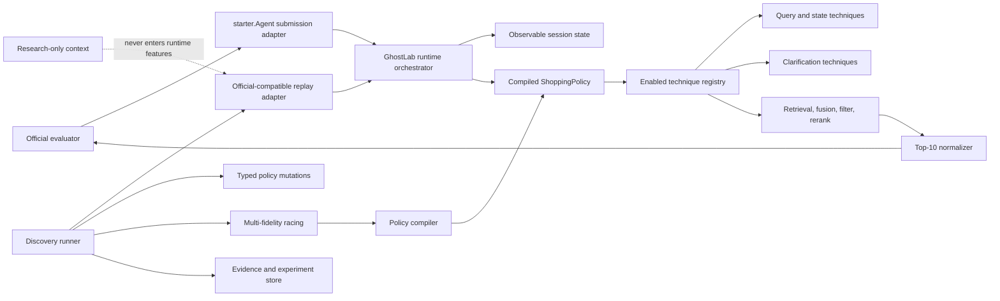

# GhostLab Track 4 Implementation and Phase-Gated Validation Blueprint

**Status:** Proposed engineering blueprint

**Target:** TikTok TechJam 2026, Track 4 Shopping Copilot

**Official repository baseline:** `TechJam2026/techjam-conversational-search` at `9a35be51780ff1caf89eceaabca34259e946f40f`

**Purpose:** Define an implementable, bounded, modular GhostLab system that preserves the official agent contract and proves each technique through controlled validation.

This document extends the ideas in `GhostLab_Track4_Comprehensive_Technical_Specification_Updated.pdf` with concrete implementation boundaries, feature switches, optimisation budgets, validation controls, repository layout, interfaces, cache keys, promotion rules, and kill criteria. It is a plan, not organizer wording, and it does not authorize changes to the official evaluator or data.

## Contents

- [Foundations and official contract](#1-status-labels-and-source-of-truth-order): Sections 1-5
- [Architecture, switches, and runtime](#6-unified-architecture): Sections 6-14
- [Replay, policy optimisation, and anti-overfitting](#15-official-compatible-research-replay): Sections 15-20
- [Phase gates, ablations, statistics, and tests](#21-phase-by-phase-implementation-and-validation): Sections 21-24
- [Operations, risks, decisions, and definition of done](#25-planned-command-line-contracts): Sections 25-34
- [Software engineering and anti-slop standard](#35-software-engineering-and-minimal-code-standard): Section 35

## 1. Status labels and source-of-truth order

Every requirement in this document uses one of these labels:

| Label | Meaning |
|---|---|
| **OFFICIAL** | Required or directly supported by the released participant repository, API schema, evaluator, or submission rules. |
| **CURRENT** | Already implemented or measured in this repository. |
| **PROPOSED** | A GhostLab engineering choice that must be validated. |
| **RESEARCH-ONLY** | May use public labels or simulator internals offline, but must never enter runtime policy features. |
| **OPTIONAL** | Implement only after the preceding phase demonstrates headroom. |
| **FUTURE** | Production extension outside the hackathon submission. |

When sources disagree, use this order:

1. `docs/agent_api_contract.json`
2. `docs/evaluation_config.json`
3. `evaluator/local_evaluator.py` for public-evaluator behavior
4. `docs/competition_specification.md`
5. `docs/submission_rules.md`
6. This blueprint and the attached GhostLab PDF

Implementation intake rule: before changing code for any GhostLab phase, the coding agent must read this complete blueprint and the complete `GhostLab_Track4_Comprehensive_Technical_Specification_Updated.pdf`, then inspect the current official contract/evaluator files named above. It must create a phase checklist mapping requested behavior to the relevant sections, preserve all `OFFICIAL` constraints, and use this blueprint's later, more specific engineering/validation controls where a `PROPOSED` PDF mechanism is underspecified. Neither document authorizes overriding an official contract.

The official evaluator, catalog, public labels, score equations, and simulator semantics must remain untouched for any reported score.

## 2. Executive decision

GhostLab will be built as one modular monolith with two strictly separated modes:

- **Runtime Mode** executes a frozen `ShoppingPolicy` through the official `Agent.reset/respond` contract.
- **Discovery Mode** evaluates typed changes to the same policy using an official-compatible replay environment, bounded multi-fidelity search, paired session rewards, and a prospective holdout gate.

The implementation will not enumerate complete ten-turn conversations. With 11 question choices including `None` and roughly three initial retrieval routes, the naive joint sequence space is about `(11 * 3)^10`, or `1.5e15`, before fusion weights, state rules, filters, and rerankers. GhostLab instead searches compact reusable policy rules and stops at explicit candidate and wall-clock limits.

The initial campaign defaults are:

```yaml
search_budget:
  max_candidates: 500
  max_wall_clock_minutes: 120
  max_f2_evaluations: 15
  max_recorded_finalists: 3
  max_holdout_candidates: 1
  interaction_reserve_fraction: 0.15
  max_interaction_partners_per_new_technique: 5
  max_interaction_order: 3
  return_best_so_far_on_timeout: true
```

These are bounded defaults, not claims of optimality. A run always terminates on convergence, candidate budget, or time budget and returns the best validated candidate seen so far.

## 3. Official competition contract

### 3.1 Objective and data

**OFFICIAL:** Build a multi-turn shopping agent that returns the hidden target product as early and as highly ranked as possible.

- Frozen catalog: 50,000 products from `Clothing_Shoes_and_Jewelry`.
- Public development sessions: 200.
- Private organizer sessions: 800.
- Scored identifier: exact `parent_asin` equality only.
- Maximum turns: 10.
- Scored recommendations: first 10 unique catalog-valid identifiers.
- Catalog is read-only.
- Hidden private intent, target, and simulator state are never runtime inputs.

Public and private scenario proportions are:

| Scenario | Proportion | Public count |
|---|---:|---:|
| Buying | 40% | 80 |
| Browsing | 40% | 80 |
| Intent Override | 15% | 30 |
| Boundary | 5% | 10 |

Participant-visible catalog fields are `parent_asin`, `title`, `features`, `description`, `price`, `categories`, `details`, `average_rating`, `rating_number`, and `store`.

### 3.2 Required runtime API

**OFFICIAL:** `starter/agent.py` must export `Agent` with this behavior:

```python
class Agent:
    def reset(self, session_id: str, user_profile: dict) -> None:
        ...

    def respond(
        self,
        session_id: str,
        user_message: str,
        turn: int,
        top_k: int,
    ) -> dict:
        return {
            "message": "Do you have a material preference?",
            "ask_attribute": "material",
            "recommendations": [{"parent_asin": "B000..."}],
            "usage": {"prompt_tokens": 0, "completion_tokens": 0},
        }
```

Allowed `ask_attribute` values are:

```text
category, material, color, size, style, brand,
budget, feature, use_case, other, null
```

The structured `ask_attribute`, not the prose, drives the simulator response. Asking and recommending can occur in the same turn, and recommendations are scored before the next simulated reply.

### 3.3 Metrics and exact per-session reward

**OFFICIAL:** Aggregate metrics are:

```text
HitRate@10 = successful sessions / N
MRR = mean(1 / target_rank; miss = 0)
MTTC = mean(first_hit_turn; miss = 11)
Efficiency = clip((11 - MTTC) / 10, 0, 1)
TechnicalScore = 0.50 * HitRate@10 + 0.30 * MRR + 0.20 * Efficiency
```

**RESEARCH-ONLY INFERENCE:** Because all components are session means, the exact aligned reward for a successful session at turn `t` and rank `k` is:

```python
reward = 0.50 + 0.30 / k + 0.02 * (11 - t)
```

A miss contributes zero. This reward may be used for paired branch attribution, but official aggregate metrics remain the reporting source of truth.

### 3.4 Submission boundaries

The final submission must:

- Export the required `Agent` entry point.
- Include declared dependencies and setup/reproduction instructions.
- Return valid output without privileged host access.
- Never modify evaluator files or catalog data.
- Never include API keys, private evaluation data, or organizer-only files.
- Document latency, model choice, approximate cost, token usage, and fallbacks.
- Work when network access is disabled, or explicitly disclose that it cannot.

## 4. Current repository evidence

### 4.1 Frozen baseline implementation

**CURRENT:** The repository contains a deliberately small baseline layer:

```text
baseline/agent.py       switchable keyword, dense, hybrid, state on/off
baseline/retrieval.py   organizer BM25 adapter, MiniLM dense retrieval, RRF
baseline/state.py       deterministic state, provenance, no-preference, override
scripts/run_baselines.py
tests/test_baseline.py
artifacts/baseline_results.json
artifacts/baseline_results.md
```

The organizer evaluator and starter remain the reference implementation. The experimental runner injects baseline agents directly; it is not yet the final submission adapter.

### 4.2 Reproduced results on all 200 public sessions

| Variant | Hit@10 | MRR | MTTC | Technical Score |
|---|---:|---:|---:|---:|
| Official keyword reference | 0.125 | 0.068034 | 9.810 | 0.106710 |
| Keyword, current turn | 0.520 | 0.358060 | 6.990 | 0.447618 |
| **Keyword + state** | **0.595** | **0.377867** | **6.375** | **0.503360** |
| Dense, current turn | 0.295 | 0.164768 | 8.690 | 0.243130 |
| Dense + state | 0.340 | 0.146607 | 8.165 | 0.270682 |
| Hybrid RRF, current turn | 0.480 | 0.243167 | 7.115 | 0.390650 |
| Hybrid RRF + state | 0.515 | 0.256236 | 6.795 | 0.418471 |

The baseline v1 reference for future experiments is therefore:

```text
policy_id: baseline_v1_keyword_state
technical_score: 0.503360
```

This baseline must remain reproducible and must not be silently retuned.

### 4.3 Current diagnostic conclusions

- Keyword retrieval is the default route until another route wins on validation.
- State improves keyword retrieval overall, especially Browsing and Intent Override, but currently regresses Buying versus the current-turn keyword variant.
- Dense retrieval is complementary in a small number of sessions but is not strong enough to be the default.
- Equal RRF lets a weaker dense ranking demote strong keyword results.
- Across the current stateful routes, a hindsight route oracle hits 130 sessions versus 119 for keyword + state and has an optimistic Technical Score near `0.560071`. Route selection has headroom, but less than clarification strategy.
- `ask_attribute="other"` is a public-evaluator wildcard for undisclosed constraints. It is legal, powerful, and potentially evaluator-specific; all headline results require a `no_other` ablation.

### 4.4 Catalog and public-set limitations

**CURRENT diagnostic, not runtime knowledge:** Catalog missing values observed in the 50,000-product file include:

| Field | Missing products |
|---|---:|
| Title | 2 |
| Features | 5,219 |
| Description | 23,887 |
| Details | 1,670 |
| Store | 314 |
| Price | 39,473 |

Strict price filtering is therefore unsafe. Structured predicates use `match`, `mismatch`, and `unknown`; unknown products remain eligible unless a validated policy explicitly says otherwise.

The four derived public constraints per session classify approximately as 404 feature, 302 material, 60 color, 19 style, 11 size, and 4 use-case constraints. This explains why a fixed question sequence can waste turns, but this aggregate diagnostic must not be treated as a private-session guarantee.

## 5. Goals and non-goals

### 5.1 Goals

1. Preserve exact official API and evaluator compatibility.
2. Make every technique independently available, enabled/disabled, testable, and attributable.
3. Use one typed `ShoppingPolicy` in research and runtime.
4. Search reusable state-conditioned rules, not memorized session actions.
5. Bound every discovery campaign by candidates, full evaluations, and wall time.
6. Prove optimiser value against manual, grid, and random search at equal budgets.
7. Prevent hidden labels and simulator state from entering runtime features.
8. Compile the winning research policy into a fast, deterministic offline runtime.
9. Compile only techniques with measured value or necessary safety behavior while preserving parked, bounded interaction hypotheses for later evidence-backed retesting.
10. Estimate generalization of the complete adaptive selection procedure with nested grouped validation and one-shot F3 confirmation.
11. Deliver the smallest readable implementation with one execution path, disciplined dependencies, typed boundaries, and behavior-focused tests.

### 5.2 Non-goals

- Modifying the official evaluator, simulator semantics, labels, or catalog.
- Exhaustively enumerating full dialogue sequences.
- Training a foundation model.
- Using private labels at runtime.
- Requiring network access during final scoring.
- Adding a vector cluster, microservices, Kubernetes, a graph database, or distributed workflow engine.
- Building a generic agent framework, dependency-injection framework, experiment platform, or policy language beyond the bounded Track 4 requirements.
- Claiming hybrid retrieval, state, clarification, or reranking alone as the innovation.
- Shipping the research search engine inside the final `Agent`.

## 6. Unified architecture



### 6.1 Competition boundary

`starter/agent.py` is a thin submission adapter. It owns no search logic and imports no research-only module:

```python
class Agent:
    def __init__(self, catalog_path="data/catalog.jsonl"):
        self.runtime = GhostLabRuntime.from_compiled_config(
            catalog_path=catalog_path,
            config_path="configs/compiled_policy.yaml",
        )

    def reset(self, session_id, user_profile):
        self.runtime.reset(session_id, user_profile)

    def respond(self, session_id, user_message, turn, top_k):
        return self.runtime.respond(session_id, user_message, turn, top_k)
```

The production implementation may differ syntactically, but the dependency direction is mandatory:

```text
starter -> runtime -> policy/techniques
research -> runtime
runtime -X-> research
runtime -X-> evaluator internals
```

### 6.2 Runtime/research data firewall

| Runtime-safe | Research-only |
|---|---|
| Session ID | Ground-truth `parent_asin` |
| Current and previous user messages | Hidden/effective intent card |
| Safe aggregate user profile | Simulator behavior object |
| Parsed active/inactive slots | Undisclosed constraint set |
| Asked attributes and outcomes | Future override turn/value |
| Retrieval scores, margins, overlap | Private scenario label |
| Turn and turns remaining | Per-session target-derived oracle features |

Runtime feature builders accept a narrow typed `RuntimeInput`, not a raw public sample dictionary. Tests must fail if target, `intent_card`, `behavior`, or scenario label is supplied to the runtime policy encoder.

## 7. Proposed repository structure

The current baseline remains frozen. GhostLab is added alongside it as a modular monolith:

```text
techjam/
├── pyproject.toml                       # one dependency/tool configuration authority
├── uv.lock                              # committed reproducible resolution
├── starter/
│   └── agent.py                         # OFFICIAL entry point; thin runtime adapter
├── evaluator/                           # OFFICIAL; never edit for reported scores
├── baseline/                            # CURRENT frozen baseline v1
├── ghostlab/
│   ├── competition/
│   │   ├── contract.py                  # local typed mirror of official API
│   │   ├── catalog.py                   # read-only catalog loader and fingerprints
│   │   ├── official_adapter.py          # invokes untouched official evaluation
│   │   ├── replay_env.py                # RESEARCH-ONLY reset/step/snapshot/clone
│   │   └── leakage_guard.py
│   ├── runtime/
│   │   ├── agent.py                     # GhostLabRuntime
│   │   ├── orchestrator.py              # deterministic turn pipeline
│   │   ├── response.py                  # contract-safe response construction
│   │   ├── normalizer.py                # valid unique Top-10 IDs
│   │   └── trace.py
│   ├── policy/
│   │   ├── models.py                    # ShoppingPolicy, JointAction, StateVector
│   │   ├── decision_list.py             # bounded predicate/rule evaluator
│   │   ├── technique_registry.py        # explicit technique ID -> constructor map
│   │   ├── validator.py                 # dependencies and incompatible switches
│   │   ├── canonicalize.py              # stable policy hash and deduplication
│   │   ├── runtime_policy.py
│   │   └── compiler.py
│   ├── techniques/
│   │   ├── query/
│   │   │   ├── current_turn.py
│   │   │   ├── raw_history.py
│   │   │   ├── structured_state.py
│   │   │   └── compressed_state.py
│   │   ├── state/
│   │   │   ├── single_value_slots.py
│   │   │   ├── multi_value_slots.py
│   │   │   ├── negative_evidence.py
│   │   │   ├── provenance.py
│   │   │   └── override_invalidation.py
│   │   ├── clarification/
│   │   │   ├── no_question.py
│   │   │   ├── fixed_sequence.py
│   │   │   ├── missing_attribute.py
│   │   │   ├── uncertainty.py
│   │   │   ├── learned_action_value.py
│   │   │   └── other_action.py
│   │   ├── retrieval/
│   │   │   ├── keyword.py
│   │   │   ├── dense.py
│   │   │   ├── rrf.py
│   │   │   ├── weighted_fusion.py
│   │   │   └── route_selector.py
│   │   ├── filters/
│   │   │   ├── category.py
│   │   │   ├── price.py
│   │   │   └── attributes.py
│   │   ├── ranking/
│   │   │   ├── none.py
│   │   │   ├── linear.py
│   │   │   ├── gbdt.py
│   │   │   └── cross_encoder.py
│   │   ├── profile/
│   │   │   ├── none.py
│   │   │   ├── tags_only.py
│   │   │   └── aggregate_features.py
│   │   └── termination/
│   │       ├── recommend_always.py
│   │       └── turn_aware.py
│   ├── discovery/
│   │   ├── snapshots.py
│   │   ├── branch_runner.py
│   │   ├── mutations.py
│   │   ├── search.py
│   │   ├── racing.py
│   │   ├── allocator.py
│   │   ├── random_search.py
│   │   ├── grid_search.py
│   │   ├── hpo.py
│   │   └── evidence.py
│   └── evaluation/
│       ├── splits.py
│       ├── nested.py                     # complete-procedure outer/inner validation
│       ├── metrics.py
│       ├── paired.py
│       ├── confidence.py
│       ├── confirmatory.py               # frozen F3 analysis contract
│       ├── ablations.py
│       ├── headroom.py
│       └── reports.py
├── configs/
│   ├── techniques/
│   │   ├── baseline_v1.yaml
│   │   ├── manual_strong.yaml
│   │   └── all_available.yaml
│   ├── search/
│   │   ├── smoke.yaml
│   │   ├── standard.yaml
│   │   └── overnight.yaml
│   ├── splits/
│   │   ├── adaptive_v1.json             # routine search can resolve only these IDs
│   │   └── nested_v1.json
│   ├── validation/
│   │   └── primary_analysis.yaml         # frozen before guarded F3 access
│   ├── ablations/
│   │   └── no_dense.yaml
│   └── compiled_policy.yaml
├── scripts/
│   ├── run_baselines.py                 # CURRENT
│   ├── build_indexes.py
│   ├── validate_replay.py
│   ├── run_ablation.py
│   ├── run_discovery.py
│   ├── compare_searchers.py
│   ├── run_nested_validation.py
│   ├── promote_holdout.py
│   ├── compile_policy.py
│   └── run_submission_eval.py
├── tests/
│   ├── unit/
│   ├── contract/
│   ├── replay_parity/
│   ├── leakage/
│   ├── validation_firewall/
│   ├── golden/
│   ├── integration/
│   └── performance/
└── artifacts/
    ├── cache/                            # ignored; content-addressed indexes
    ├── policies/
    ├── experiments/
    ├── traces/
    ├── evidence/
    ├── validation/
    ├── guarded/                          # F3 manifest/access log; unavailable to routine discovery
    └── reports/
```

Simple techniques use one module each. Asset-heavy implementations may become a folder only when they need their own schemas, loaders, or tests. This avoids one-class-per-folder boilerplate while preserving an independent switch and stable technique ID.

## 8. Technique registry and on/off switches

### 8.1 Design rule

Every experimental technique has:

- A stable `technique_id`.
- One explicit registry entry; no implicit filesystem discovery.
- `enabled` and technique-specific configuration.
- Declared dependencies and incompatibilities.
- A deterministic fallback.
- Unit tests and one isolated on/off ablation before promotion.
- A version included in the policy hash and experiment manifest.

`enabled: true` means the technique is available to a policy. It does not mean every turn uses it. For example, keyword and dense may both be enabled while the compiled route selector chooses keyword for a particular state. Disabling dense makes any policy referencing a dense route invalid at static validation time.

### 8.2 Configuration shape

```yaml
policy_version: ghostlab-v1

techniques:
  query:
    current_turn:       {enabled: false}
    raw_history:        {enabled: false}
    structured_state:   {enabled: true}
    compressed_state:   {enabled: false, max_terms_per_slot: 8}

  state:
    multi_value_slots:     {enabled: true}
    negative_evidence:     {enabled: true}
    provenance:            {enabled: true}
    override_invalidation: {enabled: true}

  clarification:
    fixed_sequence:      {enabled: true}
    uncertainty:         {enabled: false}
    learned_action_value: {enabled: false}
    other_action:        {enabled: false}

  retrieval:
    keyword:          {enabled: true, retrieval_k: 200}
    dense:            {enabled: false, retrieval_k: 200}
    rrf:              {enabled: false, rank_constant: 60}
    weighted_fusion:  {enabled: false, sparse_weight: 0.75, dense_weight: 0.25}
    route_selector:   {enabled: false}

  filters:
    category:   {enabled: false, unknown_policy: keep}
    price:      {enabled: false, unknown_policy: keep}
    attributes: {enabled: false, unknown_policy: keep}

  ranking:
    linear:        {enabled: false, rerank_k: 30}
    gbdt:          {enabled: false, rerank_k: 30}
    cross_encoder: {enabled: false, rerank_k: 20}

  profile:
    tags_only:          {enabled: false, weight: 0.10}
    aggregate_features: {enabled: false, weight: 0.05}

  termination:
    recommend_always: {enabled: true}
    turn_aware:       {enabled: false}

runtime:
  default_route: keyword
  top_k: 10
  max_turns: 10
  offline_only: true
  fallback_route: keyword
```

### 8.3 Registry interfaces

The registry is explicit and typed:

```python
TECHNIQUE_REGISTRY = {
    "query.current_turn": CurrentTurnQuery,
    "query.structured_state": StructuredStateQuery,
    "state.multi_value_slots": MultiValueSlotState,
    "clarification.fixed_sequence": FixedSequencePolicy,
    "clarification.learned_action_value": LearnedQuestionPolicy,
    "retrieval.keyword": KeywordRetriever,
    "retrieval.dense": DenseRetriever,
    "retrieval.rrf": RRFFusion,
    "retrieval.weighted_fusion": WeightedFusion,
    "ranking.linear": LinearReranker,
}
```

Techniques implement a family-specific protocol rather than one vague `apply` method:

```python
class QueryStrategy(Protocol):
    def build(self, state: RuntimeState) -> QueryBundle: ...

class Retriever(Protocol):
    def retrieve(self, query: QueryBundle, limit: int) -> RankedCandidates: ...

class FusionStrategy(Protocol):
    def fuse(self, routes: list[RankedCandidates], limit: int) -> RankedCandidates: ...

class ClarificationPolicy(Protocol):
    def select(self, state: StateVector) -> AskAttribute | None: ...

class Reranker(Protocol):
    def rerank(self, state: StateVector, candidates: RankedCandidates) -> RankedCandidates: ...
```

### 8.4 Configuration validation

The policy validator runs before evaluation and compilation. Example rules:

- `rrf` requires at least two enabled retrievers.
- `weighted_fusion` requires normalized route scores or explicit rank-based weighting.
- A dense route requires a locally resolvable encoder and matching embedding metadata.
- A filter must declare `unknown_policy`.
- A learned selector must declare its feature schema hash and model artifact.
- `other_action: false` removes `other` from the legal search action set but not from the official API schema.
- Runtime policies cannot import `ghostlab.discovery` or `ghostlab.competition.replay_env`.
- Compiled policies cannot reference disabled techniques.
- Exactly one deterministic fallback route must be enabled.

### 8.5 Experiment overrides

An experiment never edits the base YAML. It applies a typed `PolicyPatch` and records the resulting canonical policy:

```yaml
patch_id: ablation_no_dense
parent_policy_id: manual_strong_v3
operations:
  - op: set
    path: techniques.retrieval.dense.enabled
    value: false
  - op: set
    path: techniques.retrieval.route_selector.enabled
    value: false
hypothesis: Dense retrieval contributes unique browsing-session hits.
falsification: No positive paired delta or no unique Recall@200 contribution.
```

The canonicalized policy JSON is hashed. Equivalent policies deduplicate before consuming evaluation budget.

### 8.6 Technique lifecycle

Each technique moves through explicit states:

```text
PROPOSED -> AVAILABLE -> ENABLED_IN_EXPERIMENT -> VALIDATED -> COMPILED
                    \-> PARKED_STANDALONE -> INTERACTION_RESERVE
                                             \-> RETEST_AFTER_DEPENDENCY
                    \-> INVALID or RETIRED
```

- **AVAILABLE** means implemented, registered, and tested, but off by default.
- **ENABLED_IN_EXPERIMENT** means selected by one immutable experiment policy.
- **VALIDATED** means its isolated contribution or safety value passed the phase gate.
- **COMPILED** means included in the frozen submission policy.
- **PARKED_STANDALONE** means it did not justify default use alone, but its module, switch, evidence, and interaction eligibility remain available.
- **INTERACTION_RESERVE** means there is a concrete complementarity hypothesis that warrants bounded combination testing.
- **RETEST_AFTER_DEPENDENCY** means a later technique changed the inputs, routing, cost, or failure mode that caused an earlier technique to lose; the earlier technique re-enters evaluation against the new dependency.
- **INVALID** is reserved for contract, leakage, correctness, dependency, or irrecoverable runtime failures. Invalid is the only state that removes a technique from the legal search space until the defect is fixed.
- **RETIRED** preserves an older validated implementation superseded by a better version.

Removing a technique from the winning policy does not delete its code or historical artifacts. Its switch remains available for future ablation and reproduction, matching the requirement that techniques can be restored easily.

A negative standalone result is evidence about one context, not proof that the technique is universally useless. A parked technique may be reactivated when:

- Another technique changes its inputs or failure mode.
- It uniquely rescues sessions missed by the leader.
- It helps a specific observable state family despite a weak global mean.
- A later model/index implementation materially changes its quality or cost.
- A counterfactual or error analysis produces a falsifiable interaction hypothesis.

Reactivation creates a new immutable experiment; it never overwrites the earlier negative result.

## 9. Core typed models

### 9.1 Runtime state

```python
class SlotValue(BaseModel):
    slot_id: str
    attribute: AskAttribute
    value: str
    normalized_value: str
    confidence: float
    source_turn: int
    source_text: str
    provenance: Literal["explicit", "simulator_answer", "inferred", "profile"]
    scope: str | None
    hardness: Literal["hard", "soft", "unknown"]
    active: bool = True
    invalidated_by: str | None = None

class QuestionOutcome(BaseModel):
    turn: int
    attribute: AskAttribute
    outcome: Literal["new_constraint", "no_preference", "override", "unknown"]
    values_added: list[str]

class RuntimeState(BaseModel):
    session_id: str
    turn: int
    turns_remaining: int
    user_profile_features: dict[str, float | str | list[str]]
    messages: list[str]
    slots: list[SlotValue]
    question_history: list[QuestionOutcome]
    invalidated_slot_ids: set[str]
    previous_action: dict | None
```

Multiple compatible values may be active for one attribute. A second feature does not replace the first feature. Replacement requires explicit contradiction, negation, category-scope invalidation, or a policy-directed reparse with recorded provenance.

### 9.2 State vector

The compiled policy receives observable derived features only:

```python
class StateVector(BaseModel):
    turn: int
    turns_remaining: int
    active_slot_counts: dict[str, int]
    missing_attribute_mask: dict[str, bool]
    no_preference_mask: dict[str, bool]
    explicit_override_detected: bool
    last_question_outcome: str | None
    consecutive_unhelpful_questions: int
    query_term_count: int
    keyword_top1_margin: float | None
    dense_top1_margin: float | None
    sparse_dense_top10_overlap: float | None
    candidate_count_after_filters: int | None
    route_latency_ms: dict[str, float]
    profile_features: dict[str, float]
```

Do not use official scenario type at runtime. Buying/Browsing may be represented only as an inferred score derived from observable messages and retrieval signals.

### 9.3 Policy and action

```python
from pydantic import BaseModel, Field

class JointAction(BaseModel):
    ask_attribute: AskAttribute | None
    retrieval_route: Literal["keyword", "dense", "rrf", "weighted_fusion"]
    retrieval_k: int
    sparse_weight: float = 0.0
    dense_weight: float = 0.0
    enabled_filters: list[str] = Field(default_factory=list)
    reranker: Literal["none", "linear", "gbdt", "cross_encoder"] = "none"
    rerank_k: int = 0
    memory_operations: list[str] = Field(default_factory=list)
    response_template: str = "concise"

class ShoppingPolicy(BaseModel):
    policy_id: str
    version: str
    parent_policy_ids: list[str]
    technique_config: dict
    state_encoder: dict
    action_selector: dict
    runtime_budget: dict
    safety: dict
    feature_schema_hash: str
```

The policy selects both clarification and recommendation behavior because the evaluator scores recommendations before generating the next reply.

### 9.4 Minimal executable policy language

`state_encoder` and `action_selector` must not remain unconstrained dictionaries in implementation. The first production representation is a bounded, first-match decision list. It is deliberately less expressive than an arbitrary recursive tree so the search space, runtime, and compiler stay finite and auditable.

```python
Scalar = bool | int | float | str

class Predicate(BaseModel):
    feature: str
    operator: Literal[
        "eq", "ne", "lt", "le", "gt", "ge",
        "contains", "is_missing", "is_not_missing",
    ]
    value: Scalar | None = None

class ActionPatch(BaseModel):
    ask_attribute: AskAttribute | None | Literal["__inherit__"] = "__inherit__"
    retrieval_route: Literal[
        "keyword", "dense", "rrf", "weighted_fusion", "__inherit__"
    ] = "__inherit__"
    retrieval_k: int | Literal["__inherit__"] = "__inherit__"
    sparse_weight: float | Literal["__inherit__"] = "__inherit__"
    dense_weight: float | Literal["__inherit__"] = "__inherit__"
    enabled_filters: tuple[str, ...] | Literal["__inherit__"] = "__inherit__"
    reranker: Literal[
        "none", "linear", "gbdt", "cross_encoder", "__inherit__"
    ] = "__inherit__"
    rerank_k: int | Literal["__inherit__"] = "__inherit__"
    memory_operations: tuple[str, ...] | Literal["__inherit__"] = "__inherit__"

class PolicyRule(BaseModel):
    rule_id: str
    all_conditions: tuple[Predicate, ...]
    action_patch: ActionPatch

class DecisionList(BaseModel):
    rules: tuple[PolicyRule, ...]
    default_action: JointAction
```

Initial grammar and execution rules:

- At most 32 rules and four predicates per rule; these are versioned configuration limits.
- Rules execute in serialized order; the first fully matching rule wins.
- Predicates are pure, side-effect-free, and may reference only canonical scalar paths enumerated by the policy's frozen feature-schema artifact. Map features are expanded over finite official attributes/routes, for example `active_slot_counts.material` and `route_latency_ms.keyword`; arbitrary indexing or attribute traversal is invalid.
- Ordinary comparisons against a missing value return `False`; only `is_missing` and `is_not_missing` inspect missingness.
- Numeric values must be finite. NaN and infinity are policy-schema errors.
- `"__inherit__"` means leave the declared default unchanged; explicit `ask_attribute=None` means ask no question. `ActionPatch` overlays a completely valid declared default action, after which the normal action validator runs.
- No arbitrary Python expressions, callbacks, reflection, `eval`, nested Boolean AST, or source-code mutation are legal policy genes.
- A more expressive tree or learned selector is a separate technique and is introduced only if this decision list leaves measured headroom.
- Canonicalization includes rule order, predicate order, feature schema, grammar version, and declared defaults.

This is the one executable grammar used by manual policies, search mutations, compilation, hashing, tests, and runtime. Adding a new operator or feature requires a schema version change and contract tests.

### 9.5 Ranked-candidate and signal contract

Every retriever returns the same explicit representation:

```python
class RankedCandidate(BaseModel):
    parent_asin: str
    route: Literal["keyword", "dense", "rrf", "weighted_fusion"]
    rank: int                         # one-based, unique within route
    raw_score: float | None           # route-native, higher is better after adapter conversion
    normalized_score: float | None    # finite and in [0, 1]

class RankedCandidates(BaseModel):
    items: tuple[RankedCandidate, ...]
    route: str
    requested_k: int
    elapsed_ms: float
```

Signal semantics are fixed rather than inferred by each technique:

- SQLite FTS5 BM25 values are sign-adjusted at the adapter so larger `raw_score` always means better; dense cosine already uses larger-is-better ordering.
- RRF consumes ranks only and records its reciprocal-rank sum as `raw_score`.
- The initial weighted-fusion normalizer is per-query rank percentile. Score-based min-max or calibrated normalization is a separate switch and must define equal-score behavior.
- Rank-percentile normalization for `n > 1` is `1 - (rank - 1) / (n - 1)`; a one-item result receives `1.0`.
- Top-1 margin is `top1.normalized_score - top2.normalized_score`; it is `None` with fewer than two scored results.
- Sparse/dense Top-10 overlap is Jaccard similarity over product IDs; it is `None` when either route was not probed, and `0.0` when both were probed and have no overlap.
- Disabled, failed, or uncomputed probes produce `None`, never a fabricated zero. Policy rules must explicitly handle missingness.
- Ties use stable `parent_asin` ordering after the route's primary ordering rule.
- No NaN, infinity, duplicate ID, or catalog-invalid ID may cross this boundary.

Only probes named by the compiled feature schema run at inference. Tests cover empty, singleton, tied, failed, disabled, and mismatched-scale routes.

## 10. Runtime implementation

### 10.1 Reset

`reset(session_id, user_profile)` performs only runtime-safe work:

1. Validate the safe aggregate profile schema.
2. Create an empty isolated `RuntimeState` for the session.
3. Store only normalized profile features permitted by the enabled profile technique.
4. Do not reuse state across session IDs.
5. Do not access dataset rows, target labels, or scenario labels.

### 10.2 Turn pipeline

For every `respond` call:

1. Validate `session_id`, `turn`, `top_k`, and message type.
2. Parse explicit constraints, negations, no-preference evidence, and override language.
3. Apply scoped invalidation before adding replacement values.
4. Build query variants from active state.
5. Run only the cheap probes required by the compiled policy feature schema.
6. Produce `StateVector` from observable state and retrieval signals.
7. Select a `JointAction` through the compiled policy.
8. Execute enabled retrieval, filters, fusion, and reranking.
9. Normalize to ordered, unique, catalog-valid IDs and truncate to `top_k`.
10. Generate concise prose consistent with `ask_attribute`.
11. Return non-negative usage values and persist a runtime-safe trace.
12. On any optional-technique failure, use the deterministic keyword fallback.

### 10.3 Recommendation normalizer

The final normalizer is mandatory and not an ablation:

```text
input ranking
-> coerce parent_asin to stripped string
-> remove blank/unknown IDs
-> preserve first occurrence only
-> preserve ranking order
-> truncate to requested top_k (officially 10)
```

### 10.4 Runtime trace

The trace stores:

```text
session_id, turn, policy_id, enabled technique versions,
observable state summary, selected action, query hashes,
route timings, candidate counts, Top-10 IDs, usage, fallback reason
```

It never stores hidden targets, intent cards, undisclosed constraints, or private scenario labels.

## 11. State and query techniques

### 11.1 State variants

Each variant remains independently switchable for ablation:

| Technique | Behavior | Initial status |
|---|---|---|
| `query.current_turn` | Retrieve from latest message only | Baseline comparator |
| `query.raw_history` | Concatenate user messages | Experimental comparator |
| `query.structured_state` | Category plus active slot values | Baseline default |
| `query.compressed_state` | Structured state with discriminative term limits | Proposed |
| `state.single_value_slots` | One active value per attribute | Baseline comparator |
| `state.multi_value_slots` | Multiple compatible values per attribute | Proposed default after validation |
| `state.negative_evidence` | Remember no-preference responses | Proposed default |
| `state.provenance` | Track explicit/simulator/inferred/profile origin | Proposed default |
| `state.override_invalidation` | Deactivate only conflicting scoped slots | Proposed default |

### 11.2 Precedence and invalidation

Initial precedence is:

```text
current explicit statement
> earlier explicit statement
> clarification answer
> inferred value
> profile prior
```

Rules:

- Exact duplicates merge provenance rather than duplicate query terms.
- Compatible feature/material values coexist.
- Explicit `not X`, `ignore X`, or `instead Y` invalidates conflicting values.
- A category change invalidates category-scoped values but retains compatible global budget/recipient information.
- `no preference for material` creates negative evidence and prevents immediate repetition.
- Profile information is always soft and cannot invalidate explicit session state.

### 11.3 Query construction

Query strategies produce a `QueryBundle`, not one uncontrolled string:

```python
class QueryBundle(BaseModel):
    lexical_query: str
    dense_query: str
    exact_terms: list[str]
    category_terms: list[str]
    hard_constraints: list[str]
    soft_preferences: list[str]
    excluded_terms: list[str]
```

The lexical query prioritizes category, explicit hard constraints, recent explicit values, then soft values. It excludes conversational filler and negative-evidence prose. Per-slot term limits prevent one long feature sentence from consuming the starter BM25 query's first 40 unique terms.

The dense query may retain more natural phrasing but must exclude invalidated values and hidden research information.

## 12. Retrieval, filtering, and ranking techniques

### 12.1 Catalog preprocessing

Build immutable, content-addressed assets from the frozen catalog:

- Field-preserving normalized product records.
- Keyword index and document-frequency statistics.
- Dense document embeddings and ordered ID mapping.
- Optional conservative structured indexes.
- Catalog ID set for final validation.
- Metadata quality/missingness report.

Every asset records:

```text
catalog_sha256
preprocessor_version
model_name_and_revision
field_schema_hash
row_count
embedding_dimension
created_by_commit
```

An asset with mismatched metadata is rejected, not silently reused.

### 12.2 Keyword retrieval

The organizer FTS5/BM25 implementation remains the reproducible keyword reference. Proposed keyword improvements are separate techniques:

- Field-weight variants.
- Exact category/brand term boosts.
- Structured-state query construction.
- Optional phrase preservation.
- Conservative spelling/alias normalization.

Any improved keyword method must retain `official_keyword` and `baseline_v1_keyword_state` as comparators.

### 12.3 Dense retrieval

The current reference uses `sentence-transformers/all-MiniLM-L6-v2`, normalized embeddings, and exact NumPy cosine search over 50,000 products.

Proposed dense experiments must isolate:

- Retrieval-trained encoder choice.
- Required query/document prefixes.
- Document field selection and truncation.
- One-vector versus field-vector representations.
- Recall@K and latency before end-to-end score.

Final scoring may have no network. Encoder weights and metadata must be locally available or dense must have a documented keyword fallback.

### 12.4 Fusion and route selection

Available techniques:

```text
rrf:              fixed rank fusion, initial k=60
weighted_fusion:  keyword-favoring normalized or weighted rank fusion
route_selector:   state-conditioned selection among enabled routes
```

Equal RRF is not assumed superior. Search may choose keyword alone. Weighted fusion parameters are tuned only inside an already-promising structural family.

Before route-policy work, report:

- Recall@50/100/200 for each route.
- Unique target coverage by route.
- Route-union oracle headroom.
- Top-10 overlap and rank disagreement.
- Cold and warm latency.

If oracle headroom is small, route-search budget is reduced and clarification/state receives priority.

### 12.5 Structured filters

Filters use tri-state predicates:

```text
MATCH, MISMATCH, UNKNOWN
```

Default behavior is to retain `UNKNOWN`. A hard filter may remove only a confident `MISMATCH` from an explicit current hard constraint and must have an empty-result fallback. Because price is missing for most products, price filtering begins disabled.

### 12.6 Reranking

Reranking is optional and bounded to top `N` candidates. The progression is:

1. No reranker.
2. Deterministic linear feature scorer.
3. GBDT only if enough independent-session evidence exists.
4. Compact cross-encoder only if MRR headroom justifies latency and offline packaging.

An LLM reranker is not part of the initial implementation. Any reranker must report candidate recall before rerank, MRR delta, latency, asset size, and fallback behavior.

## 13. Clarification and termination techniques

### 13.1 Legal action set

The policy may select one allowed attribute or `None`. The default response still returns recommendations on every turn. `clarify_only` is not useful to the official scorer unless separately justified because scoring happens before the reply.

### 13.2 Comparator policies

Keep these simple policies available as switches:

| Policy | Purpose |
|---|---|
| `no_question` | Official-like control |
| `fixed_sequence` | Deterministic manual baseline |
| `missing_attribute` | Ask first unknown attribute |
| `uncertainty` | Ask only above a calibrated uncertainty threshold |
| `learned_action_value` | Compiled GhostLab question policy |
| `other_action` | Legal wildcard, always reported with `no_other` |

### 13.3 Observable question-value signals

- Known and missing attributes.
- Previous question outcomes.
- Consecutive no-preference responses.
- Turns remaining.
- Candidate pool size after safe filters.
- Keyword/dense score margins.
- Sparse/dense overlap.
- Query specificity.
- Explicit override evidence.

The discovery runner estimates action value through deterministic continuation rollouts. Runtime uses the compiled approximation and never branches live.

### 13.4 Turn-aware behavior

- Always provide recommendations.
- Avoid immediately repeating an unhelpful attribute.
- Do not spend late turns on questions with no estimated benefit.
- Preserve `None` as a valid question choice.
- Keep message prose aligned with the structured attribute.

## 14. Safe profile use

Profile techniques start disabled because raw profile text can add lexical noise. Validate in this order:

1. `no_profile`.
2. Controlled preference tags as a weak soft prior.
3. Numeric aggregate features for policy routing.
4. Raw summary only as a negative/control ablation, not a default.

Profile-derived evidence never becomes a hard filter and never overrides an explicit session statement.

## 15. Official-compatible research replay

### 15.1 Purpose

The public evaluator is a monolithic loop, not a clonable environment. Discovery requires a separate **RESEARCH-ONLY** adapter that reproduces public behavior without editing the evaluator.

Required interface:

```python
class ReplayEnvironment(Protocol):
    def reset(self, sample_id: str) -> ReplaySnapshot: ...
    def observe(self) -> RuntimeInput: ...
    def step(self, response: dict) -> ReplayTransition: ...
    def snapshot(self) -> ReplaySnapshot: ...
    def clone(self, snapshot: ReplaySnapshot) -> "ReplayEnvironment": ...
    @property
    def done(self) -> bool: ...
```

### 15.2 Snapshot contents

```python
class ReplaySnapshot(BaseModel):
    sample_id: str
    split_id: str
    turn: int
    runtime_input: RuntimeInput
    disclosed_constraints: frozenset[str]
    boundary_used: bool
    override_applied: bool
    effective_behavior_hash: str
    simulator_state_hash: str
```

The environment may retain research-only target and intent data internally. `observe()` returns only `RuntimeInput`; the policy and runtime orchestrator never receive the snapshot object.

### 15.3 Parity requirement

Before any policy optimisation:

- Run official and replay environments with identical golden policies.
- Compare every initial message, next message, disclosed set transition, override turn, boundary outcome, normalized ranking, hit turn, rank, and aggregate metric.
- Require exact parity on all 150 adaptive sessions plus predeclared contract fixtures across at least the official starter, current keyword-state baseline, a fixed-question policy, and an `other` policy.
- Do not use F3 for replay debugging. Synthetic contract fixtures and the 150 adaptive sessions must establish parity before the one-shot F3 event.
- Repeat twice to prove determinism.
- Treat any mismatch as an infrastructure blocker, not a policy result.

Research replay results are never reported as official results until the same frozen policy reproduces them through the untouched official evaluator.

## 16. Counterfactual attribution

### 16.1 First-action experiment

To measure the value of one decision at state `s`, vary only the first `JointAction`. Every branch then uses the same frozen continuation policy and assets:

```python
for first_action in legal_actions(state):
    branch = replay.clone(snapshot)
    branch.step(runtime.execute(first_action, state))
    while not branch.done:
        next_state = runtime.observe(branch)
        continuation = frozen_policy.act(next_state)
        branch.step(runtime.execute(continuation, next_state))
    record(first_action, branch.session_reward, branch.trace)
```

This result is an `ActionCounterfactual`. It answers which next action was better under a fixed continuation.

### 16.2 Full-policy experiment

A separate `PolicyEvaluation` runs one candidate end to end. It answers whether the whole policy is better. Never attribute a full-policy delta to its first action alone.

### 16.3 Factorized screening

Before a hit, the next simulator reply is driven mainly by `ask_attribute` and disclosed state, while recommendation identity primarily affects termination. Use this structure to reduce cost:

1. Screen clarification transitions with a frozen retrieval continuation.
2. Screen retrieval routes against shared observable states and queries.
3. Evaluate joint question-route combinations only for surviving families.

This factorization is a screening optimisation, not a replacement for final joint official evaluation.

## 17. Bounded policy search

### 17.1 What is searched

GhostLab searches a finite typed policy space:

| Gene family | Structural values | Numeric values |
|---|---|---|
| Query | current, raw history, structured, compressed | term limits, recency weights |
| State | single/multi-value, negative evidence, scoped invalidation | confidence decay |
| Clarification | fixed, missing-first, uncertainty, learned value, `other` allowed | thresholds, cooldown, max asks |
| Retrieval | keyword, dense, RRF, weighted fusion, conditional route | top-k, route/fusion weights |
| Filters | none, category, conservative price, attributes | confidence thresholds |
| Ranking | none, linear, GBDT, cross-encoder | rerank-k, feature weights |
| Profile | none, tags, aggregates | soft-prior weight |
| Termination | recommend always, turn-aware | confidence/turn threshold |

The first campaign excludes cross-encoder, LLM, crossover, and GBDT. They are enabled only after simpler components demonstrate remaining headroom.

### 17.2 Seed population

Initial seeds include:

```text
official_keyword
baseline_v1_keyword_state
keyword_current_turn
dense_state
hybrid_state
no_question
fixed_question_no_other
fixed_question_with_other
query/state specialists
keyword-heavy fusion specialist
browsing route specialist
override memory specialist
```

Every seed has an immutable policy ID and an official-evaluator result.

### 17.3 Typed mutations

A mutation changes one coherent policy choice whenever possible:

```text
enable/disable one technique
replace one technique in a family
change one question rule
add/remove one state condition
change one route condition
change one numeric value within declared bounds
change one memory invalidation rule
change one fallback
```

Invalid mutations are rejected before evaluation. Arbitrary source diffs are not policy mutations.

### 17.4 Canonicalization and deduplication

Before evaluation:

1. Resolve inherited defaults.
2. Remove disabled-technique parameters.
3. Sort mappings and set-like lists.
4. Normalize floats to configured precision.
5. Include technique/model/asset versions.
6. Serialize canonical JSON.
7. Hash it as `policy_hash`.

Previously evaluated hashes reuse their result. Behaviorally identical action traces may also deduplicate after F0, retaining the simpler policy.

### 17.5 Search modes

| Mode | Allocation | Behavior |
|---|---:|---|
| Explore | 35% initially | Underused families, structurally novel rules, broader actions |
| Exploit | 50% initially | Local changes around the current frontier |
| Skeptic | 15% initially | Disable leader features, attack weak scenarios, test `no_other` |

Allocations adapt by evidence but retain at least a 10% exploration floor. These percentages are initial defaults and are recorded in the campaign manifest.

### 17.6 Parent selection and family allocation

Maintain:

- A Pareto frontier over Technical Score, Hit@10, MRR, MTTC, latency, and complexity.
- A diversity reserve for meaningfully different action traces.
- A family ledger with evaluation count and clipped paired delta.

An initial bounded UCB-style family utility is:

```text
utility(family) = mean(clipped_delta)
                + exploration_c * sqrt(log(total_trials + 1) / (family_trials + 1))
```

Initial `exploration_c = 0.05`; deltas are clipped to `[-0.20, 0.20]` so one outlier does not dominate allocation. The allocator is itself validated against uniform and random allocation at an equal candidate budget.

### 17.7 Multi-fidelity schedule

The prospective adaptive pool contains 150 sessions. Initial fidelity defaults are:

| Fidelity | Sessions | Purpose | Maximum candidates reaching level |
|---|---:|---|---:|
| Static | 0 | Contract, dependency, leakage, asset validation | 500 |
| F0 | 16 stratified | Crash/catastrophic screen and behavioral fingerprint | 300 |
| F1 | 60 stratified | Direction, paired delta, search-family evidence | 60 |
| F2 | 150 adaptive | Candidate ranking and robustness | 15 |
| F3 | 50 prospective holdout | One predeclared primary candidate; confirmation only | 1 |

The candidate and time budgets are ceilings. Deduplication and convergence may stop earlier.

The table above describes the final search over all 150 adaptive sessions. During each nested outer fold, F2 means all 120 outer-training sessions, F1 defaults to 48 stratified outer-training sessions, and F0 defaults to 12. Inner-fold validation rows are never added to the training/evidence rows that produced their candidate. Fidelity manifests always record explicit session IDs rather than relying on the names `F0/F1/F2` alone.

### 17.8 Racing decisions

Candidate statuses are:

```text
PROMOTE
REJECT
HOLD_MORE_DATA
NOVELTY_RESERVE
INTERACTION_RESERVE
RETEST_AFTER_DEPENDENCY
INVALID
```

These statuses apply to a candidate policy at a particular fidelity. `REJECT` does not delete or permanently ban every technique inside that candidate. Only an `INVALID` technique implementation is excluded for correctness or safety reasons.

Rules:

**Static**

- `INVALID` on contract, leakage, dependency, asset, or policy-schema failure.

**F0**

- Reject runtime exceptions, invalid IDs, missing deterministic fallback, or catastrophic behavior.
- Promote the top 30% within each sufficiently sampled family by paired mean session reward.
- Preserve up to 10% of F0 capacity for novel action traces.
- Preserve a bounded interaction reserve for candidates built from parked techniques with an explicit complementarity hypothesis.
- Do not make confidence claims from 16 sessions.

**F1**

- Compare against the parent on the same 60 sessions.
- Use paired bootstrap intervals over original sessions, never branch rows.
- `PROMOTE` if mean delta is positive and either the 80% interval excludes zero or the candidate is on the Pareto frontier with a material secondary benefit.
- `HOLD_MORE_DATA` when positive but uncertain and F2 capacity remains.
- `INTERACTION_RESERVE` when standalone mean is weak but session-level wins, scenario specialization, or complementary errors support a specific combination test.
- `REJECT` clear candidate configurations without latency, simplicity, scenario, novelty, or interaction evidence. Their constituent techniques remain available or parked.

**F2**

- Use all 150 adaptive sessions and 5,000 paired bootstrap resamples.
- Record 95% confidence interval, scenario metrics, regressions, complexity, cold/warm latency, and trace diversity.
- A default material delta is `0.02` Technical Score; smaller gains may remain only if confidence and simplicity are compelling.
- Do not promote a candidate with a scenario drop greater than `0.10` on a scenario containing at least 10 adaptive sessions unless the tradeoff is explicitly accepted.
- When two candidates differ by less than `0.01` Technical Score, prefer the simpler and faster policy.

**F3**

- Exactly one frozen primary candidate selected without F3 data.
- One guarded evaluation event against one predeclared strong-manual baseline.
- F3 confirms or rejects the candidate; it never selects among candidates.
- No mutation, HPO, threshold change, fallback substitution, or candidate replacement after viewing results.
- If the declared material gain fails or reverses, no GhostLab winner is promoted and F3 is marked consumed.

Thresholds are declared configuration, versioned, and never changed in response to holdout outcomes.

### 17.9 Interaction and synergy search

Standalone ablation is necessary for attribution but is not the final word. Some techniques are useful only together, such as dense retrieval plus state-conditioned routing, structured state plus query compression, or a reranker plus a higher-recall candidate generator.

Reserve an initial 15% of the adaptive candidate budget for evidence-backed interactions. This reserve is counted inside the same 500-candidate/two-hour ceiling and is drawn from Explore/Skeptic allocation; it never adds an unbounded second campaign. Do not enumerate every combination. Generate an interaction candidate only when at least one condition holds:

- The techniques rescue different sessions or scenarios.
- One technique addresses a measured failure caused by the other.
- Route rankings or error sets have useful disagreement.
- The combination is mechanistically compatible and changes the same decision pipeline coherently.
- A technique lost mainly on efficiency but can be invoked conditionally on a small state slice.
- A later implementation version changes the quality/cost frontier.

Measure interaction relative to the same parent policy `P` with a 2x2 factorial comparison:

```text
P
P + A
P + B
P + A + B

interaction_P(A, B) = score(P+A+B)
                    - score(P+A)
                    - score(P+B)
                    + score(P)
```

Always also compare `P+A+B` directly with `P`, `P+A`, and `P+B`; a positive interaction term does not guarantee a better final policy.

#### 17.9.1 Cross-phase interaction sweep

Phase validation must not be greedy. When a new technique `B` becomes available, the optimiser performs a bounded cross-phase sweep:

```python
anchors = current_frontier + diversity_reserve + [manual_strong]
partners = select_parked_partners(
    new_technique=B,
    max_partners=5,
    evidence=[complementary_errors, unique_rescues, compatible_pipeline_stage],
)

for parent in bounded(anchors):
    evaluate(parent + B)
    for A in partners:
        evaluate(parent + A)       # reuse cache when already measured
        evaluate(parent + A + B)
        record_factorial_interaction(parent, A, B)
```

This explicitly tests the user's important case:

```text
A was slightly worse in an earlier phase
B is introduced later
A+B may outperform B alone and the current leader
```

Partner selection prioritizes:

- Non-overlapping rescued/missed sessions.
- Opposite scenario strengths.
- A known input/output dependency, such as state -> query compression or dense -> route selector.
- A quality/efficiency tradeoff that conditional routing may resolve.
- A previous failure reason that `B` directly addresses.

Every new phase emits a `retest_queue` from the evidence store. Techniques enter `RETEST_AFTER_DEPENDENCY` only with a named dependency and hypothesis; they do not all combine with everything.

#### 17.9.2 Backward ablation of combination winners

When a combination wins, run backward removal before promotion:

```text
winner A+B+C
-> test without A
-> test without B
-> test without C
```

This detects passengers: techniques that were present in the winning combination but did not cause its gain. A technique is compiled only when removing it causes a material quality, robustness, or efficiency regression under the declared evidence standard.

#### 17.9.3 Avoiding path dependence

The frontier keeps multiple diverse parents rather than only the current top scorer. New techniques are tested against:

1. The current score leader.
2. The simplest near-leader.
3. At least one behaviorally diverse policy.
4. The strongest relevant scenario specialist.

This prevents an early phase decision from permanently determining all later combinations.

Search order is bounded:

1. Test each technique alone for attribution.
2. Park weak standalone techniques rather than deleting them.
3. For every new technique, run its bounded cross-phase sweep against at most five parked partners.
4. Select evidence-backed cross-family pairs.
5. Promote a pair only if F1 shows direct or conditional benefit.
6. Test three-way combinations only when at least one validated pair supports them.
7. Backward-ablate every combination winner.
8. Never send arbitrary high-order combinations directly to F2/F3.

Efficiency is one objective, not an automatic deletion rule during research. A slow technique may stay parked or conditional if it improves quality on a narrow state family. It is excluded from the final compiled runtime only when it cannot meet the declared runtime/packaging budget or has no validated conditional value.

### 17.10 Convergence and termination

Stop and return best-so-far when any condition holds:

```text
evaluated candidates >= max_candidates
wall clock >= max_wall_clock_minutes
F2 evaluations >= max_f2_evaluations
no new Pareto-frontier policy for 100 evaluated candidates
no family has positive recent expected gain and exploration/interaction reserves have no eligible candidates
explicit operator cancellation
```

Cancellation writes a consistent checkpoint and never leaves a partially promoted candidate.

### 17.11 Local numeric optimisation

HPO occurs only after a structural family wins at F1. Initial limits:

```yaml
hpo:
  enabled: false
  max_trials_per_family: 50
  max_parallel_trials: 4
  sampler: seeded_tpe_or_random
  objective: paired_mean_session_reward
```

Example bounded parameters:

```text
retrieval_k: {50, 100, 200, 400}
rrf_constant: {10, 30, 60, 90}
sparse_weight: [0.50, 1.00]
dense_weight: [0.00, 0.50]
ask_threshold: [0.30, 0.95]
route_disagreement_threshold: [0.05, 0.80]
rerank_k: {10, 20, 30, 50}
profile_weight: [0.00, 0.20]
```

HPO uses adaptive folds only. It cannot access F3.

### 17.12 Crossover and generated hypotheses

Both begin disabled.

- Crossover is allowed only between compatible typed genes with complementary evidence and no dependency conflict.
- An optional LLM may propose schema-constrained `PolicyPatch` hypotheses offline, but cannot judge them or access holdout results.
- Evidence and official-aligned metrics decide promotion.
- If random typed mutations perform equally well, generated hypotheses are parked and disabled by default; their code and evidence remain reproducible.

## 18. Search-efficiency controls

### 18.1 Cache layers

| Cache | Key includes | Value |
|---|---|---|
| Catalog assets | catalog hash, preprocessor, model revision | indexes, embeddings, ID map |
| Query representation | runtime-state hash, query technique/version | `QueryBundle` |
| Retrieval | query hash, route, technique versions, parameters, top-k | ranked candidates and scores |
| Reranking | state/query hash, candidate hash, reranker version | reranked candidates |
| Replay transition | snapshot hash, response/action fingerprint | next snapshot/message/result |
| Policy evaluation | policy hash, split hash, evaluator version | metrics and traces |

Cache entries are content-addressed and immutable. A code/model/catalog/config version mismatch produces a miss, not stale reuse.

Caches are separated by leakage risk:

- `GLOBAL_SAFE`: catalog parsing, catalog-only embeddings, immutable ID maps, and other artifacts built without session labels.
- `FOLD_LOCAL`: fitted normalizers, selectors, rerankers, policy-evaluation results, and any artifact influenced by outcomes or target labels.
- `RUNTIME_SAFE`: only submission-permitted assets with no research labels or holdout-derived state.

Every fold-local key includes split hash, outer-fold ID, inner-fold ID, training-session hash, label-access scope, seed, and trainer version. A cache hit across incompatible scopes is a hard leakage failure.

### 18.2 Shared assets

Do not instantiate a BM25 database or dense matrix for every candidate. One process-safe immutable asset manager serves candidate workers. Candidate-specific state remains isolated.

### 18.3 Parallelism

The observed development machine is an Apple M5 Pro with 15 logical CPUs and 24 GB RAM. Initial limits:

```yaml
parallelism:
  policy_workers: 6
  dense_workers: 2
  hpo_workers: 4
  avoid_blas_oversubscription: true
```

Benchmark before increasing workers. Dense NumPy/PyTorch operations may already use multiple threads.

### 18.4 Expected runtime

Observed current measurements:

- First dense embedding build: about 4 minutes.
- Dense cache: about 74 MB.
- Seven baseline variants over 200 sessions: about 22 seconds with warm shared caches.

Expected bounded campaigns after implementation:

| Campaign | Budget | Expected range |
|---|---:|---:|
| Smoke | 50-100 candidates | 5-20 minutes |
| Standard | 300-500 candidates | 30 minutes-2 hours |
| Larger + HPO | 1,000+ candidates | 4-12 hours |
| Optional reranker/crossover campaign | Several thousand | 6-24+ hours |

These are planning estimates, not service-level guarantees. Every campaign has a hard time limit and checkpointed best-so-far result.

### 18.5 Cost-normalized optimiser comparison

GhostLab's search strategy must be compared against:

1. Random typed policy sampling.
2. Grid search on a small finite subspace.
3. Beam search without evidence allocation.
4. Full beam/best-first search with family allocation.

Use two complementary comparisons rather than claiming candidate count and wall time are simultaneously identical:

- **Candidate-normalized:** each searcher evaluates the same maximum number of unique policy hashes; report elapsed time.
- **Time-normalized:** each searcher receives the same wall-clock/worker allocation; report unique candidates evaluated.

Use the same fidelity schedule, split, starting seeds, interaction reserve, asset state, and stopping semantics. Report:

```text
best adaptive score found
best prospective holdout score
candidates/time to reach score thresholds
area under best-score-vs-candidates curve
winner stability across seeds
unique policy families explored
```

A sophisticated optimiser is retained only if it finds better validated policies, finds equal policies materially faster, or preserves useful diversity.

Fair timing requires one predeclared cache protocol for all compared searchers:

1. Preferred quality comparison: prebuild identical `GLOBAL_SAFE` assets, clear all searcher-specific evaluation caches, and exclude the one-time shared asset build from every searcher equally.
2. End-to-end comparison: start each searcher from an isolated cold cache and include all build and orchestration time.
3. Randomize or interleave searcher order across seeds so machine warming and background load do not favor one method.
4. Report cold/warm time, cache hit rate, evaluated unique policy hashes, CPU time, and wall time separately.

Never warm one optimizer with candidates or fitted artifacts discovered by another unless all methods receive the identical artifact and that fact is declared.

### 18.6 Campaign-suite accounting

The two-hour limit is per standard search campaign, not a promise that the complete optimizer proof finishes in two hours. Every suite manifest expands its total budget explicitly:

```text
suite_budget = searchers x search_seeds x outer_folds x per_campaign_budget
```

Default scopes:

- Development smoke: one searcher, one seed, no outer-loop claim.
- Standard candidate search: one searcher, one seed, maximum 500 candidates/two hours.
- Optimizer comparison: four searchers and at least three seeds under matched per-run budgets.
- Nested procedure validation: five outer folds; each fold reruns the complete inner search without outer-fold access.
- Stability audit: three fixed optimizer seeds; repeats are reported as repeats and not counted as independent sessions.

The scheduler records planned and consumed candidates, wall time, CPU time, F0/F1/F2 promotions, interaction reserve, HPO trials, cancellations, and cache hits per searcher/seed/fold. The suite also has its own operator-configured wall-clock ceiling and resumable checkpoint. No multiplication of searchers, seeds, or folds is hidden behind a single `max_wall_clock_minutes` value.

## 19. Data splitting and anti-overfitting

Adaptive policy search creates two different overfitting risks:

1. **Model/policy overfitting:** a policy learns quirks of the sessions used to fit it.
2. **Selection-procedure overfitting:** after hundreds of trials, the apparent winner exploits noise in the repeatedly inspected validation criterion.

Ordinary cross-validation of only the already-selected winner does not solve the second problem. Final validation must therefore evaluate the complete `generate -> race -> tune -> select -> compile` procedure on sessions that procedure could not inspect.

### 19.1 Known public-data facts and contamination status

Current read-only audit:

```text
sessions: 200
unique sample_id: 200
unique target parent_asin: 200
scenario mix: 80 buying / 80 browsing / 30 intent_override / 10 boundary
difficulty mix: 80 easy / 90 medium / 30 hard
unique complete profile fingerprints: 125
largest repeated profile fingerprint: 26 sessions
category_bucket: clothing for all 200 sessions
```

All 200 sessions have already contributed to aggregate baseline or diagnostic inspection. Therefore no subset can now be claimed as historically untouched. The 50-session holdout is **prospectively protected from its freeze date**. The private 800-session organizer evaluation remains the only genuinely unseen final sample.

Record in the split manifest:

- Freeze timestamp and git commit.
- Every prior aggregate or session-level public-data access known to the team.
- Exact split-generation code/config and seed.
- Hashes of input dataset and output manifests.
- Whether profiles, targets, scenario labels, difficulty labels, or simulator traces were inspected before freeze.

### 19.2 Primary 150/50 split

Create a deterministic, versioned split by `sample_id`, jointly stratified as closely as counts permit by scenario and difficulty:

```text
adaptive pool: 150 sessions
prospective holdout F3: 50 sessions
```

Scenario allocation:

| Scenario | Adaptive | F3 holdout |
|---|---:|---:|
| Buying | 60 | 20 |
| Browsing | 60 | 20 |
| Intent Override | 22 | 8 |
| Boundary | 8 | 2 |

`category_bucket` cannot stratify this dataset because it is constant. Difficulty balance is optimized inside the scenario allocation and recorded, not silently assumed.

Boundary F3 has only two sessions and cannot support a reliable standalone effectiveness claim. Scenario results remain diagnostic; overall TechnicalScore is the confirmatory endpoint. The private 800-session evaluation is required for strong generalization claims.

### 19.3 Grouping and independence invariants

- All branches, snapshots, action counterfactuals, paraphrases, cached transitions, and derived training rows from one `sample_id` remain in the same split and fold.
- Confidence resampling is over original sessions, never turns, branches, candidates, or counterfactual rows.
- Branch rows are correlated research observations, not additional users.
- Targets are currently unique, but the split builder must group repeated target IDs if a future dataset contains them.
- For profile-enabled techniques, run a secondary sensitivity split that groups identical normalized profile fingerprints. Do not claim profile generalization if performance depends on memorizing a repeated profile template.
- Split manifests store exact sample IDs, group IDs, strata, generator version, and content hash.

### 19.4 Nested validation of the complete search procedure

The primary adaptive-pool estimate uses a predeclared five-fold outer loop. Each outer fold contains approximately 30 sessions and preserves scenario/difficulty balance as closely as integer counts allow.

```text
for each of 5 outer folds:
    outer_train = 120 sessions
    outer_test  = 30 sessions hidden from all search decisions

    run the complete GhostLab search on outer_train only
    use four group-stratified inner folds for mutation/HPO selection
    freeze one fold winner and its compiler
    evaluate it once on outer_test

concatenate the 5 outer-test per-session results -> 150 OOF session results
```

The outer test fold must not influence:

- Candidate or parent generation.
- Evidence-memory claims or family allocation.
- F0/F1/F2 racing.
- Interaction partner selection.
- HPO, thresholds, feature selection, normalization, reranker training, or compilation.
- Early stopping or choice of search seed.

One fixed split seed is the primary nested estimate. Repeat the entire nested procedure with three fixed optimizer seeds for stability; report the repeats separately and never treat overlapping results as 450 independent sessions. A policy family is stable only when its gains, selected techniques, and failure profile are reasonably consistent across outer folds and search seeds.

Nested evaluation estimates the generalization of the **selection procedure**. It is expected to produce different fold winners. After its design and gates are frozen, rerun that approved procedure on all 150 adaptive sessions to produce one final primary policy.

### 19.5 One-candidate, one-shot F3 confirmation

The F3 holdout is not a tournament. Before any F3 score is computed:

1. Select and freeze exactly one primary policy using nested adaptive evidence only.
2. Predeclare `manual_strong` as the sole primary baseline.
3. Predeclare official TechnicalScore as the sole primary endpoint.
4. Predeclare the direction and minimum practically useful delta; initial default `0.02`.
5. Freeze policy, compiler, dependencies, assets, feature schema, seeds, source commit, and analysis script.
6. Run contract, replay, leakage, determinism, runtime, and packaging gates without F3 performance labels.
7. Execute one guarded F3 comparison and mark the holdout consumed.

HitRate@10, MRR, MTTC, scenario metrics, latency, and ablations are secondary/descriptive on F3. Do not select a winner among multiple candidates using F3. Recorded runners-up may be ordered technical fallbacks, but a fallback may replace the primary only for a pre-score contract failure; it cannot replace a primary after its performance is revealed.

After F3 access:

- No policy mutation, HPO, threshold adjustment, feature change, candidate substitution, or recompiled behavior may use its results.
- A failed or reversed gain means no confirmed GhostLab winner; do not tune and retry on the same F3.
- Post-hoc error analysis is allowed only after accepting that F3 is consumed and cannot validate the resulting changes.
- Only the private 800-session evaluation can provide a new clean performance check.

### 19.6 Fold-local fitting and cache firewall

Anything influenced by session labels, targets, rewards, counterfactual outcomes, or validation results is fitted inside the applicable training fold:

- Fusion weights and score calibrators.
- Question-value or route selectors.
- Linear/GBDT/cross-encoder rerankers trained with session outcomes.
- Learned parsers, thresholds, feature selection, and normalizers.
- Evidence allocation, failure clusters, and policy compilation/distillation.

Catalog-only tokenization, indexes, product embeddings, and immutable ID maps may be global because they use no session outcome. Query-result caches may be shared only when their computation is label-free and their keys contain all runtime inputs. Learned or evaluated artifacts are fold-local and use the scope-aware keys in Section 18.1.

Every trainer accepts explicit `train_session_ids`; it must not resolve a global dataset implicitly. Every artifact stores the training-session hash. Tests deliberately attempt cross-fold loading and require rejection.

### 19.7 Exploratory versus confirmatory statistics

F0/F1/F2 racing is exploratory:

- Paired deltas and bootstrap intervals guide allocation but are not final evidence.
- F0 makes no confidence claim.
- F1's 80% interval is a search heuristic.
- F2's 95% interval is descriptive and selection-biased after adaptive candidate search.
- P-values observed during search never become confirmatory by being reported later.

Primary nested out-of-fold reporting and the one-shot F3 comparison use original-session paired rewards. For F3, report:

- Mean paired TechnicalScore contribution delta and a 95% paired bootstrap interval with at least 10,000 deterministic resamples.
- An approximate paired randomization test of the predeclared candidate versus `manual_strong`.
- Raw win/tie/loss counts and the full bounded reward-delta distribution.
- The predeclared practical-effect result independently of statistical significance.

If more than one confirmatory hypothesis is unavoidable, declare the family before access and use Holm correction. Prefer one primary candidate, one baseline, and one primary metric because the sample is small. Do not interpret lack of significance as equivalence; equivalence requires its own predeclared margin and test.

### 19.8 Racing safety diagnostics

Multi-fidelity racing saves compute but does not establish validity. Retrospectively measure:

- F0-to-F1, F1-to-F2, and early-to-outer-test rank correlation.
- False-prune rate: eventual strong candidates removed at a lower fidelity.
- Promotion regret versus evaluating the same bounded candidate set at the next fidelity.
- Survival rate by scenario specialist, interaction candidate, and complexity class.
- Effect of `NOVELTY_RESERVE`, `INTERACTION_RESERVE`, and `HOLD_MORE_DATA` on recovered winners.

Tune fidelity sizes and promotion fractions only on adaptive/nested evidence. Preserve close, novel, or mechanistically complementary candidates when early rank correlation is weak.

### 19.9 Holdout guard and contamination response

`promote_holdout.py` must require:

- Exactly one explicit primary candidate ID and one explicit baseline ID.
- Clean working tree or recorded commit hash.
- Frozen policy/compiler/artifact hashes and primary analysis manifest.
- Passing contract, replay, leakage, determinism, runtime, and packaging tests.
- Proof that the candidate was selected without importing the F3 manifest.
- Human confirmation of the one-time gate.
- Append-only access log written before and after evaluation.
- Refusal when an access record already exists, except a documented infrastructure failure that revealed no performance result.

Routine discovery, dashboards, notebooks, test collection, and cache builders cannot import, enumerate, or resolve the F3 manifest. CI uses synthetic fixtures rather than F3. A parity audit never needs F3 labels or metrics.

If F3 results leak before the primary is frozen, mark F3 contaminated in the manifest. Do not invent a replacement split from sessions already adaptively inspected and call it pristine; report the limitation and rely on nested estimates plus the private evaluation.

## 20. Evidence and experiment storage

### 20.1 Experiment manifest

Every run stores:

```yaml
experiment_id: exp_...
created_at_utc: ...
git_commit: ...
catalog_sha256: ...
dataset_sha256: ...
split_hash: ...
evaluator_version: ...
policy_id: ...
policy_hash: ...
parent_policy_ids: [...]
patch_id: ...
searcher: beam|random|grid|manual
seed: ...
fidelity: F0|F1|F2|F3
session_ids_hash: ...
enabled_techniques: {...}
asset_versions: {...}
budget: {...}
latency_context: cold|warm
result_artifacts: [...]
```

### 20.2 Evidence record

```python
class EvidenceRecord(BaseModel):
    evidence_id: str
    policy_id: str
    parent_policy_ids: list[str]
    technique_ids: list[str]
    kind: Literal["positive", "negative", "failure", "ablation", "interaction"]
    claim: str
    conditions: dict
    sample_ids: list[str]
    paired_delta_score: float | None
    paired_delta_hit: float | None
    paired_delta_mrr: float | None
    paired_delta_mttc: float | None
    factorial_interaction_delta: float | None
    confidence_interval: tuple[float, float] | None
    retest_trigger: str | None
    trace_refs: list[str]
    decision: str
    reason: str
```

Evidence may influence future candidate allocation only when its conditions match. A browsing-specific win is not promoted as a universal rule.

### 20.3 Storage

- SQLite for policy, experiment, metric, evidence, and promotion metadata.
- JSON/YAML for policies and manifests.
- Compressed JSONL or Parquet for large traces.
- NPY plus JSON metadata for dense embeddings.
- No graph database is needed.

## 21. Phase-by-phase implementation and validation

Each phase changes one coherent capability, produces a reproducible report, and ends with a `PROMOTE`, `PARK`, `INTERACTION_RESERVE`, `RETEST_AFTER_DEPENDENCY`, or `INVALID` decision. A phase may implement infrastructure without increasing score; its exit criterion must then be correctness or parity, not a fabricated metric gain.

Phase gates control default activation and search budget; they do not erase ideas. A technique that loses alone remains switchable and may enter later bounded combination tests when evidence suggests synergy. Only contract, leakage, correctness, or unrecoverable dependency failures mark an implementation `INVALID`.

### Phase 0 - Freeze and reproduce the official reference

**Status:** Complete.

Deliverables:

- Official commit and release checksums in `configs/integrity/official_v1.json`.
- Frozen catalog/public-set and official-contract fingerprints.
- Immutable weak starter reference at `baseline/official_reference.py`, independent of the future `starter.Agent` adapter.
- Exact official starter metrics and protected-file verification through `python -m scripts.verify_phase0`.
- Machine-readable result at `artifacts/phase0_verification.json`.

Exit criterion:

```text
Hit@10 0.125000
MRR 0.068034
MTTC 9.810000
Technical Score 0.106710
```

### Phase 1 - Freeze baseline v1 component matrix

**Status:** Complete.

Switches:

```text
retrieval: keyword | dense | fixed RRF
state: off | on
```

Deliverables:

- Seven-row baseline table.
- Scenario results.
- Unit tests for RRF, state parsing, override, no preference, and response contract.
- Repeated identical metrics.

Decision:

- Freeze `baseline_v1_keyword_state` at `0.503360`.
- Do not assume dense or hybrid is better.

### Phase 2 - Technique registry and submission adapter

Implement:

- Typed configuration loader.
- Explicit registry.
- Dependency/incompatibility validation.
- `starter.Agent -> GhostLabRuntime` adapter.
- Deterministic fallback and response normalizer.

Validation:

- Every technique can be toggled without editing code.
- Disabled techniques are not initialized and consume no model/assets.
- Baseline v1 through the adapter exactly matches the frozen result.
- Official contract and malformed-output tests pass.

Exit criterion: adapter parity and no evaluator/data modifications. No score gain is required.

### Phase 3 - Retrieval diagnostics and strong manual retrieval

Implement/compare:

- Current keyword reference.
- Field-aware keyword variants.
- Current MiniLM dense reference.
- At most one retrieval-trained dense model initially.
- Fixed RRF and keyword-heavy weighted fusion.
- Candidate retrieval at `K={50,100,200}`.

Validation:

- Target Recall@50/100/200 by route and scenario.
- Route-only unique coverage and union oracle.
- Top-10 overlap/disagreement.
- Field ablations: title, category, features, details, description, store.
- Cold/warm latency and local asset size.
- Offline/no-network startup.

Gate:

- Retain a route only if it adds unique candidate recall or improves paired end-to-end metrics within its latency budget.
- If dense has little standalone headroom, keep it available but disabled by default and retain it for conditional-routing or future-encoder interaction tests.

### Phase 4 - State hardening

Implement/compare independently:

```text
current turn
raw history
structured single-value state
structured multi-value state
compressed structured state
negative evidence off/on
provenance off/on
override invalidation off/on
```

Golden conversations:

- Multiple compatible features remain active.
- `black -> navy` invalidates only black.
- `bags -> shoes` invalidates bag-scoped attributes.
- Compatible budget/recipient state survives a category override.
- No-preference evidence prevents immediate repeated questions.
- Profile priors never override explicit statements.
- Paraphrased messages do not silently retain contradictory state.

Gate:

- Require overall paired benefit or a material Intent Override/Boundary improvement without an unacceptable Buying regression.
- Keep provenance and leakage protections even if score-neutral when required for correctness and auditing.

### Phase 5 - Manual clarification and termination baselines

Compare:

```text
no question
fixed sequence
missing-attribute priority
feature-first/manual data-informed sequence
uncertainty threshold
other always
same policies with other disabled
recommend always vs any proposed confidence gate
```

Validation:

- Question outcome distribution by attribute.
- Information disclosed per question.
- MTTC and Hit@10 tradeoff.
- Repeated/no-preference behavior.
- Late-turn question value.
- `with_other` and `no_other` tables.

Gate: establish `manual_strong` as the strongest simple policy on adaptive cross-validation, not merely all-public score.

### Phase 6 - Replay environment and leakage firewall

Implement:

- `reset`, `observe`, `step`, `snapshot`, and `clone`.
- Research-only simulator context.
- Narrow runtime input conversion.
- Per-session aligned reward.

Validation:

- Exact turn-by-turn replay parity on the adaptive sessions and predeclared fixtures for multiple golden policies.
- No F3 import, enumeration, trace, or parity access.
- Repeat determinism.
- Snapshot clone independence.
- Leakage sentinel tests that fail on forbidden fields.
- Official-evaluator confirmation after replay evaluation.

Gate: 100% transition and metric parity. No policy search begins before this passes.

### Phase 7 - Counterfactual action evaluator

Implement:

- First-action branches with a frozen continuation.
- Separate end-to-end policy evaluation.
- State/action/reward trace schema.
- Memoized transition and retrieval caches.

Validation:

- Synthetic cases with analytically known best next action.
- Repeated branch rewards are identical.
- First-action attribution is unaffected by candidate ordering.
- Action oracle and regret can be computed without entering runtime features.

Gate: recover all known synthetic optima and reproduce hand-calculated rewards.

### Phase 8 - Bounded optimiser

Implement:

- Typed mutations.
- Canonical policy hash/deduplication.
- Beam/best-first frontier.
- F0/F1/F2 racing.
- Evidence store.
- Compatibility/complementarity graph and cross-phase `retest_queue`.
- Bounded 2x2 factorial interaction sweeps and backward ablation.
- Checkpoint/resume and hard budget termination.

Run equal-budget controls:

```text
random search
small grid search
beam without allocator
full allocator search
```

Run each stochastic search with at least three seeds for the initial proof and five seeds for the final optimizer claim.

Validation:

- Best-score-versus-candidates curve.
- Time-to-score thresholds.
- Five-fold nested outer-test score of the complete search-and-selection procedure; Phase 8 cannot access F3.
- Winner/policy-family stability.
- Search overhead, cache hit rate, and failure rate.
- F0/F1 false-prune rate, promotion regret, and early-to-late rank correlation.
- Behavior diversity, not only configuration diversity.
- Recovery of a synthetic case where a standalone loser becomes part of the best combination.
- Verification that each new technique is tested against bounded leader, simple, diverse, specialist, and parked-partner anchors.

Gate: compile the advanced allocator as the default searcher only if it beats equal-budget random/uniform search in quality, time, or stable diversity. Otherwise park it, preserve its evidence, and keep random/beam as the active searcher.

### Phase 9 - State-conditioned question policy

Build an action-value dataset from counterfactual outcomes using adaptive sessions only. Candidate compiled forms, in order:

1. Decision table.
2. Depth-limited decision tree.
3. Linear/logistic action scorer.
4. GBDT only if simpler forms leave validated headroom.

Validation:

- Group-aware cross-fitting by original session.
- Feature ablations.
- Maximum tree depth/leaf count.
- Oracle regret by state family.
- Manual versus learned policy.
- `no_other` learned policy.

Gate: positive out-of-fold paired delta versus `manual_strong`, stable across folds and seeds.

### Phase 10 - State-conditioned retrieval/ranking policy

Only after Phase 3 demonstrates route headroom:

- Compare global keyword, global weighted hybrid, and state-conditioned routing.
- Add reranking only when candidate Recall@K is already strong and MRR is the bottleneck.
- Screen question and route decisions separately, then test joint policies.

Validation:

- Retrieval-route oracle gap.
- Route confusion/regret by observable state family.
- Unique rescued sessions.
- Interaction ablation: learned questions only, learned route only, both.
- Latency and asset penalties.

Gate: retain learned routing only if it closes meaningful oracle gap and survives prospective validation.

### Phase 11 - Optional evidence allocation, HPO, crossover, and reranking

Enable one at a time:

- Evidence-aware family allocator versus uniform allocation.
- Structural policy versus structural + HPO.
- No crossover versus compatible crossover.
- No reranker versus linear, GBDT, or compact cross-encoder.

All comparisons use matched evaluation budgets. A component that improves only the public adaptive score is not compiled into the final runtime, but it remains parked and switchable for future interaction or upgraded-implementation tests.

### Phase 12 - Compilation, packaging, and final gate

Implement:

- Compile winner to deterministic YAML/JSON plus optional small local model.
- Thin `starter.Agent` adapter.
- Offline assets and fallback.
- Submission manifest and reproduction instructions.

Validation:

- Research-policy versus compiled-policy action parity on a replay suite.
- Official evaluator parity for the same policy.
- Cold-start latency, warm-turn latency, peak memory, disk size.
- Network-disabled execution.
- Missing/corrupt optional asset fallback.
- Clean environment installation.
- No import from research modules in the submission dependency graph.

Select one primary from nested adaptive evidence, compile and freeze it, then run F3 once as a confirmation rather than a selection tournament. Run the untouched official public evaluator for the frozen final report and await private evaluation. Any post-F3 change is unconfirmed until the private evaluation.

## 22. Complete ablation matrix

### 22.1 Mandatory component ablations

| ID | Parent | Change | Primary question |
|---|---|---|---|
| A00 | Official starter | None | Can the published baseline be reproduced? |
| A01 | Keyword current-turn | Enable structured state | Does session state help? |
| A02 | Keyword state | Replace keyword with dense | Does semantic retrieval help alone? |
| A03 | Keyword state | Enable fixed RRF | Does equal hybrid help? |
| A04 | Hybrid state | Disable dense | What does dense contribute? |
| A05 | Hybrid state | Disable keyword | What does sparse contribute? |
| A06 | Structured state | Use raw history | Is structured memory better than concatenation? |
| A07 | Single-value state | Enable multi-value slots | Does preserving compatible constraints help? |
| A08 | Full state | Disable negative evidence | Does no-preference memory help? |
| A09 | Full state | Disable override invalidation | Does explicit conflict handling help? |
| A10 | Manual questions | Disable all questions | What does clarification contribute? |
| A11 | Manual questions | Enable `other` | How much comes from wildcard disclosure? |
| A12 | Learned questions | Disable `other` | Does policy discovery generalize beyond wildcard behavior? |
| A13 | Full policy | Disable profile | Does safe personalization help? |
| A14 | Full policy | Disable reranker | Is reranking necessary? |
| A15 | Full policy | Disable state-conditioned route | Does conditional routing help? |
| A16 | Research policy | Compile | Does runtime simplification preserve gain? |

### 22.2 Optimiser ablations missing from the original mandatory list

| ID | Comparison | Proof required |
|---|---|---|
| O01 | Random vs beam, equal candidates/time | Beam finds better or equal policies faster |
| O02 | Uniform vs evidence allocator | Evidence allocation improves sample efficiency |
| O03 | Single seed vs 3-5 seeds | Winner family and gain are stable |
| O04 | Full search vs small exact synthetic grid | Search recovers known optimum |
| O05 | Structural search vs structural + HPO | Numeric tuning adds validated value |
| O06 | No novelty reserve vs reserve | Reserve prevents premature convergence usefully |
| O07 | Policy complexity levels | Added complexity earns its cost |
| O08 | Adaptive winner vs prospective holdout | Search gain generalizes |
| O09 | Standalone loser vs evidence-backed combination | Parked techniques can be reactivated when interaction benefit is plausible |

### 22.3 Retrieval and robustness diagnostics

| ID | Test | Purpose |
|---|---|---|
| R01 | Recall@50/100/200 | Separate candidate generation from ranking failure |
| R02 | Route union/oracle | Quantify maximum routing headroom |
| R03 | Catalog field removal | Identify useful/noisy product fields |
| R04 | Missing price/details/features | Prevent unsafe filters |
| R05 | Paraphrased user templates | Detect parser wording overfit |
| R06 | Cold/warm runtime | Distinguish cache diagnostics from deploy latency |
| R07 | Network disabled | Prove official-environment viability |
| R08 | Corrupt optional asset | Prove deterministic fallback |

## 23. Statistical reporting

### 23.1 Paired comparisons

All candidates are compared on the same session IDs as their parent. Store raw per-session rewards and deltas:

```text
delta_i = reward(candidate, session_i) - reward(parent, session_i)
```

Report:

- Mean paired reward delta.
- Median and distribution of deltas.
- Win/tie/loss session counts.
- Paired bootstrap interval.
- Overall official metrics.
- Scenario metrics.
- Regressed/rescued session lists in research artifacts.

### 23.2 Confidence limits

- Bootstrap original sessions, not turns or branches.
- F0 is screening only.
- F1 may use an 80% interval for racing, clearly labeled non-final.
- F2 uses a 95% interval with at least 5,000 deterministic resamples, labeled descriptive and selection-biased after adaptive search.
- Primary nested out-of-fold and F3 reports use 95% intervals; F3 uses at least 10,000 deterministic paired resamples plus the predeclared paired randomization test.
- Avoid declaring changes around `0.005` meaningful without stable paired evidence.
- Scenario intervals with tiny counts are descriptive, not decisive.

### 23.3 Complexity and runtime tie-breaks

Official Technical Score is never altered. Complexity is a selection tie-breaker reported separately:

```text
technique count
rule/tree node count
model/asset size
cold-start milliseconds
warm p50/p95 milliseconds
peak resident memory
external calls and token usage
```

When adaptive scores differ by less than the configured `0.01` tie band, prefer the simpler/faster candidate unless paired confidence clearly favors the complex one.

## 24. Testing strategy

### 24.1 Unit tests

- Slot normalization, multi-value coexistence, contradiction, scope, provenance, and no preference.
- Query construction and term-budget priority.
- Score normalization, RRF, weighted fusion, filters, and normalizer.
- Policy parsing, canonicalization, hashing, dependency validation, and mutation application.
- Reward equation and metric aggregation.
- Cache key completeness.

### 24.2 Official contract tests

- `reset/respond` signatures.
- Allowed `ask_attribute` or `None`.
- String `message`.
- Ordered catalog-valid unique IDs.
- Top-k compliance.
- Non-negative usage.
- Exception fallback.
- Session isolation.

### 24.3 Replay parity tests

- Initial messages.
- Every clarification reply type.
- Boundary no-preference behavior.
- Intent Override timing and non-conversion before override.
- Disclosed-set updates.
- Hit-before-reply ordering.
- Exact final session and aggregate metrics.

### 24.4 Leakage tests

- Runtime constructors reject raw samples containing research-only fields.
- Policy feature schemas contain no forbidden names.
- Learned model training records feature schema hash.
- Serialization and traces omit targets and hidden intent.
- Submission dependency graph excludes research modules.

### 24.5 Golden and robustness tests

- Buying hard constraint.
- Vague browsing.
- Attribute and category overrides.
- Boundary no preference.
- Multiple values for one attribute.
- Missing metadata and empty filter result.
- Duplicate and invalid identifiers.
- Paraphrased templates.
- Missing model/index and network unavailable.

### 24.6 Optimiser tests

- Known synthetic optimum.
- Budget/time stop.
- Checkpoint/resume equivalence.
- Deterministic seeded search.
- Deduplication.
- Novelty reserve.
- Park/reactivate lifecycle and bounded interaction reserve.
- Pairwise interaction scoring and prevention of unsupported high-order combinations.
- Equal-budget random/grid comparator.
- No holdout path access.

### 24.7 Validation-firewall tests

- Every branch derived from one `sample_id` has the same split and fold.
- Outer-test IDs are rejected by inner search, training, evidence, mutation, HPO, compiler, and early-stopping APIs.
- Every learned artifact records exactly the expected training-session hash.
- Global-safe cache accepts catalog-only assets and rejects outcome-derived artifacts.
- Fold-local cache rejects a mismatched split, fold, training-session hash, seed, or label scope.
- Nested-validation fixture evaluates each session only through an outer-fold policy that never saw it.
- Repeated profile fingerprints remain grouped in the profile sensitivity split.
- F3 manifest cannot be imported by ordinary modules, tests, dashboards, notebooks, or discovery CLIs.
- Holdout command accepts exactly one candidate and refuses a second completed access.
- F2 reports are marked exploratory/selection-biased and cannot be serialized as confirmatory results.
- Confirmatory analysis matches the pre-access manifest and fails on an undeclared metric, baseline, or test.

### 24.8 CI tiers

```text
Per change:       lint, type, unit, contract, leakage
Local integration: replay fixtures, adapter baseline parity
Nightly/manual:   full 200-session official baselines and F0 search smoke
Guarded:          nested adaptive campaigns and one-shot prospective holdout
```

The official evaluator is invoked as a subprocess or stable adapter and checked for an unchanged source hash before reporting results.

## 25. Planned command-line contracts

Commands are future interfaces defined here for implementation consistency:

```bash
# Reproduce frozen baseline matrix
uv run python -m scripts.run_baselines

# Build/fingerprint local immutable assets
uv run python -m scripts.build_indexes \
  --catalog data/catalog.jsonl \
  --config configs/techniques/all_available.yaml

# Prove replay parity before discovery
uv run python -m scripts.validate_replay \
  --dataset data/public_set.jsonl \
  --policies official_keyword baseline_v1_keyword_state fixed_question other_action

# Run one controlled ablation
uv run python -m scripts.run_ablation \
  --parent configs/techniques/manual_strong.yaml \
  --patch configs/ablations/no_dense.yaml \
  --split adaptive

# Smoke campaign
uv run python -m scripts.run_discovery \
  --config configs/search/smoke.yaml \
  --split configs/splits/adaptive_v1.json

# Standard bounded campaign; returns best-so-far on timeout
uv run python -m scripts.run_discovery \
  --config configs/search/standard.yaml \
  --max-candidates 500 \
  --max-minutes 120 \
  --resume

# Equal-budget optimiser comparison
uv run python -m scripts.compare_searchers \
  --searchers random grid beam allocated \
  --protocols candidate_normalized time_normalized \
  --candidate-budget 500 \
  --max-minutes 120 \
  --seeds 3

# Validate the complete search-and-selection procedure without F3
uv run python -m scripts.run_nested_validation \
  --config configs/search/standard.yaml \
  --split configs/splits/nested_v1.json \
  --outer-folds 5 \
  --inner-folds 4 \
  --search-seeds 3

# Compile and freeze the one primary selected from nested evidence
uv run python -m scripts.compile_policy \
  --policy cand_0068 \
  --output configs/compiled_policy.yaml

# Guarded one-time F3 confirmation
uv run python -m scripts.promote_holdout \
  --candidate cand_0068 \
  --baseline manual_strong_v1 \
  --compiled configs/compiled_policy.yaml \
  --primary-metric technical_score \
  --minimum-delta 0.02 \
  --analysis configs/validation/primary_analysis.yaml \
  --split artifacts/guarded/f3_v1.json

# Run final Agent through untouched official evaluator
uv run python -m scripts.run_submission_eval \
  --output artifacts/reports/final_public.json
```

Every command writes a manifest before work begins and updates status atomically on completion/failure. `--resume` accepts only a compatible code/config/data fingerprint.

## 26. Observability and reports

### 26.1 Campaign dashboard/report data

The research report is generated from artifacts and includes:

- Candidates created/evaluated/rejected/promoted/held.
- Best score versus candidate count and wall time.
- Family allocations over time.
- Cache hit/miss rates.
- Failure and invalid-policy counts.
- Pareto frontier.
- Parent/child lineage.
- Overall and scenario deltas.
- `no_other` comparison.
- Searcher comparison across seeds.
- Nested outer-fold results and search-procedure stability.
- Fidelity rank correlation, false-prune rate, and promotion regret.
- Split/fold/cache scope and label-access audit.
- Holdout access count.
- Compilation parity.

The viewer must not invent metrics or maintain a separate state store.

### 26.2 Required tables for the final report

1. Official weak baseline reproduction.
2. Baseline component matrix.
3. Strong manual baseline.
4. GhostLab clarification-only improvement.
5. GhostLab routing-only improvement.
6. Full GhostLab.
7. `no_other` ablation.
8. Random/grid/beam/allocator equal-budget search.
9. Research versus compiled runtime.
10. Adaptive in-sample, nested out-of-fold, and one-shot F3 results, with selection-bias labels.
11. Scenario metrics, latency, memory, assets, token/cost disclosure.
12. Code-quality delta: dependencies, public contracts, tests, parity, and justified complexity.

## 27. Security, privacy, and integrity

- API keys only through environment variables; never commit them or log values.
- Catalog and official data are read-only inputs.
- Derived assets live under ignored content-addressed cache paths.
- Runtime never sees target, intent card, simulator behavior, disclosed-set internals, or private scenario label.
- Research traces containing public targets remain local research artifacts and are excluded from submission unless clearly permissible and necessary.
- External services receive only minimum runtime-safe text, never research labels.
- Final runtime has a network-free fallback and ideally requires no external service.
- Validate all returned IDs against the catalog.
- Use fixed seeds and fingerprints for reproducibility.
- Log holdout access append-only.
- Do not claim online learning or learning from private evaluation.

## 28. Performance and packaging budgets

Initial runtime budgets are explicit configuration:

```yaml
runtime_budget:
  cold_start_seconds: 30
  warm_turn_p95_ms: 500
  peak_memory_mb: 4096
  local_asset_mb: 500
  external_calls_per_turn: 0
  deterministic_fallback: keyword
```

These are team targets, not organizer-published limits. Tighten them after the organizer publishes actual constraints.

Packaging checks:

- Clean environment installation from the declared lock/requirements.
- Model and indexes resolve locally.
- No user-specific absolute paths.
- No undeclared service.
- No private or ignored data accidentally included.
- `starter.Agent` initializes exactly once per evaluator process where possible.
- Shared immutable assets are memory-mapped or loaded once.
- Dense/model failure falls back to keyword without invalid output.

## 29. Risk and mitigation ledger

| Risk | Evidence/trigger | Mitigation | Kill/demote condition |
|---|---|---|---|
| Public overfitting | Nested gain is unstable or F3 reverses | Nested grouped procedure validation, one frozen F3 candidate, complexity tie-break | No headline GhostLab claim; F3 remains consumed |
| `other` shortcut dominates | Gain disappears in `no_other` | Separate action, mandatory ablation | Present as simulator optimisation only |
| Dense weakens keyword | Hybrid below keyword, low unique recall | Keyword default, conditional/weighted fusion | Park dense as standalone; retain conditional/future-model tests |
| State pollution | Buying regression, stale slots | Multi-value state, scoped invalidation, compressed query | Park failing state variant; preserve corrected variants and evidence |
| Missing metadata | Price/details absent | Tri-state filters, unknown=keep | Disable unsafe filter |
| Replay drift | Any transition mismatch | Golden parity against untouched evaluator | Block discovery |
| Fold/cache leakage | Artifact train hash or scope mismatches | Explicit train IDs, fold-local artifacts, hostile leakage tests | Invalidate affected experiments and rebuild |
| Selection-procedure overfit | F2 gain exceeds nested OOF or winner family changes by fold | Nested complete-procedure evaluation and simpler policy tie-break | Do not make generalization claim |
| Holdout becomes a tournament | Multiple candidates or repeated F3 access | One predeclared primary, append-only guard, single endpoint | Mark F3 contaminated/consumed |
| Search does not beat random | Equal-budget curves overlap | Simplify to random/grid or manual search | Park allocator as default; preserve implementation and evidence |
| Winner instability | Different families win across seeds | More evidence, simpler policy, stability report | Do not promote brittle rule |
| Candidate explosion | Low cache hits, deadline pressure | Typed mutations, dedupe, F0 racing, hard budgets | Return best-so-far |
| Runtime packaging fails | Model download/network required | Bundle permitted local assets, keyword fallback | Disable technique |
| Reranker latency | MRR gain small vs p95/asset cost | Bounded top-N, linear first, conditional invocation | Park from runtime default; retain bounded interaction tests |
| Profile noise/privacy | No gain or regressions | Tags/aggregates only, soft weight | Keep profile off |
| Compiler loses gain | Action/score parity fails | Simpler representation or bounded model | Ship research-equivalent safe policy or demote compiler story |
| Scope expansion | Phases added without prior gate | Phase exit criteria and decision ledger | Stop optional work |
| AI-generated overengineering | More layers/dependencies without deleted complexity or measured need | Section 35 admission test, small changes, direct alternative review | Rewrite to smallest equivalent implementation |
| Quality theater | Green checks caused by weak tests/global ignores | Negative fixtures, narrow ignores, behavior review | Gate remains failed |

## 30. Technique decision ledger

Use one row per technique and update only from reproducible artifacts:

| Technique ID | Default | Phase | Required evidence | Initial disposition |
|---|---:|---:|---|---|
| `retrieval.keyword` | On | 1 | Reproduced and strongest clean baseline | Keep |
| `retrieval.dense` | Off | 3 | Unique Recall@K and validated route benefit | Test |
| `retrieval.rrf` | Off | 3 | Beats keyword or useful conditional slice | Test |
| `retrieval.weighted_fusion` | Off | 3/10 | Paired gain on adaptive and prospective | Test |
| `state.multi_value_slots` | Off until Phase 4 | 4 | Removes same-attribute overwrite regressions | Test |
| `state.negative_evidence` | On candidate | 4 | Boundary/question-efficiency benefit | Test |
| `state.override_invalidation` | On candidate | 4 | Intent Override benefit and correctness | Keep if safe |
| `clarification.fixed_sequence` | On baseline | 5 | Manual comparator | Keep as control |
| `clarification.other_action` | Off headline | 5/9 | With/no-other disclosure | Test separately |
| `clarification.learned_action_value` | Off | 9 | Out-of-fold and prospective gain | Headline candidate |
| `retrieval.route_selector` | Off | 10 | Closes oracle gap | Test |
| `filters.price` | Off | 3 | Safe tri-state benefit despite missingness | Skeptical |
| `ranking.linear` | Off | 11 | MRR gain within latency | Optional |
| `ranking.gbdt` | Off | 11 | Beats linear with group-safe training | Optional |
| `ranking.cross_encoder` | Off | 11 | Material MRR gain and offline package | Optional |
| `profile.tags_only` | Off | 11 | Browsing gain without regressions | Optional |
| `termination.turn_aware` | Off | 5/9 | MTTC/Hit tradeoff improvement | Test |
| `search.evidence_allocator` | Off until proof | 8 | Beats uniform/random at equal budget | Test |
| `search.hpo` | Off | 11 | Adds held-out value within budget | Optional |
| `search.crossover` | Off | 11 | Compatible combination gain | Optional |
| `search.llm_hypotheses` | Off | 11 | Better candidate efficiency than typed random | Optional |

Disposition rules:

- `Off`, `Test`, `Optional`, and `Skeptical` all remain implemented and switchable once available.
- A standalone loss changes the default to off and records `PARKED_STANDALONE`; it does not delete the module.
- The ledger records both standalone evidence and known interaction hypotheses.
- When a dependency, model, query representation, or routing policy changes materially, affected parked techniques become eligible for a versioned retest.
- Only `INVALID` prevents use, and only until the correctness, leakage, contract, or dependency defect is repaired.

## 31. What is deliberately postponed

Until the bounded counterfactual question search beats `manual_strong`:

- LLM hypothesis generation.
- LLM reranking.
- Cross-encoder packaging.
- GBDT/MLP policy models.
- Crossover.
- Large HPO campaigns.
- Research-tree UI beyond a static artifact viewer.
- Production telemetry and online improvement.

This preserves the central experiment: whether measured counterfactual policy discovery improves the same shopping system.

## 32. Definition of done

GhostLab is implementation-complete only when all statements are true:

### Official compatibility

- [ ] Official weak baseline reproduces exactly.
- [ ] `starter.Agent` passes contract tests.
- [ ] Catalog/evaluator integrity checks pass.
- [ ] Final output contains valid unique Top-10 IDs.

### Modularity

- [ ] Every technique has a stable ID, switch, config schema, registry entry, and test.
- [ ] Disabled techniques do not initialize or consume assets.
- [ ] Policy validation catches missing dependencies and incompatibilities.
- [ ] Each retained technique has an on/off ablation.
- [ ] Standalone losers are parked with evidence rather than deleted.
- [ ] Evidence-backed interaction candidates can reactivate parked techniques within a fixed reserve budget.

### Research correctness

- [ ] Replay matches the official evaluator exactly on golden policies across the adaptive sessions and contract fixtures.
- [ ] Runtime feature leakage tests pass.
- [ ] Action-level and policy-level experiments are separate.
- [ ] Branch descendants never cross session folds.

### Optimisation

- [ ] Candidate and wall-clock limits terminate every campaign.
- [ ] Checkpoint/resume is deterministic.
- [ ] Synthetic known optimum is recovered.
- [ ] Random, grid, beam, and allocated search are compared at equal budget.
- [ ] Search-seed stability is reported.
- [ ] Advanced search is retained only if it provides measured value.
- [ ] Interaction search is bounded and does not expand into unrestricted combinations.

### Generalization

- [ ] `manual_strong` is frozen before GhostLab claims.
- [ ] Complete search-and-selection procedure passes five-fold nested grouped validation.
- [ ] Fold-local training and cache-scope leakage tests pass.
- [ ] Exactly one predeclared primary candidate accesses F3 once.
- [ ] Primary metric, baseline, material delta, resampling, and randomization analysis are frozen before F3.
- [ ] Paired confidence, selection-bias labels, and regressions are reported.
- [ ] `no_other` result is reported.
- [ ] No post-holdout tuning occurs.

### Code quality

- [ ] Runtime, research, and submission share one authoritative execution path.
- [ ] Every new abstraction passes Section 35.3's admission test.
- [ ] No speculative service, factory, manager, wrapper, dependency, or configuration option remains.
- [ ] `uv lock --check`, Ruff format/lint, owned-code mypy, and relevant pytest tiers pass.
- [ ] Public and technique-boundary types are complete; ignores are narrow and justified.
- [ ] Disabled techniques have zero import/model/network/runtime cost.
- [ ] Critical tests were reviewed to ensure they fail under the defect they claim to catch.
- [ ] No import-time model build/download, mutable global session state, broad swallowed exception, placeholder, or user-specific path exists.
- [ ] Each phase records its simpler alternative, dependencies, tests, parity/benchmark evidence, and dead-code review.

### Runtime and submission

- [ ] Compiled/research action parity passes.
- [ ] Network-disabled execution succeeds or limitation is explicitly disclosed.
- [ ] Cold start, warm p95, peak memory, local assets, tokens, and cost are reported.
- [ ] Deterministic keyword fallback works.
- [ ] Clean-environment reproduction command succeeds.
- [ ] Submission contains no secrets, private data, cache, or organizer-only files.

## 33. Recommended immediate next work

The baseline is already complete. The next implementation order is:

1. Freeze/version the adaptive, nested, and guarded F3 manifests plus contamination/access ledger before more policy tuning.
2. Add the exact decision-list policy grammar, ranked-candidate/signal contract, technique registry, and thin official adapter while preserving baseline parity.
3. Establish the minimal `uv`/Ruff/mypy/pytest quality gate from Section 35 without refactoring the frozen baseline unnecessarily.
4. Implement retrieval Recall@K/headroom diagnostics and state hardening.
5. Establish `manual_strong`, including mandatory `no_other` and repeated-profile sensitivity reporting.
6. Build replay and require exact parity using adaptive sessions and synthetic fixtures only.
7. Implement first-action counterfactual evaluation and fold-scope cache firewall.
8. Run a 50-100 candidate smoke campaign.
9. Compare random versus beam at equal budget and audit early-pruning regret.
10. Run the standard bounded search, then the five-fold nested complete-procedure validation.
11. Select, compile, and freeze one primary policy before the one-shot F3 command.

Do not start HPO, crossover, learned reranking, or generated hypotheses before the core counterfactual loop demonstrates a stable gain.

## 34. Source basis

Primary local sources:

- `README.md`
- `docs/competition_specification.md`
- `docs/agent_api_contract.json`
- `docs/evaluation_config.json`
- `docs/submission_rules.md`
- `evaluator/local_evaluator.py`
- `starter/agent.py`
- `artifacts/baseline_results.json`
- `artifacts/baseline_results.md`
- `GhostLab_Track4_Comprehensive_Technical_Specification_Updated.pdf`

External source entry points supplied with the challenge:

- Official repository: <https://github.com/TechJam2026/techjam-conversational-search>
- Participant kit release: <https://github.com/TechJam2026/techjam-conversational-search/releases/tag/participant-kit>
- Amazon Reviews 2023: <https://amazon-reviews-2023.github.io>

Validation and adaptive-selection references:

- Cawley and Talbot, *On Over-fitting in Model Selection and Subsequent Selection Bias in Performance Evaluation*: <https://www.jmlr.org/papers/v11/cawley10a.html>
- Varma and Simon, *Bias in Error Estimation When Using Cross-Validation for Model Selection*: <https://doi.org/10.1186/1471-2105-7-91>
- Dwork et al., *The Reusable Holdout: Preserving Validity in Adaptive Data Analysis*: <https://doi.org/10.1126/science.aaa9375>
- Li et al., *Hyperband: A Novel Bandit-Based Approach to Hyperparameter Optimization*: <https://www.jmlr.org/papers/v18/16-558.html>
- Dror et al., *The Hitchhiker's Guide to Testing Statistical Significance in Natural Language Processing*: <https://aclanthology.org/P18-1128/>

Software-engineering source basis:

- Python PEP 8, readability and project consistency: <https://peps.python.org/pep-0008/>
- Python typing and structural protocols: <https://docs.python.org/3/library/typing.html#typing.Protocol>
- Google Engineering Practices, small self-contained changes and code review: <https://google.github.io/eng-practices/review/developer/small-cls.html>
- pytest good integration practices: <https://docs.pytest.org/en/stable/explanation/goodpractices.html>
- Ruff configuration and unified lint/format workflow: <https://docs.astral.sh/ruff/configuration/>
- mypy guidance for introducing and enforcing type checking: <https://mypy.readthedocs.io/en/stable/existing_code.html>
- uv project and lockfile reproducibility: <https://docs.astral.sh/uv/guides/projects/>
- NIST Secure Software Development Framework: <https://csrc.nist.gov/projects/ssdf>

This blueprint intentionally distinguishes official constraints from GhostLab proposals. Only measurements from the untouched official evaluator may be called official public-set results.

## 35. Software engineering and minimal-code standard

### 35.1 Quality objective

The implementation must be the smallest clear system that satisfies the official contract, reproduces declared experiments, and supports the currently validated technique switches. "Minimal" means fewer concepts, dependencies, mutable states, branches, and duplicated execution paths while retaining the same tested behavior. It does not mean compressed one-liners, hidden coupling, missing validation, or removing types/tests required for correctness.

Code quality is a release requirement equal to score and parity. Generated code receives no lower review standard than human-written code.

### 35.2 Non-negotiable design rules

1. **One modular monolith.** No service, worker framework, database server, message bus, plugin process, or network boundary without a measured need that the existing process cannot satisfy.
2. **One runtime pipeline.** Manual, searched, compiled, and submitted policies use the same state, query, retrieval, normalization, action, and output code. Research wraps this pipeline; it does not fork a second implementation.
3. **Functional core, imperative shell.** Parsing transforms, state transitions, policy evaluation, fusion, metrics, and hashing are deterministic pure functions where practical. Filesystem, process, clock, model loading, and SQLite effects live at narrow boundaries.
4. **Typed boundaries, simple internals.** Use Pydantic for untrusted config/artifact/API validation. Use frozen dataclasses, named tuples, or plain typed functions for trusted hot-path internal values when runtime validation adds no benefit.
5. **Composition before inheritance.** Technique families implement small `Protocol` contracts. Do not create inheritance hierarchies for configuration reuse or a base class with only one real implementation.
6. **Explicit dependencies.** Constructors receive required assets/services. No service locator, ambient singleton, hidden dataset lookup, or mutable global session state.
7. **Determinism by default.** Randomness comes from an explicit seeded generator. Time, process count, cache warmth, directory order, and hash randomization must not change rankings or policy choices.
8. **Errors at boundaries.** Validate once on entry, preserve causal exception information, and convert to deterministic fallback only at the official runtime boundary. Never use broad `except Exception: pass`.
9. **Optimize after profiling.** A faster-looking abstraction is not accepted without a benchmark that identifies the bottleneck and proves the improvement without changing results.
10. **Delete dead paths.** Parked research techniques remain switchable and tested, but abandoned duplicate implementations, unused flags, speculative stubs, and unreachable compatibility layers are removed.

### 35.3 Abstraction admission test

Before adding a module, class, factory, manager, repository, adapter, wrapper, or utility, the change must answer:

```text
What concrete responsibility does it own?
Which existing duplication or boundary does it remove/isolate?
Who are its current callers or implementations?
Why is a function or direct data structure insufficient?
What test proves its contract?
What code can be deleted because it exists?
```

Admission rules:

- An abstraction normally needs at least two current consumers/implementations or one genuine external boundary. Official API adapters, leakage firewalls, artifact stores, and technique-family protocols qualify as boundaries.
- Do not add an interface solely because a future implementation might exist.
- Do not create `BaseX`/`XImpl`, `Manager`, `Service`, `Helper`, `Utils`, or `Factory` without a responsibility that cannot be named more precisely.
- A wrapper that only forwards identical arguments is removed unless it enforces a contract, firewall, version, cache, metric, or fallback boundary.
- Prefer a small amount of local duplication over a premature abstraction that couples unrelated techniques. Extract only after the common behavior and variation points are demonstrated.
- Configuration is data, not a reason to generate classes. Do not build a generic framework where a typed dictionary/decision list is sufficient.
- Every optional technique must be lazily loaded. Disabled techniques add no import, model load, network, memory, or runtime cost.

### 35.4 Module and dependency direction

Allowed dependency direction:

```text
starter adapter
    -> runtime orchestrator
        -> policy + state + retrieval/ranking contracts
            -> small shared core models/utilities

research discovery/evaluation
    -> the same runtime core

runtime/submission -X-> research, evaluator internals, public labels, dashboards
core             -X-> scripts, storage adapters, optional heavy models
```

Rules:

- No circular imports.
- `starter.Agent` remains a thin contract adapter, not a dependency-injection container.
- `core` has no filesystem/network side effects at import time.
- Optional dense/reranker/provider dependencies are imported inside their owning adapter and have a declared fallback.
- Cross-package access uses public contracts; tests may not justify production backdoors.
- One authoritative implementation owns each invariant: policy validation, candidate normalization, session reward, split assignment, and official response normalization must not be reimplemented elsewhere.

### 35.5 Python implementation standard

- Support the repository's declared `>=3.10,<3.14` range until the official environment narrows it; do not use syntax unavailable on Python 3.10.
- Public functions, methods, models, and technique boundaries have complete type annotations. New owned `ghostlab` runtime/core code targets `mypy --strict`; narrow third-party exceptions are module-specific and documented.
- Avoid `Any`. At JSON boundaries use explicit validated schemas or `object` plus narrowing. Every `# type: ignore[code]` names a code and explains the external limitation.
- Prefer `pathlib.Path`, context managers, `Enum`/`Literal` for closed sets, immutable tuples/frozensets for hashed state, and explicit keyword arguments for ambiguous calls.
- Mutable defaults are forbidden. Returned mutable objects do not expose shared internal state.
- Functions do one coherent transformation. If a function mixes orchestration, parsing, I/O, scoring, and mutation, split by responsibility; do not split merely to meet a line-count target.
- Comments explain intent, invariants, units, non-obvious evaluator behavior, or tradeoffs. They do not narrate obvious code. Public contracts have concise docstrings; private trivial helpers do not require boilerplate docstrings.
- Names use domain language (`policy_hash`, `outer_fold_id`, `normalized_score`) rather than generic placeholders (`data`, `obj`, `manager`, `process_item`).
- No import-time index build, model download, environment mutation, CLI parsing, or evaluator run.
- No dynamic code execution, monkey-patching of the evaluator, metaclass registry, or reflection-based policy behavior.

### 35.6 Dependency discipline and reproducibility

Use one `pyproject.toml` as the dependency and tool-configuration authority and commit one `uv.lock`. Separate runtime and development dependencies with standard dependency groups. `uv run`/`uv sync --locked` are the documented execution paths.

A new dependency requires a short decision record containing:

```text
capability required
stdlib/current-dependency alternative considered
measured benefit
version constraint and lock impact
license and local/offline availability
artifact size/startup/runtime impact
failure and removal plan
```

Do not add libraries for trivial string processing, configuration access, retries, dependency injection, logging facades, result wrappers, or collections already covered clearly by the standard library. Research-only dependencies must not enter the submission environment unless the compiled runtime actually uses them.

### 35.7 Tooling and automated quality gate

The intended minimal toolchain is:

```text
uv       environment and lockfile
ruff     formatting, imports, lint, common bug patterns
mypy     static checks for owned typed code
pytest   behavior, contract, integration, replay, leakage, and optimizer tests
```

Initial project checks:

```bash
uv lock --check
uv run ruff format --check .
uv run ruff check .
uv run mypy ghostlab starter
uv run pytest tests/unit tests/evaluator_contract tests/leakage -q
```

Recommended stable Ruff families are `E`, `F`, `I`, `UP`, `B`, `SIM`, and `RUF`; enable additions only when existing code is clean and the rule prevents a real defect. Formatter and linter share `pyproject.toml`. Avoid preview/unstable rules in the competition branch.

Complexity metrics are review signals, not targets to game. A cyclomatic-complexity warning around 10 prompts simplification or a written reason; do not split a coherent algorithm into indirection merely to lower the number.

Warnings, skipped tests, lint ignores, type ignores, and expected exceptions must be narrow and justified. A green command produced by globally disabling a check is not a quality gate.

### 35.8 Test quality rather than test volume

- Tests accompany the behavior change in the same small implementation phase.
- Prefer observable inputs/outputs and invariants over private call counts or implementation snapshots.
- Every test must be capable of failing: for critical tests, demonstrate the failure with a deliberate local mutation or a focused negative fixture during development.
- Use real pure components and tiny deterministic fixtures; mock only external network/process/time boundaries.
- Do not mock the official evaluator when a small official fixture can exercise it.
- Unit tests cover edge semantics; contract tests protect the official API; integration tests protect the runtime pipeline; parity tests protect research replay; leakage tests protect validation.
- Bugs receive a minimal regression test before or with the fix.
- Coverage percentage is diagnostic, not a target. Critical branches—fallbacks, leakage rejection, override invalidation, score ties, empty retrieval, cache scope, cancellation, and holdout refusal—must be explicitly tested even if aggregate coverage is already high.
- Flaky tests are defects. Randomized tests record the seed and must reproduce from the failure output.
- Performance tests use declared cold/warm conditions and tolerant budgets; they do not assert noisy microseconds.

### 35.9 Small-change implementation workflow

Implement the blueprint in self-contained vertical changes. Each change leaves the repository runnable and contains:

1. One stated behavior or infrastructure invariant.
2. The minimum production code required for it.
3. Focused tests and, where relevant, a benchmark or parity result.
4. Documentation/config updates caused by the behavior.
5. No unrelated formatting, renaming, dependency upgrade, or speculative refactor.

Refactors that move or rename substantial code are separate from behavioral changes. Generated bulk files and mechanical formatting are reviewed separately. A large phase is delivered as ordered small changes, not one unreviewable code dump.

Before finishing each change:

```text
Can any new file/class/wrapper be removed?
Can two execution paths use the same function?
Can a dependency be avoided?
Is every configuration option currently exercised?
Does the failure path return a valid official response?
Would a new contributor understand the domain names and control flow?
Do tests prove behavior rather than echo the implementation?
```

### 35.10 AI-generated-code rejection checklist

Reject or rewrite a change when any condition holds:

- It creates architecture not requested by the current phase or backed by a measured need.
- It contains placeholder implementations, fake success paths, `pass`, unowned TODOs, or tests that only assert objects can be constructed.
- It duplicates an evaluator equation, normalizer, policy schema, or state transition instead of importing the authoritative implementation.
- It adds generic wrappers, factories, managers, registries, or configuration layers without deleting more complexity than it adds.
- It silently catches errors, fabricates fallback scores, converts missing data to zero, or returns empty recommendations without the declared keyword fallback.
- It uses `Any`, unvalidated dictionaries, stringly typed actions, unexplained ignores, or unchecked casts at core boundaries.
- It adds verbose comments/docstrings that restate the code, promotional wording, invented benchmark claims, or abstractions named more broadly than their actual responsibility.
- It writes tests coupled to private implementation details, excessive mocks, duplicated fixtures, or assertions too weak to detect incorrect ranking/state behavior.
- It introduces nondeterminism, network dependence, user-specific paths, import-time work, or environment-specific assumptions.
- The author cannot state the policy/evaluator invariant preserved and show the smallest failing test the change fixes.

Passing lint and tests is necessary but not sufficient; a reviewer also compares the change with the simplest direct implementation offering identical behavior.

### 35.11 Code-review and completion record

Every phase report includes a concise engineering delta:

```yaml
behavior_added: ...
files_added: ...
files_removed: ...
production_loc_added: ...       # diagnostic, not a target
dependencies_added: ...
new_public_contracts: ...
tests_added: ...
benchmark_or_parity_result: ...
known_complexity_and_reason: ...
simpler_alternative_considered: ...
```

A phase is not complete merely because its experiment runs. It must also pass formatting, lint, owned-code typing, relevant tests, deterministic replay where applicable, dependency review, dead-code review, and the official contract fallback test.
