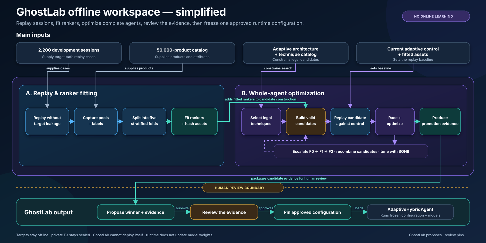
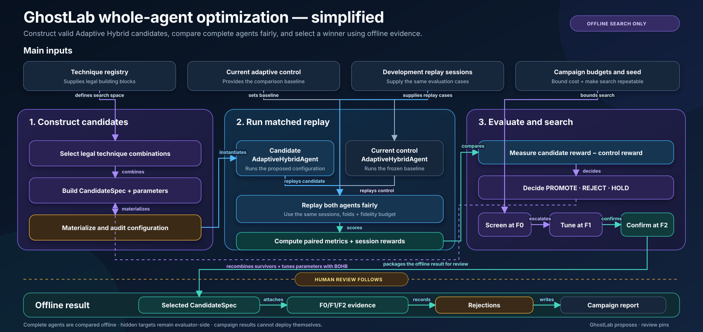

# Offline training and optimization pipeline

## Offline workspace

## Whole-agent optimization

Together, the diagrams follow five steps:

1. **Development data:** combine the 200 official sessions and two 1,000-session synthetic sources with the frozen 50,000-product catalog.
2. **Replay sessions:** run the real agent workflow, capture its candidate pool, and attach the hidden target label only afterward.
3. **Train rankers:** use five deterministic source/scenario-balanced folds to evaluate and fit the union and Browsing-safe GBDTs.
4. **Optimize the complete system:** GhostLab tests architecture-valid techniques, combinations, thresholds and budgets through F0/F1/F2 racing.
5. **Review and run:** a campaign winner remains evidence until a human-reviewed, hash-pinned pointer activates it; otherwise the guarded champion remains active.

Neither runtime updates model weights during a customer session. Session state changes are runtime context adaptation, not online learning.
